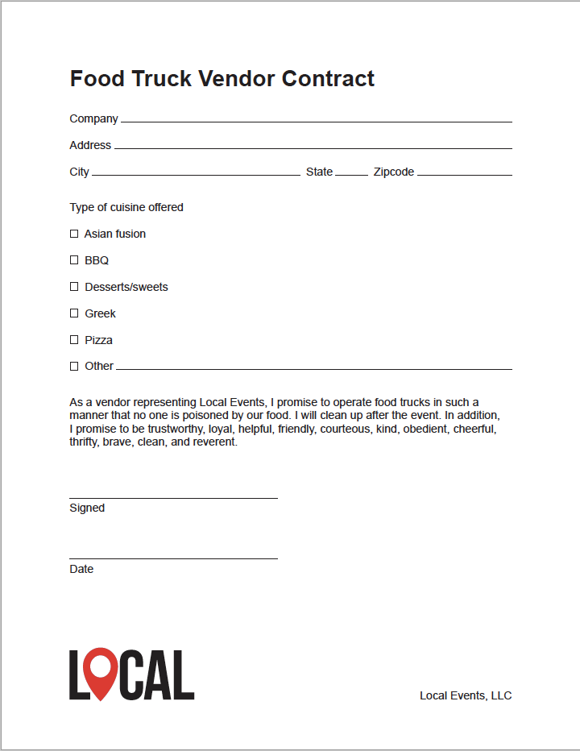

# Getting Sh*t Done with Acrobat DC

Did you know that Acrobat is the second most used application in Creative Cloud? Learn how to use Acrobat and Adobe Document Cloud apps to go digital, stay digital, and speed processes so that you can get back to being creative. Discover how to conduct business from anywhere with Acrobat and Document Cloud apps for both desktop and mobile.

In this session, you’ll explore new features and best practices with Patti Sokol, Adobe Sr. Solutions Consultant and MAX Master, and Keith Gilbert, Principal at Gilbert Consulting, as you learn how to:

* Go digital with Adobe Scan
* Stay digital with Adobe Fill & Sign — mobile and desktop
* Be digital on the go with the Acrobat Reader mobile app
* Speed the feedback process with the new Document Cloud Review service

## Lessons (basic bullet list)

* [Lesson1](assets/01_Review.zip)
* [Lesson2](assets/02_SendTrack.zip)
* [Lesson3](assets/03_FillSignScan.zip)

## Lessons (cards in table)

<table>
<tr>
  <td>
    
    

    <a href="assets/01_Review.zip"><strong>Lesson 1</strong></a>
    

    <em>Download 01_Review.zip</em>
     
  </td>
  <td>
    
    

    <a href="assets/02_SendTrack.zip"><strong>Lesson 2</strong></a>
    

    <em>Download 02_SendTrack.zip</em>
     
  </td>
  <td>
    
    

    <a href="assets/03_FillSignScan.zip"><strong>Lesson 3</strong></a>
    

    <em>Download 03_FillSignScan.zip</em>
     
  </td>
</tr>
</table>
