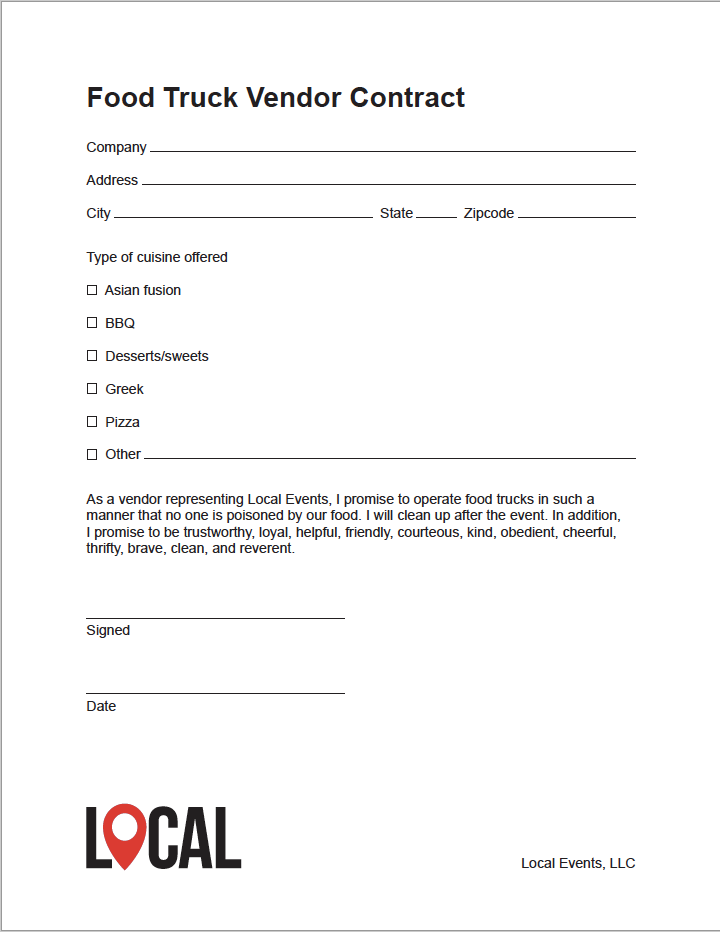

# Getting Sh*t Done with Acrobat DC

## Lessons (basic bullet list)

* [Review](assets/01_Review.zip)
* [Send & Track](assets/02_SendTrack.zip)
* [Fill, Sign, and Scan](assets/03_FillSignScan.zip)

## Lessons (cards in table)

<table>
<tr>
  <td>
    
    

    <a href="assets/01_Review.zip"><strong>Lesson 1</strong></a>
    

    <em>Download 01_Review.zip</em>
     
  </td>
  <td>
    
    

    <a href="assets/02_SendTrack.zip"><strong>Lesson 2</strong></a>
    

    <em>Download 02_SendTrack.zip</em>
     
  </td>
  <td>
    
    

    <a href="assets/03_FillSignScan.zip"><strong>Lesson 3</strong></a>
    

    <em>Download 03_FillSignScan.zip</em>
     
  </td>
</tr>
</table>
