# 60-second Acrobat overview

60-Second Acrobat gives you bite-sized tutorials to help you learn a new trick in Acrobat in one minute or less. These task-based tips help you pick up new skills for working with PDF files by unlocking some of Acrobat's hidden gems. You can watch one to get a quick answer, or watch five to boost your document productivity – and still have time to enjoy your coffee break.

## 60-second Acrobat tutorials

## Edit

<table style="table-layout:fixed">
<tr>
   <td>
    
  </td>
  <td>
    <a href="textrecognition.md">
      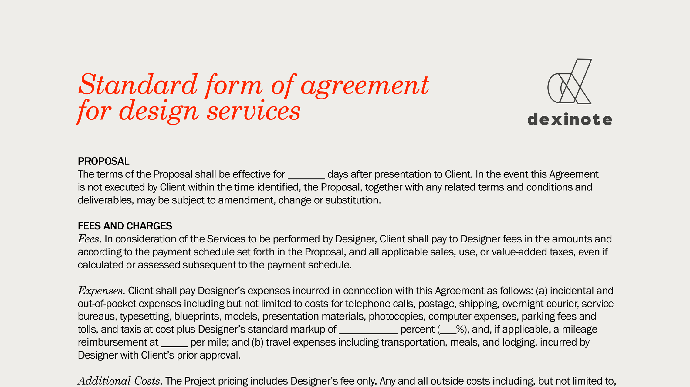
    </a>
  </td>
  <td>
    
  </td>
   <td>
    
  </td>
</tr>
<tr>
  <td>
    
  </td>
  <td>
    <a href="editgraphic.md">
      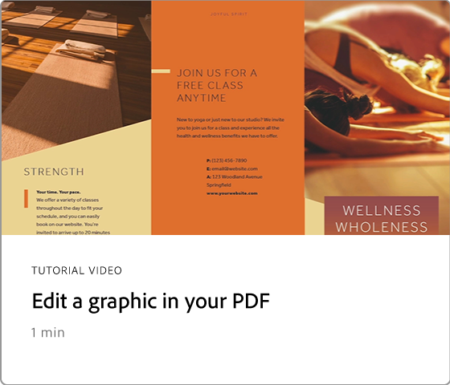
    </a>
  </td>
  <td>
      
        

         
  </td>
  <td>
      
        

         
  </td>
</tr>
</table>

## Convert

<table style="table-layout:fixed">
<tr>
  <td>
    <a href="convert-pdf-word.md">
      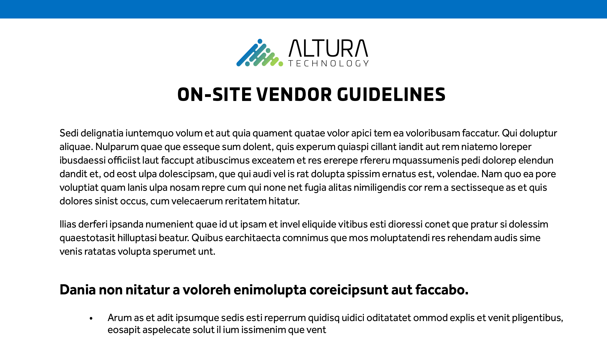
    </a>
  </td>
 <td>
    <a href="convert-pdf-excel.md">
      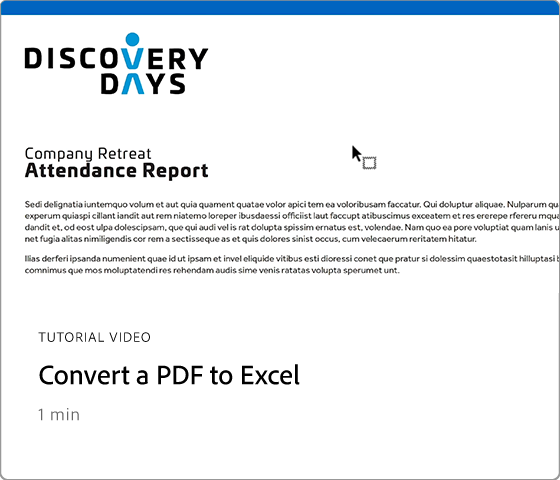
    </a>
  </td>
  <td>
    <a href="convert-pdf-powerpoint.md">
      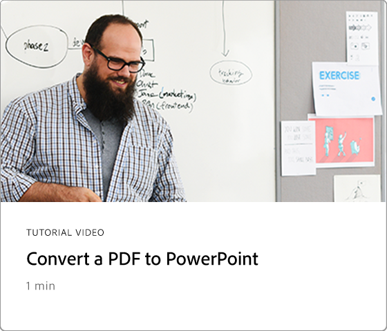
    </a>
  </td>
  <td>
    <a href="exportwordphone.md">
      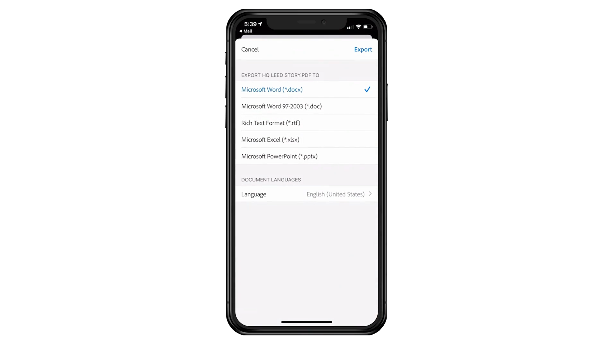
    </a>
  </td>
</tr>
</table>

## Create

<table style="table-layout:fixed">
<tr>
  <td>
    <a href="word-to-pdf.md">
      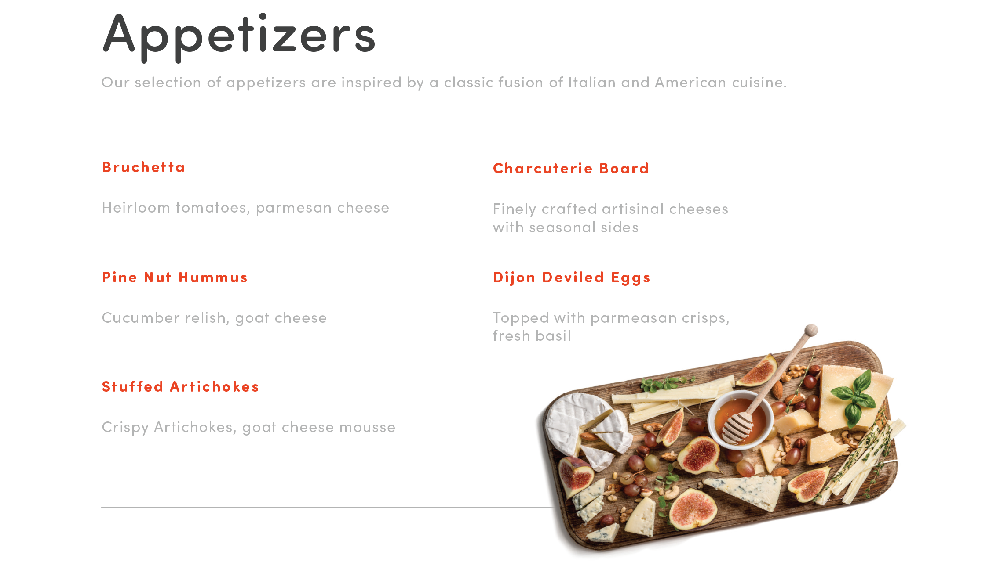
    </a>
  </td>
  <td>
    <a href="create-from-acrobat.md">
      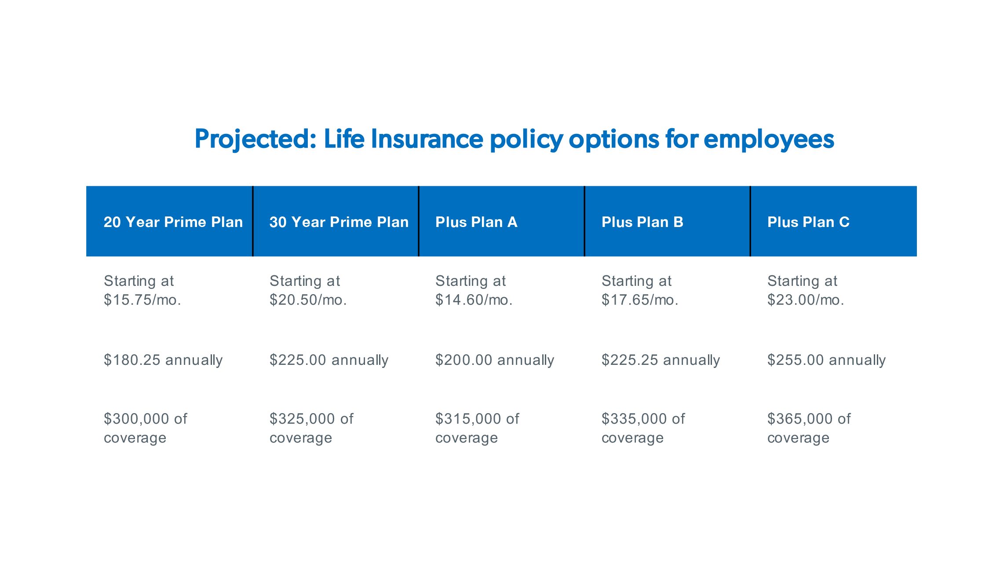
    </a>
  <td>
    <a href="wordform.md">
      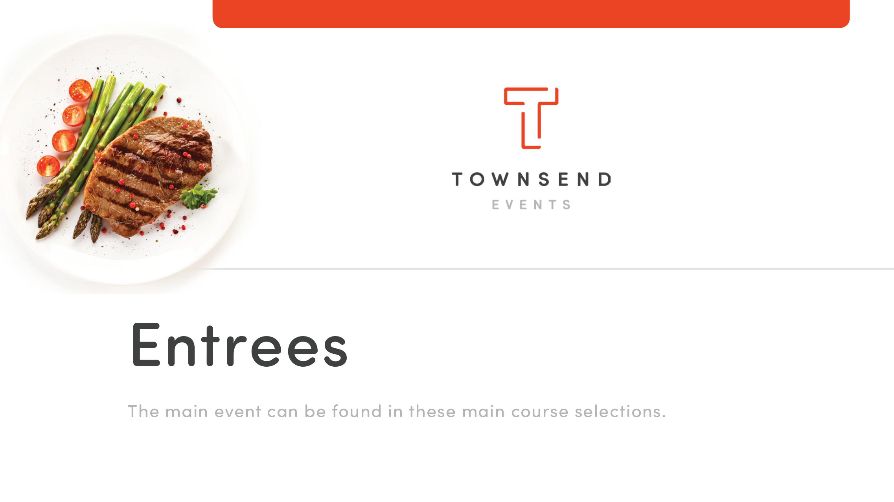
    </a>
  </td>
  <td>
      
  </td>
</tr>
<tr>
  <td>
    <a href="phone.md">
      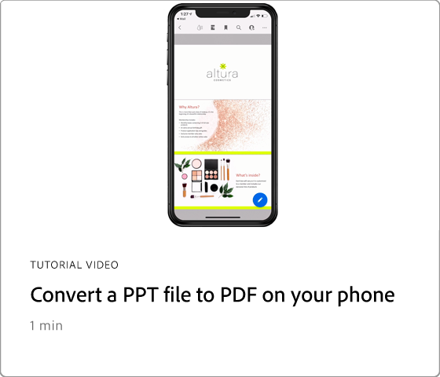
    </a>
  </td>
  <td>
      
  </td>
  <td>
      
        

         
  </td>
  <td>
      
        

         
  </td>
</tr>
</table>

## Sign

<table style="table-layout:fixed">
<tr>
  <td>
    <a href="sign.md">
      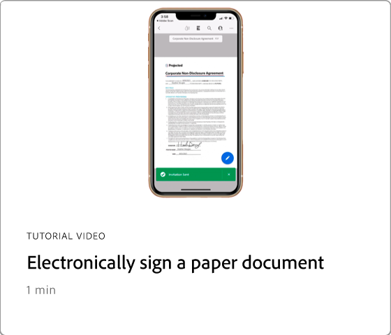
    </a>
  </td>
  <td>
      
        

         
  </td>
  <td>
      
        

         
  </td>
  <td>
      
        

         
  </td>
</tr>
</table>

## Protect

<table style="table-layout:fixed">
<tr>
  <td>
    
  </td>
  <td>
    <a href="redaction.md">
      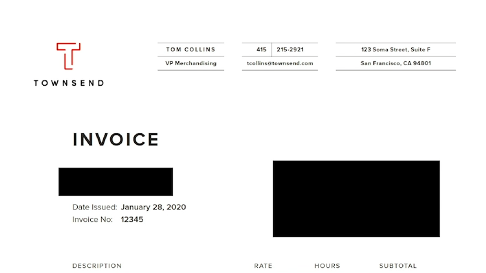
    </a>
  </td>
  <td>
      
        

         
  </td>
  <td>
      
        

         
  </td>
</tr>
</table>

## Share and review

<table style="table-layout:fixed">
<tr>
  <td>
    <a href="share-comment.md">
      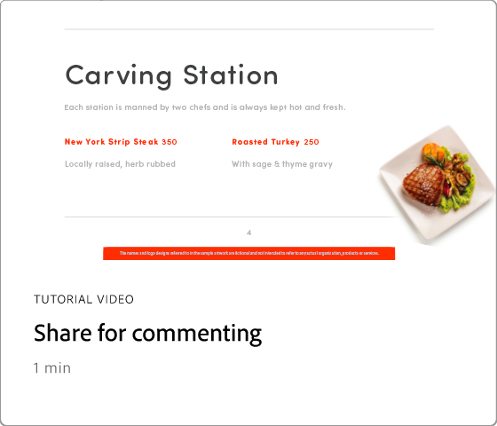
    </a>
  </td>
  <td>
    <a href="share-comment-teams.md">
      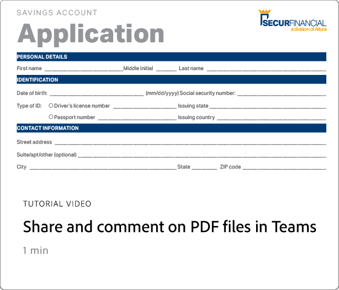
    </a>
  </td>
  <td>
    <a href="summarize-comments.md">
      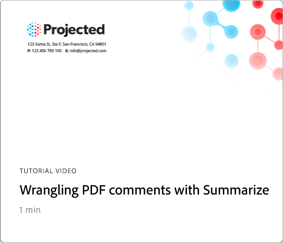
    </a>
  </td>
   <td>
    
  </td>
</tr>
</table>
  
## Prepare

<table style="table-layout:fixed">
<tr>
  <td>
    
  </td>
 <td>
    <a href="conform.md">
      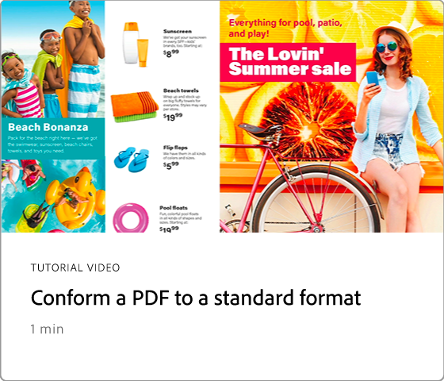
    </a>
  </td>
  <td>
      
        

         
  </td>
  <td>
      
        

         
  </td>
</tr>
</table>
  
## Additional topics

<table style="table-layout:fixed">
<tr>
  <td>
    
  </td>
 <td>
    <a href="search.md">
      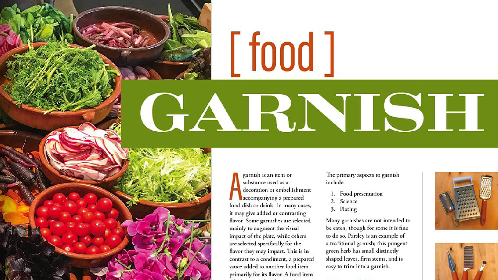
    </a>
  </td>
  <td>
      
        

         
  </td>
  <td>
      
        

         
  </td>
</tr>
</table>