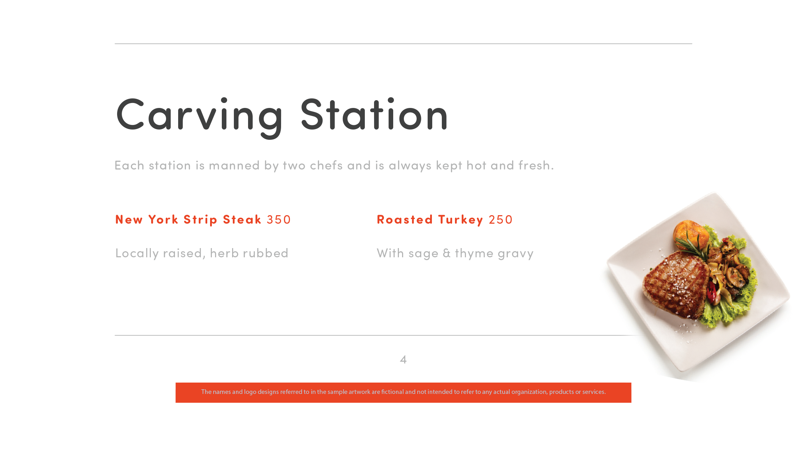
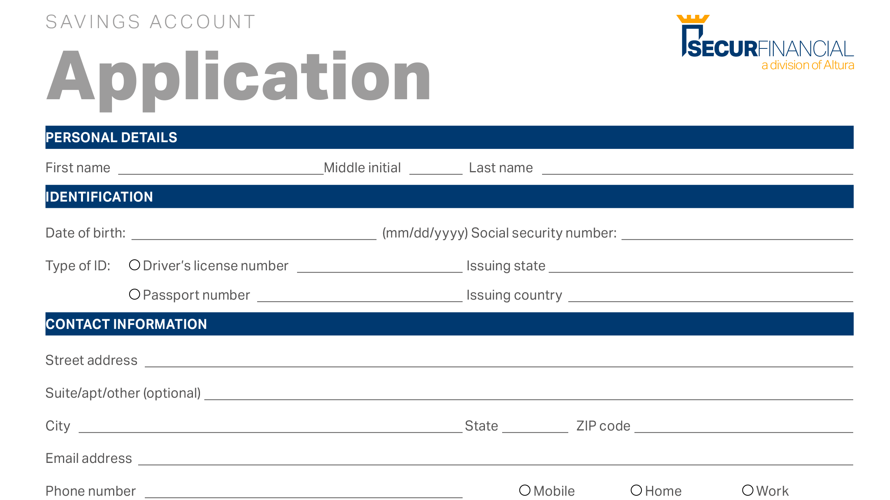

# 60-second Acrobat overview

60-Second Acrobat gives you bite-sized tutorials to help you learn a new trick in Acrobat in one minute or less. These task-based tips help you pick up new skills for working with PDF files by unlocking some of Acrobat's hidden gems. You can watch one to get a quick answer, or watch five to boost your document productivity – and still have time to enjoy your coffee break.

## 60-second Acrobat tutorials

## Edit

<table style="table-layout:fixed">
<tr>
   <td>
    
    

    <a href="edit.md"><strong>Edit PDF with Acrobat Web</strong></a>
    

    Learn how to edit in Acrobat web
     
  </td>
  <td>
    
    

    <a href="textrecognition.md"><strong>Recognize text in a scanned PDF file</strong></a>
    

    Learn how recognize text from a scanned image
     
  </td>
  <td>
    
    

    <a href="combine-to-one-pdf.md"><strong>Combine files into one PDF</strong></a>
    

    Learn how quickly combine files into a single PDF
     
  </td>
   <td>
    
    

    <a href="organize.md"><strong>Organize pages in a snap</strong></a>
    

    Learn how quickly organize pages in a PDF
     
  </td>
</tr>
<tr>
  <td>
    
    

    <a href="editphoto.md"><strong>Edit a photo in your PDF</strong></a>
    

    Learn how edit a photo in your PDF
  </td>
  <td>
    
    

    <a href="editgraphic.md"><strong>Edit a graphic in your PDF</strong></a>
    

    Learn how edit a graphic in your PDF
  </td>
  <td>
      
        

         
  </td>
  <td>
      
        

         
  </td>
</tr>
</table>

## Convert

<table style="table-layout:fixed">
<tr>
  <td>
    
    

    <a href="convert-pdf-word.md"><strong>Convert a PDF to Word</strong></a>
    

    Learn how to convert a PDF to Word format
  </td>
 <td>
    
    

    <a href="convert-pdf-excel.md"><strong>Convert a PDF to Excel</strong></a>
    

    Learn how to convert a PDF to Excel format
  </td>
  <td>
    
    

    <a href="convert-pdf-powerpoint.md"><strong>Convert a PDF to PowerPoint</strong></a>
    

    Learn how to convert a PDF to PowerPoint format
  </td>
  <td>
    
    

    <a href="exportwordphone.md"><strong>Export PDF to Word from your phone</strong></a>
    

    Learn how to export a PDF to Word from your phone
  </td>
</tr>
</table>

## Create

<table style="table-layout:fixed">
<tr>
  <td>
    
    

    <a href="word-to-pdf.md"><strong>Create a PDF from Microsoft Word</strong></a>
    

    Learn how to create a PDF directly from Word
  </td>
  <td>
    
    

    <a href="create-from-acrobat.md"><strong>Create PDFs from Acrobat</strong></a>
    

    Learn how to create PDFs from inside Acrobat
  <td>
    
    

    <a href="wordform.md"><strong>Convert Word to PDF including form fields</strong></a>
    

    Convert a Word file to PDF and automatically generate form fields
  </td>
  <td>
    
    

    <a href="photo.md"><strong>Create a PDF of photos in an instant</strong></a>
    

    Create a PDF of multiple photos
  </td>
</tr>
<tr>
  <td>
    
    

    <a href="phone.md"><strong>Convert a PPT file to PDF on your phone</strong></a>
    

    Convert a PowerPoint file to PDF on your phone
  </td>
  <td>
    
    

    <a href="optimize.md"><strong>Create more efficient PDF files in a snap</strong></a>
    

    Optimize your PDF files in a snap
  </td>
  <td>
      
        

         
  </td>
  <td>
      
        

         
  </td>
</tr>
</table>

## Sign

<table style="table-layout:fixed">
<tr>
  <td>
    
    

    <a href="sign.md"><strong>Electronically sign a paper document</strong></a>
    

    Learn how to electronically sign a paper document
  </td>
  <td>
      
        

         
  </td>
  <td>
      
        

         
  </td>
  <td>
      
        

         
  </td>
</tr>
</table>

## Protect

<table style="table-layout:fixed">
<tr>
  <td>
    
    

    <a href="protect.md"><strong>Protect your PDF files with a password</strong></a>
    

    Learn how to secure your PDF with a password
  </td>
  <td>
    
  </td>
  <td>
      
        

         
  </td>
  <td>
      
        

         
  </td>
</tr>
</table>

## Share and review

<table style="table-layout:fixed">
<tr>
  <td>
    
    

    <a href="share-comment.md"><strong>Share a PDF for commenting</strong></a>
    

    Learn how to share a PDF for others to comment on
  </td>
  <td>
    
    

    <a href="share-comment-teams.md"><strong>Share and comment on PDF files in Teams</strong></a>
    

    Learn how to share and comment on a PDF file in Microsoft Teams
  </td>
  <td>
    
    

    <a href="summarize-comments.md"><strong>Wrangling PDF comments with Summarize</strong></a>
    

    Learn how to summarize all you comments into a single PDF
  </td>
   <td>
    
    

    <a href="indesign.md"><strong>Load PDF comments into InDesign</strong></a>
    

    Learn how to bring all your PDF comments into InDesign
  </td>
</tr>
</table>
  
## Prepare

<table style="table-layout:fixed">
<tr>
  <td>
    
    

    <a href="accessible.md"><strong>Let Acrobat help you make Accessible PDFs</strong></a>
    

    Learn how to make your PDF universally accessible
  </td>
 <td>
    
    

    <a href="conform.md"><strong>Conform a PDF to a standard format</strong></a>
    

    Learn how to conform a PDF to a particular standard
  </td>
  <td>
      
        

         
  </td>
  <td>
      
        

         
  </td>
</tr>
</table>
  
## Additional topics

<table style="table-layout:fixed">
<tr>
  <td>
    
    

    <a href="compare.md"><strong>Spot the differences with PDF Compare</strong></a>
    

    Learn how to quickly compare the difference between two PDFs
  </td>
 <td>
    
    

    <a href="search.md"><strong>Search multiple PDF files at once</strong></a>
    

    Learn how to search across multiple PDF files
  </td>
  <td>
      
        

         
  </td>
  <td>
      
        

         
  </td>
</tr>
</table>