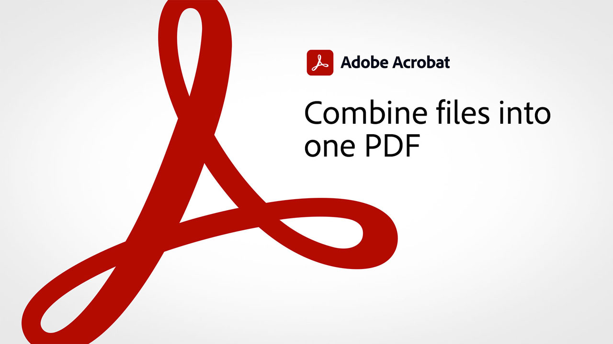

# 60-second Acrobat overview

60-Second Acrobat gives you bite-sized tutorials to help you learn a new trick in Acrobat DC in one minute or less. These task-based tips help you pick up new skills for working with PDF files by unlocking some of Acrobat’s hidden gems. You can watch one to get a quick answer, or watch five to boost your document productivity – and still have time to enjoy your coffee break.

## 60-second Acrobat tutorials

<table style="table-layout:fixed">
<tr>
  <td>
    
    

    <a href="combine-to-one-pdf.md"><strong>Combine files into one PDF</strong></a>
    

    <em>Quickly create a new document by combining several different types of files into a single PDF</em>
     
  </td>
  <td>
    
    

    <a href="edit.md"><strong>Edit PDF with Acrobat Web</strong></a>
    

    <em>Make simple edits to text and images without even downloading the PDF</em>
     
  </td>
  <td>
    
    

     <a href="search.md"><strong>Search multiple PDF files at once</strong></a>
    

    <em>Start a search in a PDF file, then open Advanced Search and search an entire folder of PDF files</em>
     
  </td>
</tr>
<tr>
  <td>
    
    

    <a href="photo.md"><strong>Create a PDF of photos in an instant</strong></a>
    

    <em>Learn how just drag-and-drop a bunch of JPGs onto the Acrobat icon to create a PDF</em>
     
  </td>
  <td>
    
    

    <a href="phone.md"><strong>Convert a PPT file to PDF on your phone</strong></a>
    

    <em>Learn how to convert an email PowerPoint attachment to PDF on your phone</em>
     
  </td>  
  <td>
   
    

     
  </td>
</tr>
</table>
