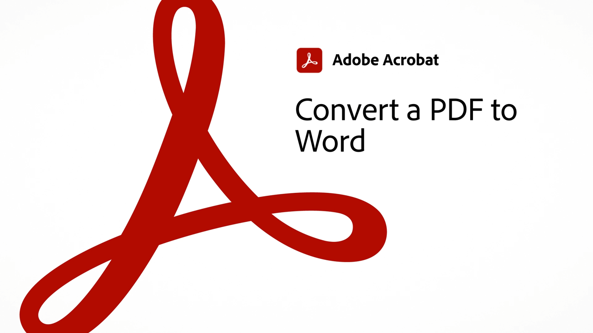
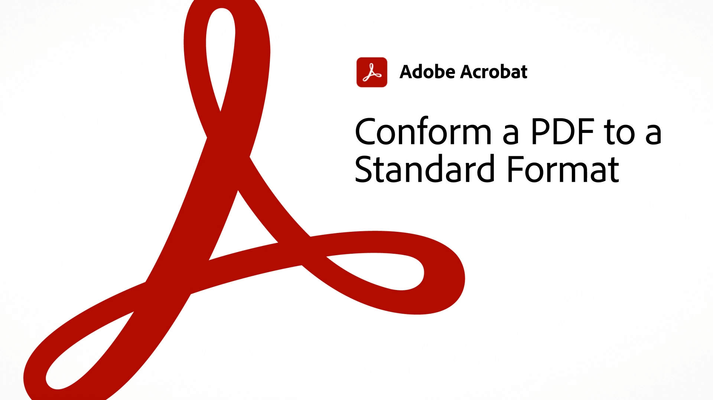

# 60-second Acrobat overview

60-Second Acrobat gives you bite-sized tutorials to help you learn a new trick in Acrobat in one minute or less. These task-based tips help you pick up new skills for working with PDF files by unlocking some of Acrobat's hidden gems. You can watch one to get a quick answer, or watch five to boost your document productivity – and still have time to enjoy your coffee break.

## 60-second Acrobat tutorials

## Edit

<table style="table-layout:fixed">
<tr>
   <td>
    
    

    <a href="edit.md"><strong>Edit PDF with Acrobat Web</strong></a>
    

    <em>Make simple edits to text and images without even downloading the PDF</em>
     
  </td>
  <td>
    
    

     <a href="textrecognition.md"><strong>Recognize text in a scanned PDF file</strong></a>
    

    <em>Convert a scanned PDF so that you can search for text in the PDF</em>
     
  </td>
  <td>
    
    

    <a href="combine-to-one-pdf.md"><strong>Combine files into one PDF</strong></a>
    

    <em>Quickly create a new document by combining several different types of files into a single PDF</em>
     
  </td>
   <td>
    
    

    <a href="organize.md"><strong>Organize pages in a snap</strong></a>
    

    <em>Learn to use the Organize Pages tool to get a bird's eye view of your PDF</em>
     
  </td>
</tr>
<tr>
  <td>
    
    

    <a href="editphoto.md"><strong>Edit a photo in your PDF</strong></a>
    

    <em>Learn to make advanced edits to a photo in your PDF using Photoshop</em>
     
  </td>
  <td>
    
    

    <a href="editgraphic.md"><strong>Edit a graphic in your PDF</strong></a>
    

    <em>Learn to make advanced edits to a graphic in your PDF using Illustrator</em>
     
  </td>
  <td>
      
        

         
  </td>
  <td>
      
        

         
  </td>
</tr>
</table>

## Convert

<table style="table-layout:fixed">
<tr>
  <td>
    
    

    <a href="convert-pdf-word.md"><strong>Convert a PDF to Word</strong></a>
    

    <em>Convert a PDF file to a fully editable Microsoft Word document</em>
     
  </td>
 <td>
    
    

    <a href="convert-pdf-excel.md"><strong>Convert a PDF to Excel</strong></a>
    

    <em>Convert a PDF file to a fully editable Microsoft Excel document</em>
     
  </td>
  <td>
    
    

    <a href="convert-pdf-powerpoint.md"><strong>Convert a PDF to PowerPoint</strong></a>
    

    <em>Convert a PDF file to a fully editable Microsoft PowerPoint document</em>
     
  </td>
  <td>
    
    

    <a href="exportwordphone.md"><strong>Export PDF to Word from your phone</strong></a>
    

    <em>Convert a PDF file to a fully editable Microsoft Word document with the Acrobat mobile app</em>
     
  </td>
</tr>
</table>

## Create

<table style="table-layout:fixed">
<tr>
  <td>
    
    

     <a href="word-to-pdf.md"><strong>Create a PDF from Microsoft Word</strong></a>
    

    <em>Create a PDF from Microsoft Word</em>
     
  </td>
  <td>
    
    

     <a href="create-from-acrobat.md"><strong>Create PDFs from Acrobat</strong></a>
    

    <em>Create PDFs from Microsoft 365 files right inside the Acrobat desktop app</em>
     
  </td>
  <td>
    
    

     <a href="wordform.md"><strong>Convert Word to PDF including form fields</strong></a>
    

    <em>Convert Word files and forms to PDF and automatically build form fields</em>
     
  </td>
  <td>
      
      

      <a href="photo.md"><strong>Create a PDF of photos in an instant</strong></a>
      

      <em>Learn how just drag-and-drop a bunch of JPGs onto the Acrobat icon to create a PDF</em>
       
  </td>
</tr>
<tr>
  <td>
    
    

    <a href="phone.md"><strong>Convert a PPT file to PDF on your phone</strong></a>
    

    <em>Learn how to convert an email PowerPoint attachment to PDF on your phone</em>
     
  </td>
  <td>
      
      

      <a href="optimize.md"><strong>Create more efficient PDF files in a snap</strong></a>
      

      <em>Use the Optimize PDF tool to significantly reduce the size of your PDF files</em>
       
  </td>
  <td>
      
        

         
  </td>
  <td>
      
        

         
  </td>
</tr>
</table>

## Sign

<table style="table-layout:fixed">
<tr>
  <td>
    
    

    <a href="sign.md"><strong>Electronically sign a paper document</strong></a>
    

    <em>Learn to use Adobe Scan to sign a printed form</em>
     
  </td>
  <td>
      
        

         
  </td>
  <td>
      
        

         
  </td>
  <td>
      
        

         
  </td>
</tr>
</table>

## Protect

<table style="table-layout:fixed">
<tr>
  <td>
    
    

    <a href="protect.md"><strong>Protect your PDF files with a password</strong></a>
    

    <em>Protect a PDF so that a password is required either to open or edit the PDF</em>
     
  </td>
  <td>
    
    

    <a href="redaction.md"><strong>Redaction: The Right Way</strong></a>
    

    <em>Learn the right way to remove sensitive information from a PDF</em>
     
  </td>
  <td>
      
        

         
  </td>
  <td>
      
        

         
  </td>
</tr>
</table>

## Share and review

<table style="table-layout:fixed">
<tr>
  <td>
    
    

    <a href="share-comment.md"><strong>Share a PDF for commenting</strong></a>
    

    <em>Learn how to share a PDF to collect feedback quickly from multiple people in a single file</em>
     
  </td>
  <td>
    
    

    <a href="share-comment-teams.md"><strong>Share and comment on PDF files in Teams</strong></a>
    

    <em>Learn how to collaborate in real-time on a PDF file in Microsoft Teams</em>
     
  </td>
  <td>
    
    

    <a href="summarize-comments.md"><strong>Wrangling PDF comments with Summarize</strong></a>
    

    <em>Learn how to create a summary of all the comments and mark-ups in your PDF file</em>
     
  </td>
   <td>
    
    

    <a href="indesign.md"><strong>Load PDF comments into InDesign</strong></a>
    

    <em>Learn how to load PDF comments back into InDesign after an Acrobat shared review</em>
     
  </td>
</tr>
</table>
  
## Prepare

<table style="table-layout:fixed">
<tr>
  <td>
    
    

    <a href="accessible.md"><strong>Let Acrobat help you make Accessible PDFs</strong></a>
    

    <em>Check to see if a PDF is Accessible</em>
     
  </td>
 <td>
    
    

    <a href="conform.md"><strong>Conform a PDF to a standard format</strong></a>
    

    <em>Learn how to validate PDF content against PDF standard criteria such as PDF/X, PDF/A, or PDF/E</em>
     
  </td>
  <td>
      
        

         
  </td>
  <td>
      
        

         
  </td>
</tr>
</table>
  
## Additional topics

<table style="table-layout:fixed">
<tr>
  <td>
    
    

     <a href="compare.md"><strong>Spot the differences with PDF Compare</strong></a>
    

    <em>Learn how to spot the differences between two PDF files by using the Compare Files tool in Acrobat</em>
     
  </td>
 <td>
    
    

     <a href="search.md"><strong>Search multiple PDF files at once</strong></a>
    

    <em>Start a search in a PDF file, then open Advanced Search and search an entire folder of PDF files</em>
     
  </td>
  <td>
      
        

         
  </td>
  <td>
      
        

         
  </td>
</tr>
</table>