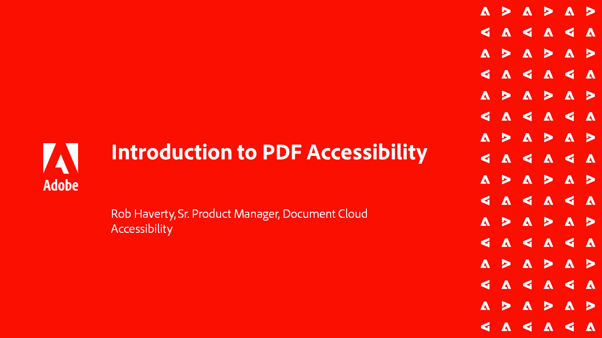
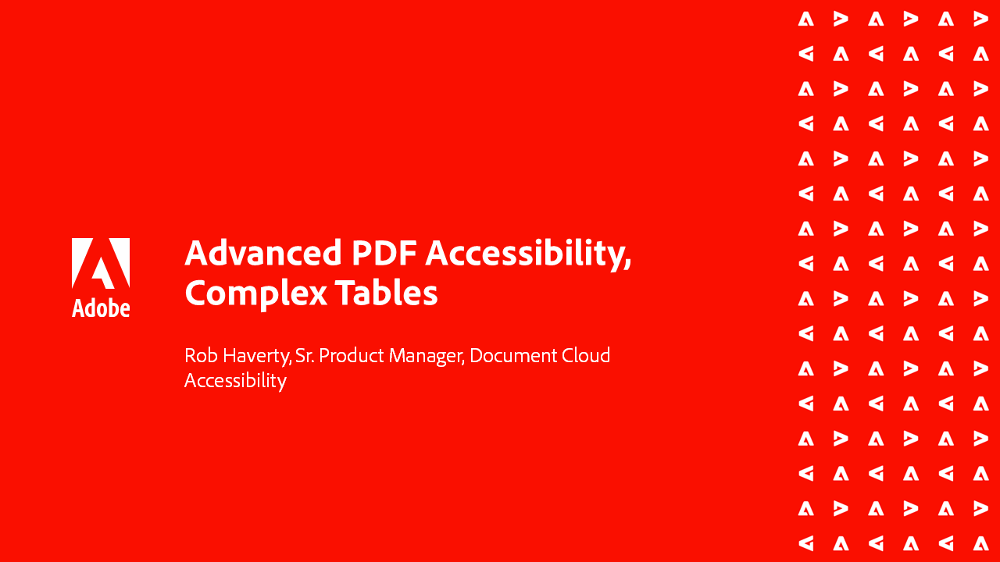
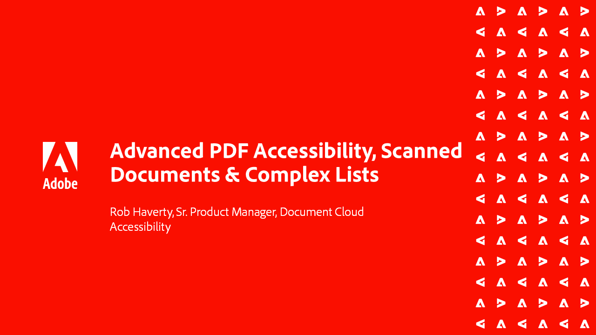
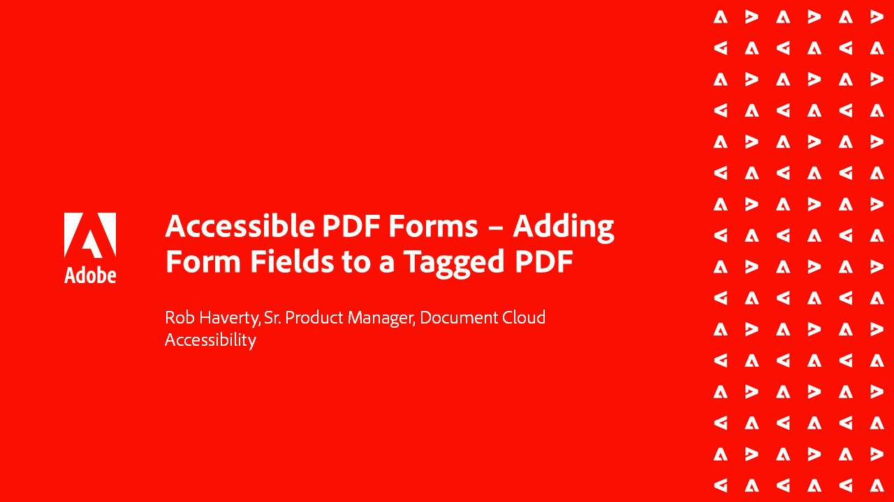
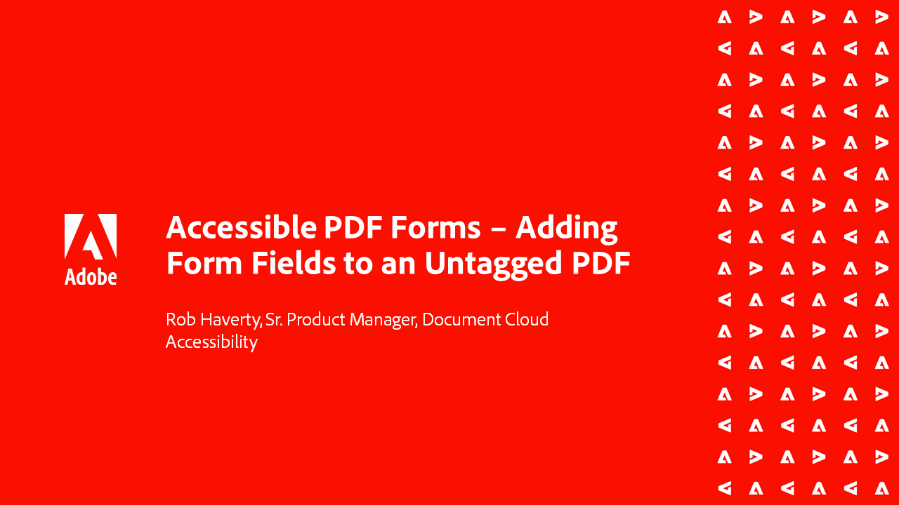

# Acrobat Accessibility series

In this six-part on-demand webinar series, go from the basics of Accessibility to a deep-dive of tagging your PDF files. Each session includes practice files to follow along.

<table style="table-layout:fixed">
<tr>
  <td>
    
    

    <a href="accessibilitysession1.md"><strong>Introduction to PDF Accessibility</strong></a>
    

    <em>In this on-demand session, learn what it means to make a PDF accessible, how to set up Acrobat Pro to work on PDFs for accessibility, and the conversion process from a source document to a PDF</em>
     
  </td>
  <td>
    
    

    <a href="accessibilitysession2.md"><strong>Remediating an inaccessible PDF</strong></a>
    

    <em>In this on-demand session, learn the workflow to convert a Word document and fixing some basic tagging issues using the Acrobat Pro tools shown in the introduction webinar</em>
     
  </td>  
  <td>
    
    

    <a href="accessibilitysession3.md"><strong>Complex tables</strong></a>
    

    <em>This on-demand session addresses one of the more common and challenging issues in remediating a PDF for accessibility--complex tables</em>
     
  </td>
</tr>
<tr>
  <td>
    
    

    <a href="accessibilitysession4.md"><strong>Scanned documents & complex lists</strong></a>
    

    <em>This on-demand session addresses the more complex issues people frequently run into such as scanned documents and complex lists</em>
     
  </td>
  <td>
    
    

    <a href="accessibilitysession5.md"><strong>Adding form fields to a tagged PDF</strong></a>
    

    <em>This on-demand session focuses on adding form fields to a previously tagged PDF</em>
     
  </td>  
  <td>
    
    

    <a href="accessibilitysession6.md"><strong>Adding form Fields to an untagged PDF</strong></a>
    

    <em>This on-demand session goes deeper into creating manual form fields and additional form field properties</em>
     
  </td> 
</tr>
</table>
