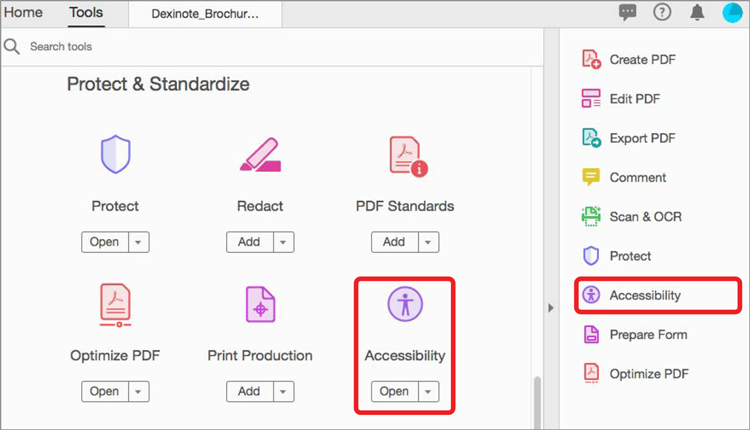
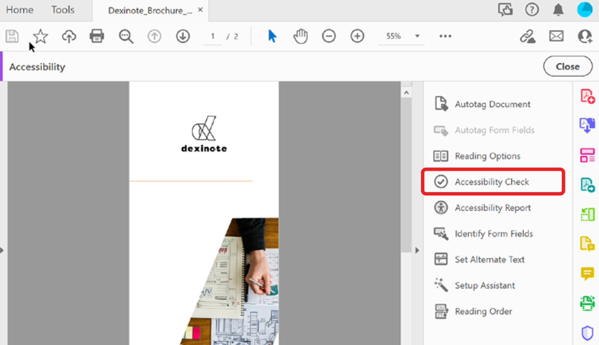
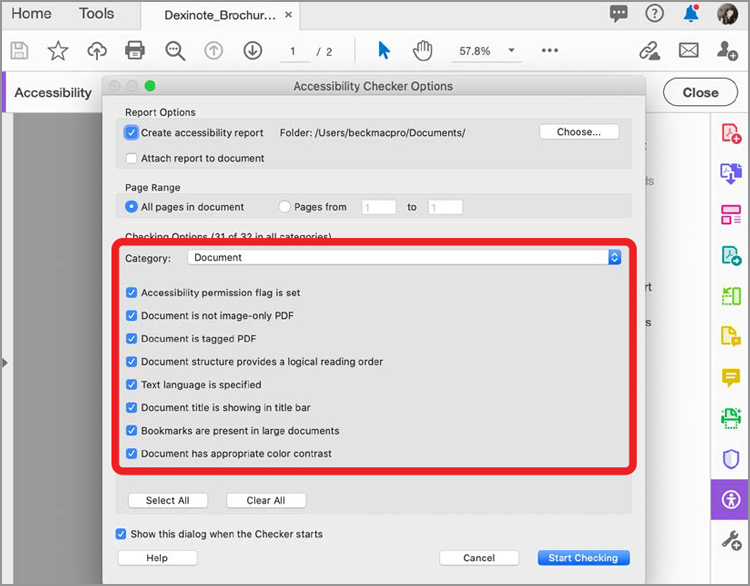
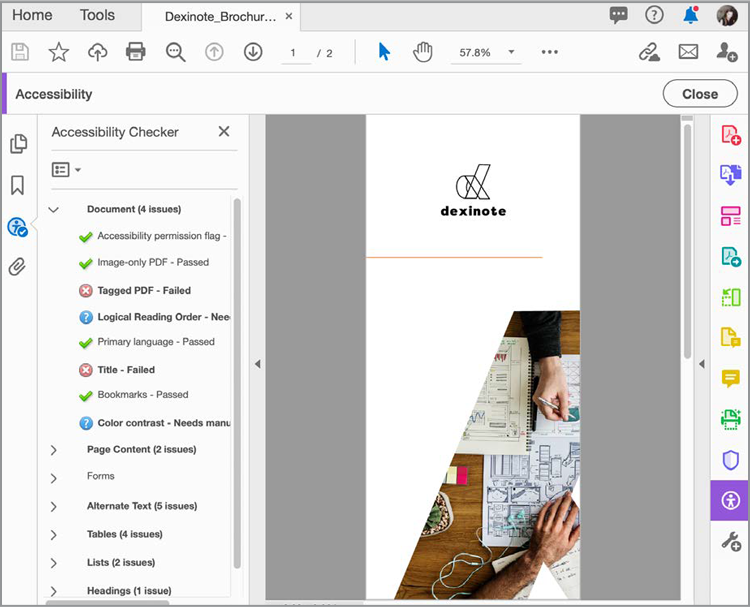

# Preparing Accessible PDF files

Learn how to check the accessibility of your existing PDF files. The **[!UICONTROL Full Check/Accessibility Check]** tool verifies whether the document conforms to accessibility standards, such as PDF/UA and WCAG 2.0. The **[!UICONTROL Accessibility Report]** summarizes the findings of the accessibility check.

>[!NOTE]
>
>Available in Acrobat Pro DC only.

## Using the Acrobat Pro DC [!UICONTROL Accessibility Check] (Full Check)

1. In Acrobat Pro DC, select **[!UICONTROL Accessibility]** from the Tools center or pane.

    

1. In the right-hand pane, select **[!UICONTROL Full Check]**.

    

1. In the dialog box, select a category from the dropdown, and items from the checklist.

    Leave every box checked for a complete report. 

1. Click **[!UICONTROL Start Checking]** to begin the report.

    

    The left navigation pane opens to show the report results. 

1. Expand a section to see the details.

    

You can also use the [!UICONTROL Make Accessible] action in the [Action Wizard](https://experienceleague.adobe.com/docs/document-cloud-learn/acrobat-learning/advanced-tasks/action.html) tool, which walks through a basic set of steps to create an accessible PDF.

## Fix accessibility issues

In the accessibility report window, right-click on an item to bring up the context menu. The context menu for any item that failed the accessibility check gives you the option to fix the issue.

*Please note: some issues cannot be fixed automatically and need your manual intervention to correct the problem. In those cases, Acrobat present a dialog box telling you what to correct.*

Click to download a PDF of the *Preparing Accessible PDF files* tutorial.

.
