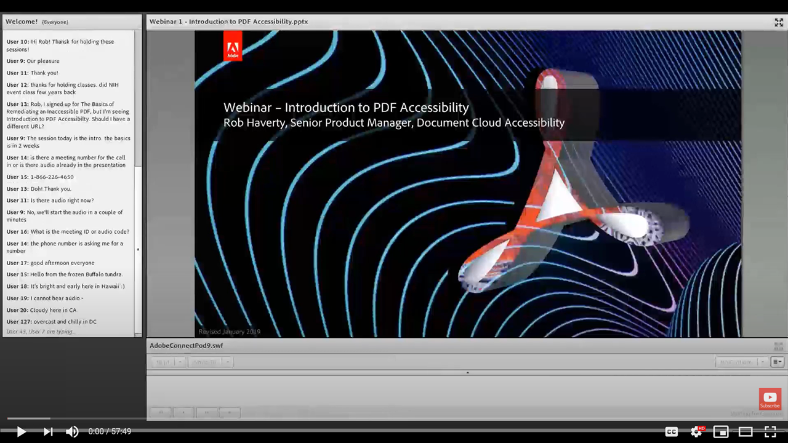

# Introduction to PDF Accessibility

In this session, learn what it means to make a PDF accessible, how to set up Acrobat Pro (Premium, or Studio) to work on PDFs for accessibility, and the conversion process from a source document to a PDF.

Click [here](../assets/accessibilitysession1.zip) to download a zip folder of the hands-on session files.

Select the image to view the video in a separate browser tab.

{target="_blank"}
