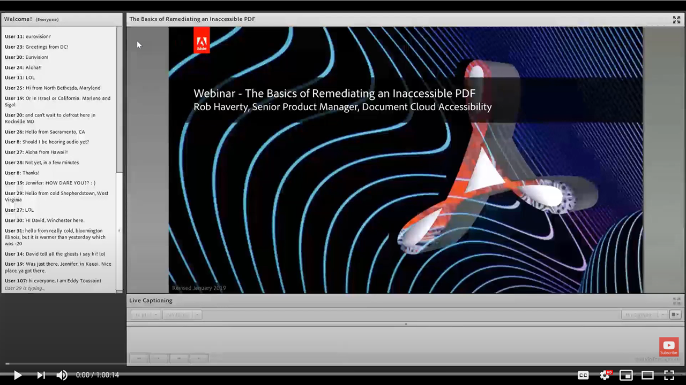

# Remediating an inaccessible PDF

In this on-demand session, learn the workflow to convert a Word document and fixing some basic tagging issues using the Acrobat Pro DC tools shown in the introduction webinar.

Click [here](../assets/accessibilitysession2.zip) to download a zip folder of the hands-on session files.

Select the image to view the video in a separate browser tab.

{target="_blank"}
