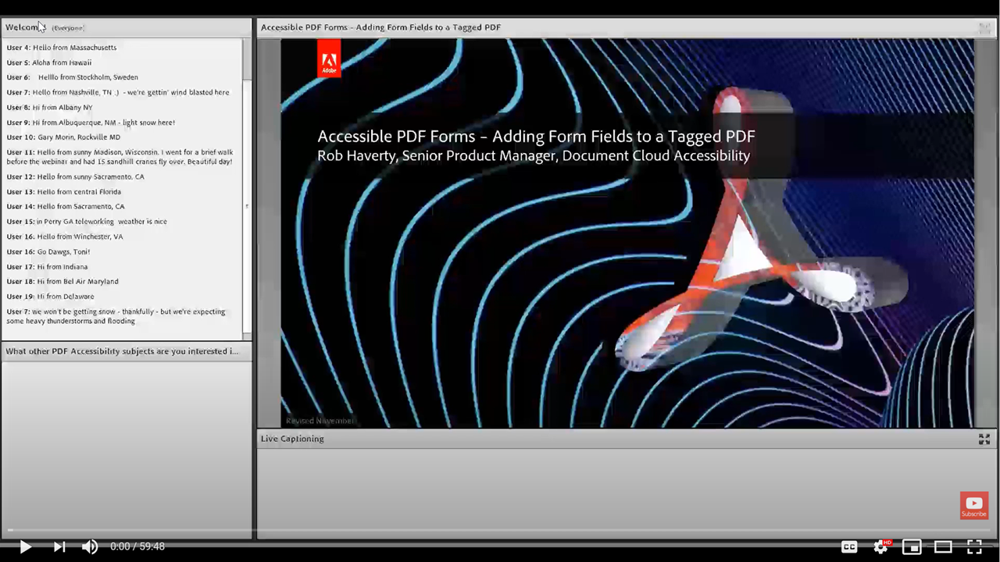

# Adding form fields to a tagged PDF

This on-demand session focuses on adding form fields to a previously tagged PDF.

Click [here](../assets/accessibilitysession5.zip) to download a zip file of the hands-on files for this session.

Select the image to view the video in a separate browser tab.

{target="_blank"}
