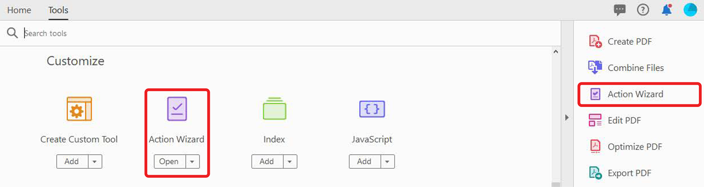
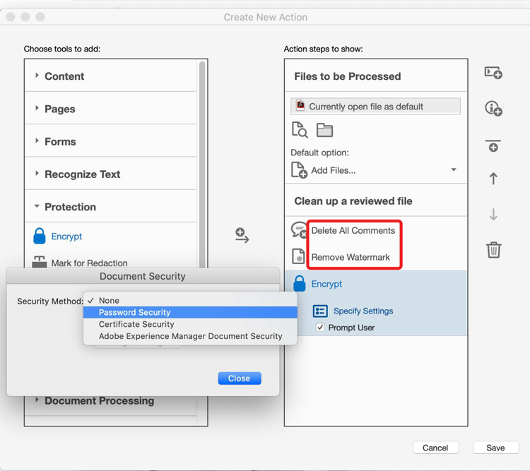

# Action Wizard

Create an action to automatically apply a set of commands to one or multiple files. *Available in Acrobat Pro DC only*.

1. In Acrobat Pro DC, select **Action Wizard** from the Tools center or pane.

    

1. Predefined actions appear in the **Actions List**. To create a custom action, click **New Action** in the top menu bar.

    

1. In the **Create New Action** dialog box, add commands to the action by selecting a task from the list on the left and clicking the arrow in the center to add it to the column on the right.

    *Settings for each task can be pre-determined in this dialog box, or you can allow the user to be prompted to make any necessary decisions as the action runs.*

    

1. Click **Save**, give your new action a name, and save it to your **Action List**.

Now you can run the custom action any time you need to perform that series of steps on a PDF file.

[Download this Action Wizard tutorial](../assets/AcrobatDCActionWizard.pdf).    