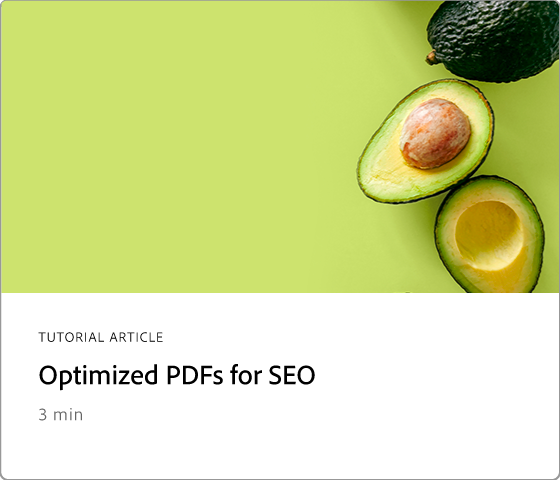
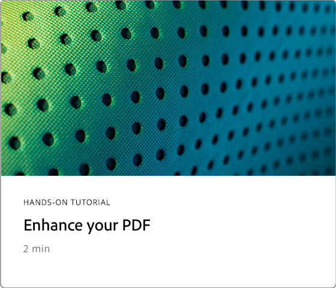
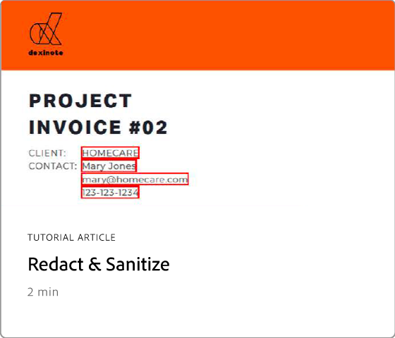
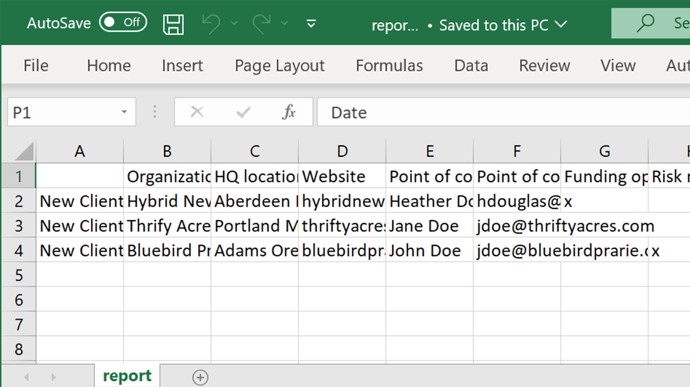
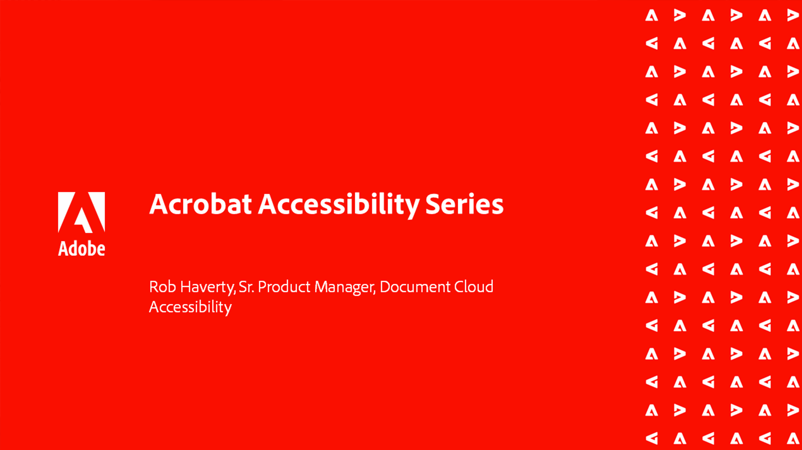

# Advanced tasks overview

Go beyond the basics with these advanced tools in Acrobat. Learn how to create an Action to repeat mundane tasks, remove sensitive information, reduce and optimize large files, quickly gather form data, and create universally Accessible PDF files. Check out this expertly curated [playlist](https://experienceleague.adobe.com/en/playlists/acrobat-peform-advanced-tasks) for performing advanced tasks in Acrobat.

## What's new

>[!BEGINTABS]

>[!TAB Guided actions]

Learn how to improve efficiency using [guided actions](action.md).

>[!TAB Optimize PDFs for SEO (Search Engine Optimization)]

 Learn how to [optimize a PDF](optimizeseo.md) for improved discoverability and search engine ranking on the web.

>[!ENDTABS]

## Advanced tasks tutorials

<table style="table-layout:fixed">
<tr>
  <td>
    
    

      <a href="bookmarks.md"><strong>Adding bookmarks and hyperlinks</strong></a>
      

      Add bookmarks and hyperlinks for better navigation
  </td>
  <td>
    
    

      <a href="optimizescan.md"><strong>Optimize scanned documents</strong></a>
      

      Learn how to enhance scanned documents
  </td>
  <td>
    
    

      <a href="custom.md"><strong>Custom Commands and Tools</strong></a>
      

      Learn how to improve document workflow efficiency
  </td>
  <td>
    
    

      <a href="advancedforms.md"><strong>Advanced form fields</strong></a>
      

      Learn how to build advanced form fields
  </td>
</tr>
<tr>
 <td>
    
    

      <a href="optimizeseo.md"><strong>Optimize PDFs for SEO</strong></a>
      

      Optimize a PDF for SEO (Search Engine Optimization)
  </td>
  <td>
    
    

      <a href="workforms.md"><strong>Work with form fields</strong></a>
      

      Learn how to add various types of form fields and properties
  </td>
  <td>
    
    

      <a href="enhance.md"><strong>Enhance your PDF</strong></a>
      

      Learn how to transform your PDF
  </td>
 <td>
    
    

      <a href="compare.md"><strong>Detect differences between two PDFs</strong></a>
      

      Quickly detect the differences between two PDF files
  </td>
</tr>
<tr>
  <td>
    
    

      <a href="action.md"><strong>Guided actions</strong></a>
      

      Learn how to improve efficiency using guided actions
  </td>
  <td>
    
    

      <a href="redact.md"><strong>Redact & Sanitize</strong></a>
      

      Learn how to permanently remove sensitive information
  </td>
 <td>
    
    

      <a href="reduce.md"><strong>Reduce file size & optimize</strong></a>
      

      Reduce large files without compromising quality
  </td>
  <td>
    
    

      <a href="formdata.md"><strong>Work with form data</strong></a>
      

      Learn how to compile form data
  </td>
</tr>
<tr>
 <td>
    
    

      <a href="accessibility.md"><strong>Check PDF Accessibility</strong></a>
      

      Learn how to check if your PDF is universally accessible
  </td>
 <td>
    
    

      <a href="accessibility-series.md"><strong>Acrobat Accessibility Series</strong></a>
      

      Six-session on-demand PDF accessibility series
  </td>
  <td>
   
    

     
  </td> 
  <td>
   
    

     
  </td>  
</tr>
</table>
