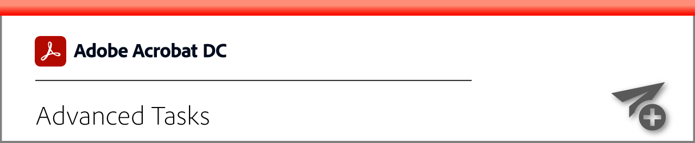
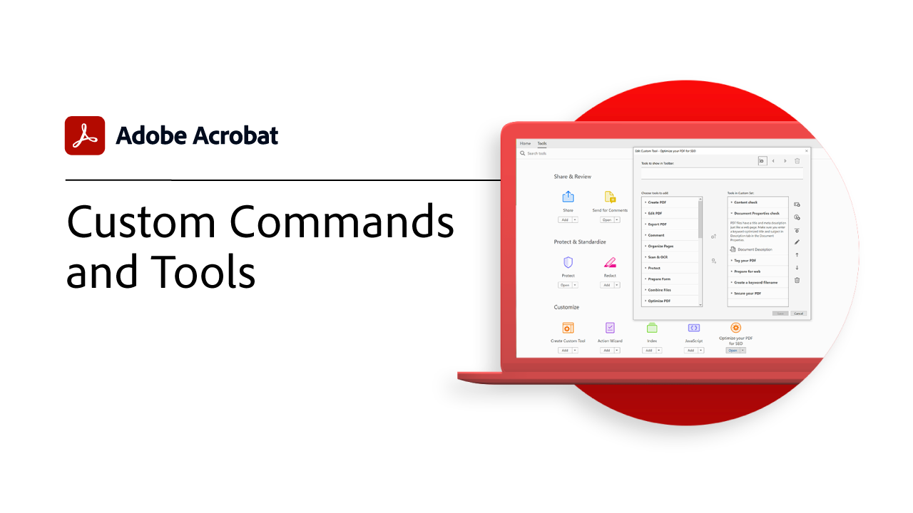
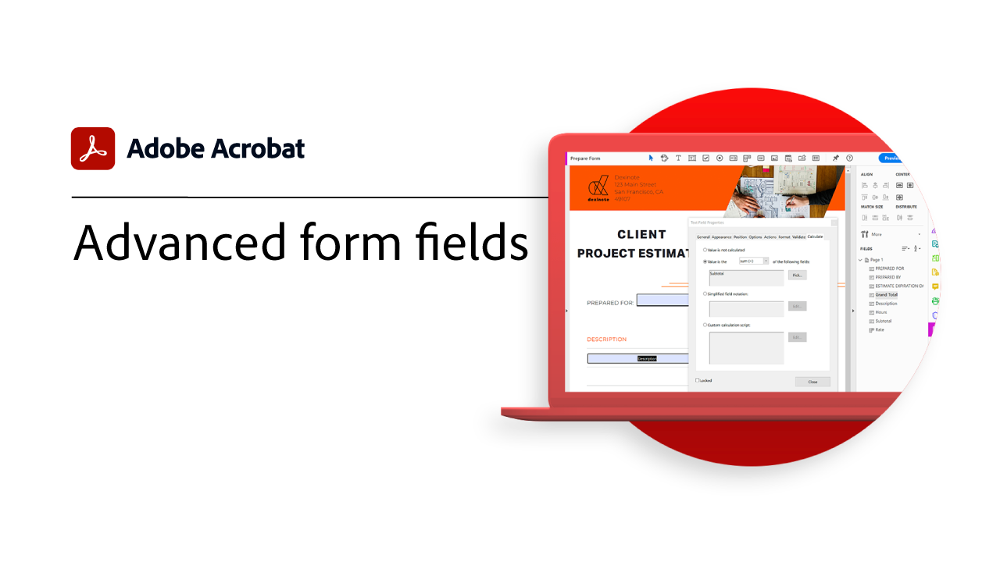
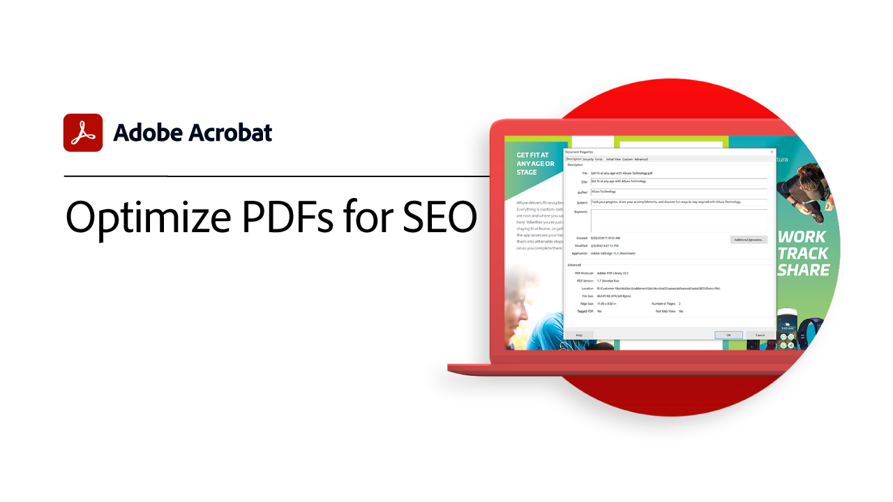
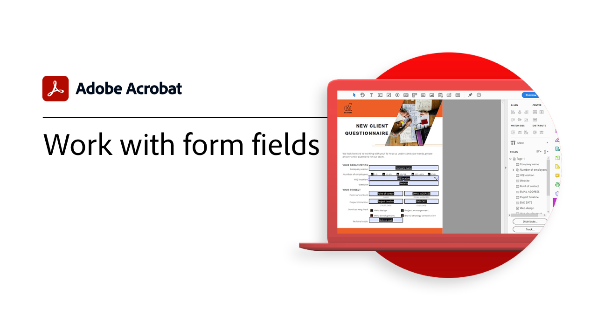
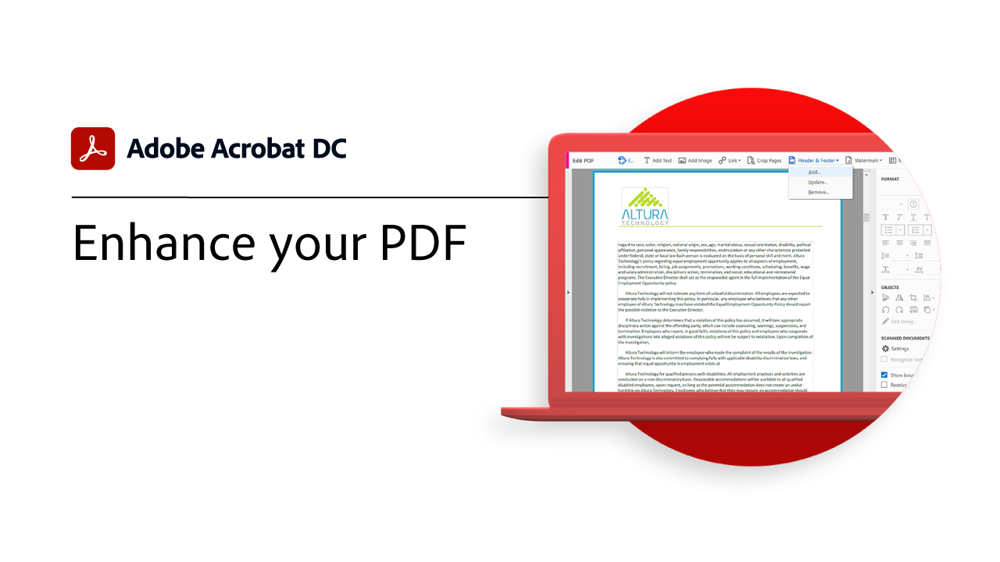
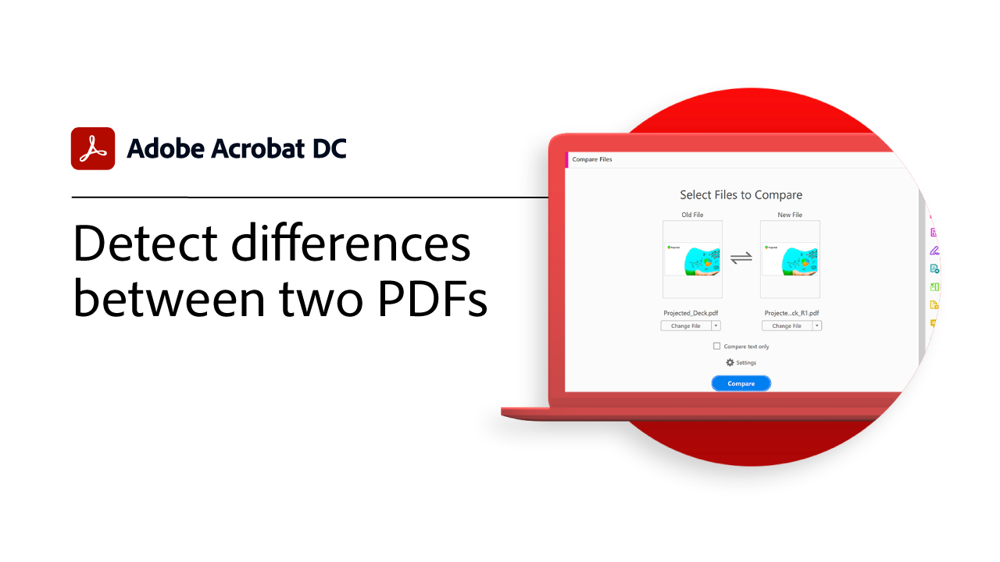
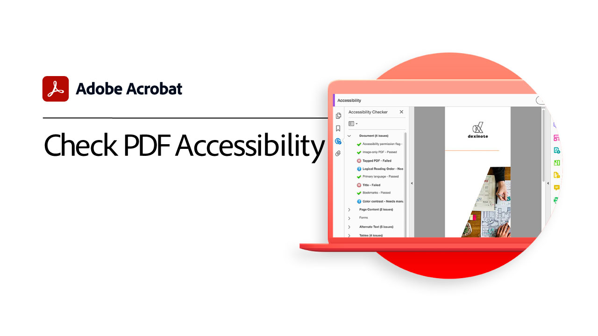
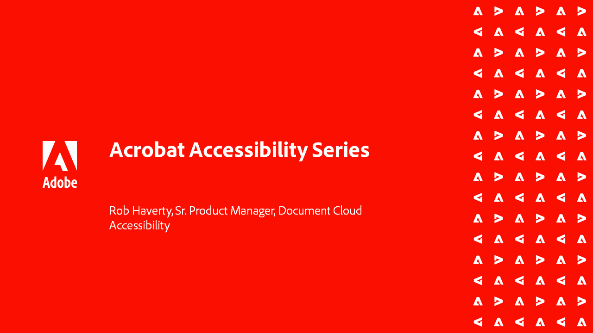

# Advanced tasks overview

Go beyond the basics with these advanced tools in Acrobat. Learn how to create an Action to repeat mundane tasks, remove sensitive information, reduce and optimize large files, quickly gather form data, and create universally Accessible PDF files.

## Acrobat tutorials

<table style="table-layout:fixed">
<tr>
  <td>
    
    

    <a href="custom.md"><strong>Custom Commands and Tools</strong></a>
    

    <em>Improve document workflow productivity by using custom commands and toolsets</em>
     
  </td>
  <td>
    
    

    <a href="advancedforms.md"><strong>Advanced form fields</strong></a>
    

    <em>Learn advanced techniques for buiding professional PDF forms</em>
     
  </td>
  <td>
    
    

    <a href="optimizeseo.md"><strong>Optimize PDFs for SEO (Search Engine Optimization)</strong></a>
    

    <em>Optimize a PDF for improved discoverability and search engine ranking on the web</em>
     
  </td>
</tr>
<tr>
  <td>
    
    

    <a href="workforms.md"><strong>Work with form fields</strong></a>
    

    <em>Add various types of form fields, set form field properties, and add security to create high-quality professional forms</em>
     
  </td>
  <td>
    
    

    <a href="enhance.md"><strong>Enhance your PDF</strong></a>
    

    <em>Transform your PDF by adding graphic enhancements and automatic numbering</em>
     
  </td>
  <td>
    
    

    <a href="compare.md"><strong>Detect differences between two PDFs</strong></a>
    

    <em>Quickly and accurately detect the differences between two PDF files</em>
     
  </td>   
</tr>
<tr>
  <td>
    
    

    <a href="action.md"><strong>Action Wizard</strong></a>
    

    <em>Save time and keystrokes by using an Action to automatically apply a set of commands to one or multiple files</em>
     
  </td>
  <td>
    
    

    <a href="redact.md"><strong>Redact & Sanitize</strong></a>
    

    <em>Permanently remove private or sensitive information from your PDF</em>
     
  </td>
   <td>
    
    

    <a href="reduce.md"><strong>Reduce file size & optimize</strong></a>
    

    <em>Reduce large files and optimize your PDFs without compromising quality for sharing, posting, or archiving</em>
     
  </td>
</tr>
<tr>
  <td>
    
    

    <a href="formdata.md"><strong>Working with form data</strong></a>
    

    <em>Compile form data into a single spreadsheet</em>
     
  </td>
  <td>
    
    

    <a href="accessibility.md"><strong>Check PDF Accessibility</strong></a>
    

    <em>Check if your PDF is universally accessible to people with disabilities</em>
     
  </td>
  <td>
    
    

    <a href="accessibility-series.md"><strong>Acrobat Accessibility series</strong></a>
    

    <em>In this six-part on-demand webinar series, go from the basics of Accessibility to a deep-dive of tagging your PDF files</em>
     
  </td>
</tr>
</table>
