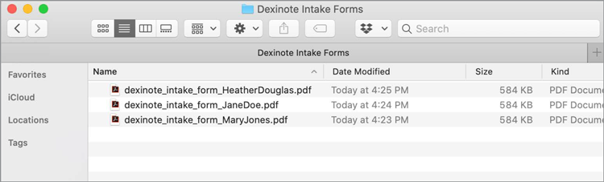
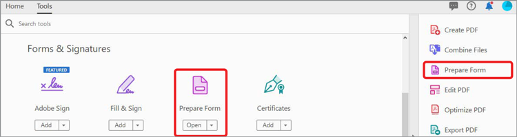
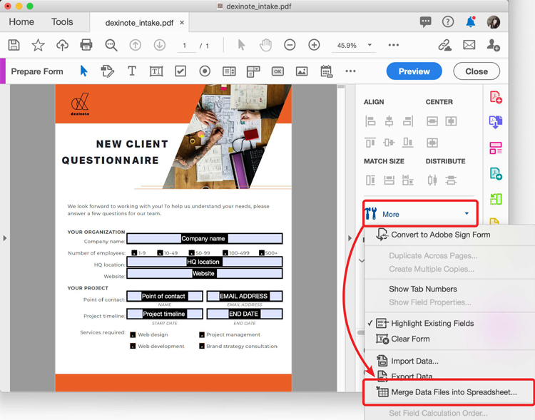
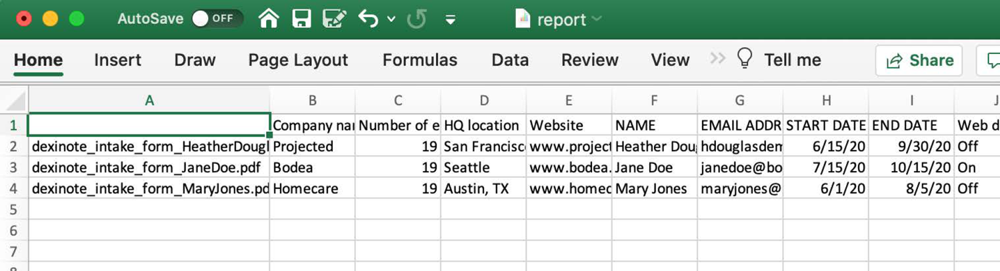

# Working with form data

If you have a set of completed forms and need to compile the data, you can use Acrobat DC to merge the responses into a single spreadsheet.

1. Start by putting all your PDF files into a folder on your computer.

    

1. Open one for the form files in Acrobat DC and select **Prepare Form** from the Tools center or pane.

    

1. In the right pane, select **More, Merge Data Files into Spreadsheet**.

    

1. Select the folder you created with the form responses and Acrobat will extract the data from each and create a spreadsheet of all the data.

    

Click to download a *PDF of the Working with form data* tutorial.

.