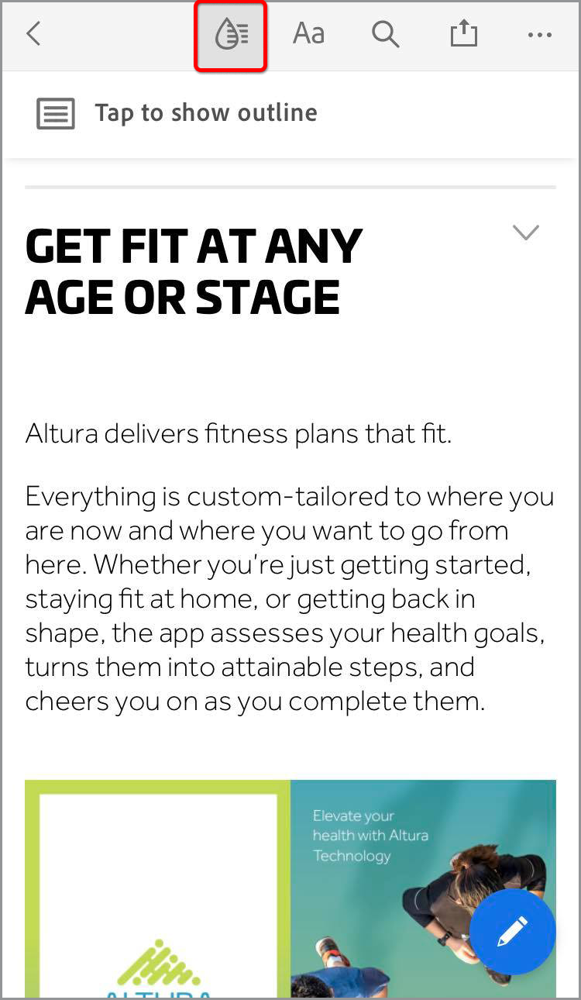
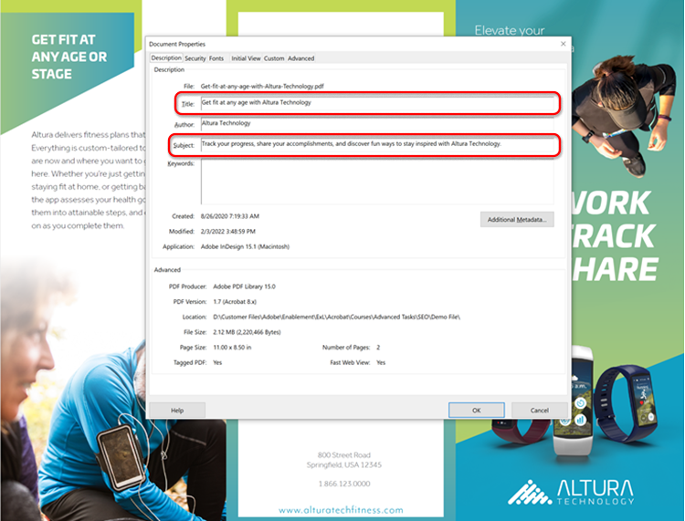
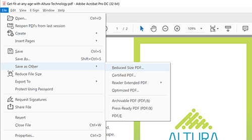
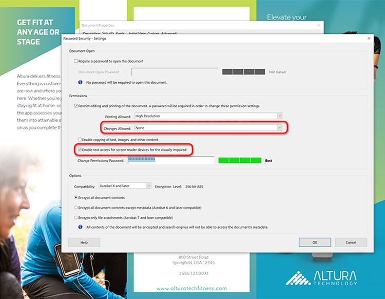

# Optimize PDFs for SEO (Search Engine Optimization)

Learn how to optimize a PDF for improved discoverability and search engine ranking on the web.

## Create unique content

Create PDF content that is different from the information your web pages. 

+++View details on how to create unique content

PDF content should be unique and structured as follows:

*   Use a single main heading/title beginning with a keyword
*   Use keyword subheadings organized in a hierarchical structure
*   Use short paragraphs containing keywords and lists
*   Add internal and external (content on your website or other websites) hyperlinks
*   Add a hyperlinked table of contents for documents longer than 25 pages
*   Run [text recognition](https://experienceleague.adobe.com/docs/document-cloud-learn/acrobat-learning/getting-started/scan-and-ocr.html) on all scanned documents
*   Build PDFs that are mobile friendly
    To check the mobile viewing experience of your PDF, open the file in the [Acrobat Reader mobile app](https://www.adobe.com/acrobat/mobile/acrobat-reader.html) and turn on Liquid Mode. Include additional subheadings if necessary to improve navigation.

    

+++

 &nbsp;

## Add Document Properties

PDF files have a title and meta description just like a web page. 

+++View details on how to add Document Properties

Add key **[!UICONTROL Document Properties]** as follows:

1. Select **[!UICONTROL File > Properties]** or use the keyboard shortcut *Ctrl + D* on Windows or *Cmd + D* on Mac and select the **[!UICONTROL Description]** tab.
1.  Enter a keyword-optimized title in the **[!UICONTROL Title:]** field.
1.  Make sure the **[!UICONTROL Author:]** field doesn’t identify a specific individual within your organization.
1.  Enter a keyword-optimized summary of your document in the **[!UICONTROL Subject:]** field.
    Try beginning the summary using an action verb like Learn, Discover, Explore, etc.
1.  Select **[!UICONTROL Additional Metadata]** to add copyright or public domain information if applicable.
    
    

+++

 &nbsp;

## Tag your PDF

>[!NOTE] 
>
>Available in Acrobat Pro only.

Tagging content in your PDF not only makes your file [Accessible](https://experienceleague.adobe.com/docs/document-cloud-learn/acrobat-learning/advanced-tasks/accessibility.html) to those with disabilities—it also improves SEO. 

+++View details on how to tag a PDF

Tag a PDF as follows:

1.  Select **[!UICONTROL Accessibility]** in the **[!UICONTROL Tools]** center.
1.  Select **[!UICONTROL Autotag Document]** in the right-hand pane.
1.  Follow the hints for repair in the left-hand pane **[!UICONTROL Recognition Report]**.
1.  Run **[!UICONTROL Set Alternate Text]** if necessary.
1.  Use keywords to describe the image in the **[!UICONTROL Alternate Text]**.
    
    

+++

 &nbsp;

## Prepare for web

Optimize the experience of interacting with your PDF by preparing it for web viewing and reducing the file size. 

+++View details on how to prepare your PDF for the web

Prepare your PDF for the web as follows:

To prepare your PDF for the web, select **[!UICONTROL File > Save as Other > Reduced Size PDF]**.

This step reduces the file size and enables **Fast Web View** in the PDF. **Fast Web View** allows the file to be immediately opened, viewed, and searched before the entire file is streamed or downloaded—-creating an optimal end-user experience. Open **[!UICONTROL Document Properties]** (*Ctrl + D* on Windows or *Cmd + D* on Mac) to determine if **Fast Web View** is enabled.

>[!TIP]
>
>If you have Acrobat Pro, run Optimize for Web and Mobile in the Action Wizard tool. This Action converts colors to sRGB and embeds fonts for consistent display of PDFs across browsers and mobile devices.

+++

 &nbsp;

## Create a keyword filename

+++View details on how to create a keyword filename

Create a keyword filename as follows:

The filename becomes part of the URL when a PDF is posted on the web. A good practice is to match your keyword-optimized title with the filename. To be search-friendly—use lowercase, no punctuation or hashes, and avoid stop words (a, an, the, and, it, for, or, but, in, my, your, our, and their, etc.). If you use separate words, add hyphens or underscores between the words.

+++

 &nbsp;

## Secure your PDF

The last step is to protect your PDF to prevent unauthorized changes. 

+++View details on how to secure your PDF

Secure a PDF as follows:

1.  Open **[!UICONTROL Document Properties]** (*Ctrl + D* on Windows or *Cmd + D* on Mac) and select the **[!UICONTROL Security]** tab.
1.  Check **[!UICONTROL Printing editing and printing of the document. A password will be required in order to change these settings.]**
1.  Under **[!UICONTROL Changes Allowed:]** select **[!UICONTROL None]**.
1.  Check **[!UICONTROL Enable text access for screen reader devices for the visually impaired.]**
1.  Enter and confirm a strong password.
1.  Select **[!UICONTROL OK]** and save the file.

    

+++

Now your PDF is ready to be posted on the web—-with optimal keyword ranking potential and end-user interaction.
