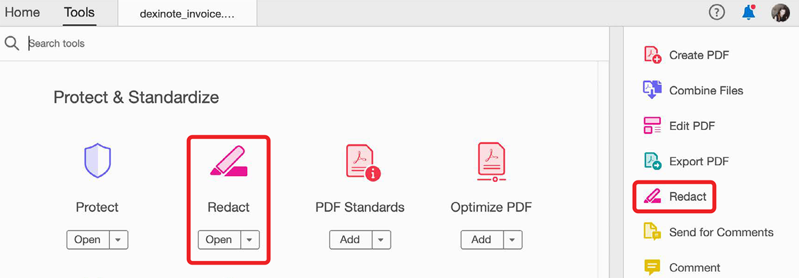
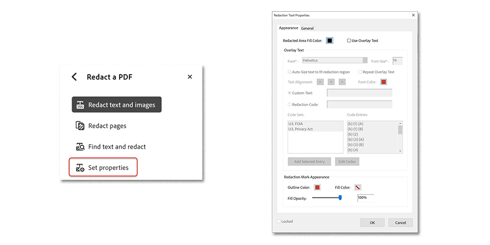
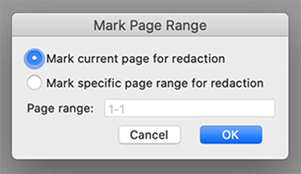
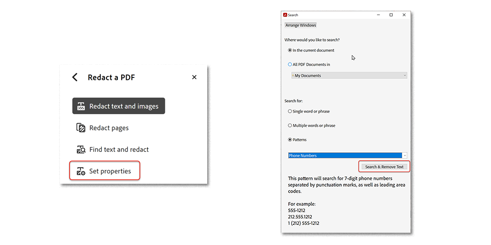
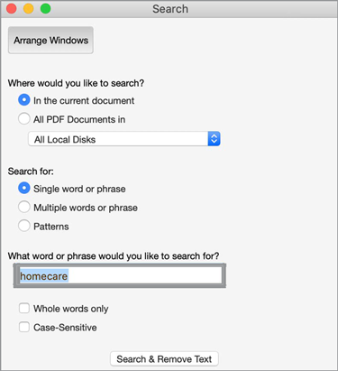
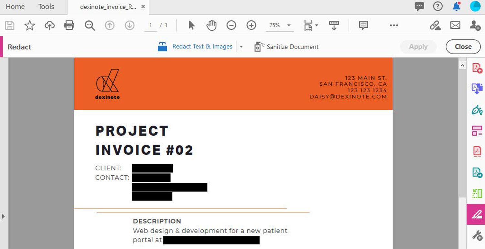
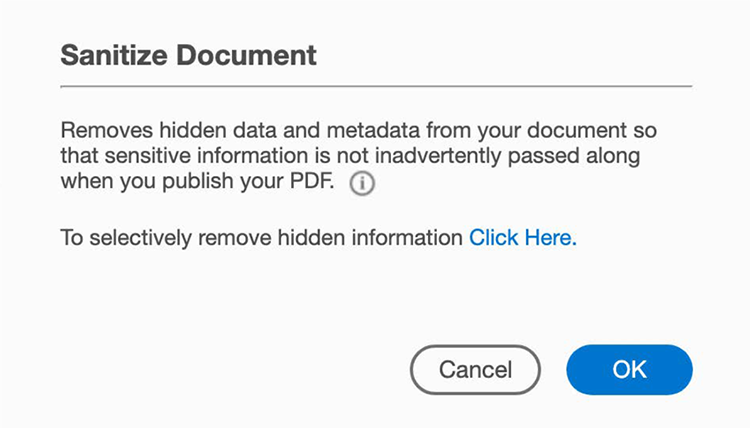

# Redact & Sanitize

Use the Redact tool to permanently remove private or sensitive information from your PDF and Sanitize document to remove information that is not visible in the file, such as
comments, metadata, or hidden layers. *Available in Acrobat Pro DC only*.

## Redact text & images

1. In Acrobat Pro DC, select **Redact** from the Tools center or pane.

1. Open **Properties** to customize the appearance of your redactions including color of redaction boxes or text overlay.

1. To redact information, first **mark** the items for removal and then **apply** the redactions. You can redact entire pages or selected content.

1. To redact an entire page or pages, select **Redact Pages**, select the page or page range which you’d like to redact, and click **Ok**.

1. To find specific content to redact, select **Redact Text & Images, Find Text & Redact**.

Use the cursor to select the content to redact and see a preview of the redaction by hovering over the selected content.

Use the search box to search for a specific word or phrase, or select **Pattern** to find certain types of information. Select the boxes next to items and click **Search & Remove Text**.

1. Click **Apply** in the Redact top menu bar to apply the marked redactions and save redacted file.

## Sanitize document

1. With the **Redact** toolbar open, click **Sanitize Document** in the top menu bar.

1. Click **OK** to confirm the removal of hidden information and all hidden information will be removed from the document. Alternatively, click to selectively remove hidden information, choose which information you want hidden, and click **Remove**.

[Download this Redact & Sanitize tutorial](../assets/AcrobatDCRedact.pdf).    