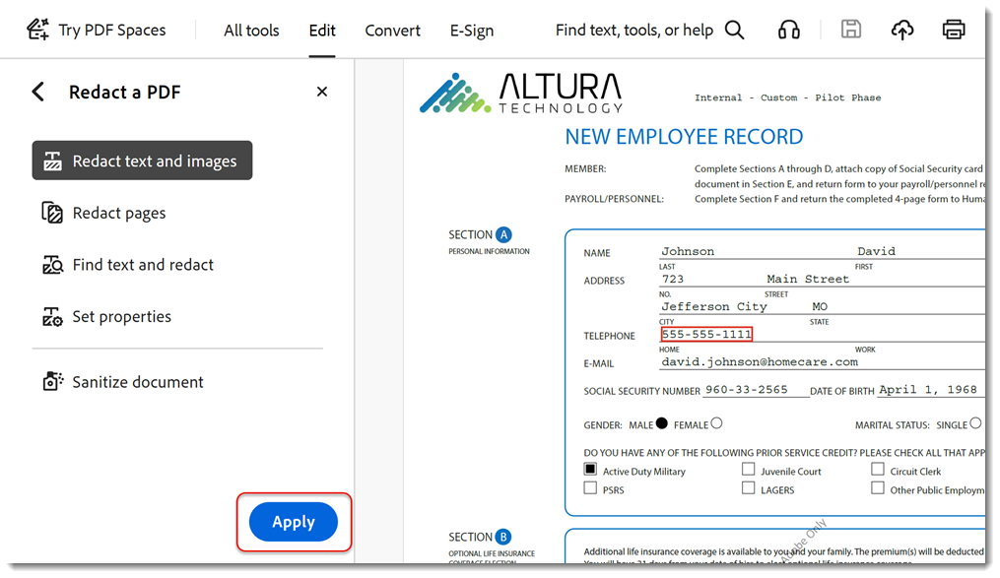
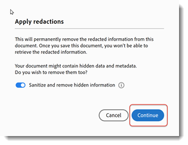

# Remove sensitive information

Learn how to use the Redact tool to permanently remove private or sensitive information from a PDF, then sanitize the document to remove information that is not visible in the file, such as comments, metadata, or hidden layers. Permanently removing sensitive content and hidden data is important so the information is not passed along when publishing your PDF. This tutorial uses the [New Acrobat experience](../getting-started/new-workspace.md).

>[!NOTE]
>
>Available in Acrobat Pro only.

[!BADGE Organizational Impact]
Customer data protection, Risk management

## How to redact information in Acrobat desktop

1. Open a file and select **[!UICONTROL All tools]** from the toolbar, then choose **[!UICONTROL Redact a PDF]**.
    

1. Select **[!UICONTROL Set properties]** to customize the appearance of your redactions including the color of redaction boxes or text overlay.

    

    To redact information, first mark the items for removal and then apply the redactions. You can redact entire pages or selected content. 

1. Select **[!UICONTROL Redact text and images]** and use the cursor to select the content to redact.

    

    You can see a preview of the redaction by hovering over the selected content.

1. Select **[!UICONTROL Find text and redact]** to search for a specific word or phrase, or search for a Pattern to find certain types of information. Set your search and select Search & Remove Text.

    

1. In the search results dialog, check the boxes next to the items and select **[!UICONTROL Mark checked results for redaction]**.

    

1. Select **[!UICONTROL Redact pages]** to mark entire pages for redaction.

    

1. Select your pages and choose **[!UICONTROL OK]**.

    

1. Select **[!UICONTROL Apply]** in the Redact a PDF panel to apply the marked redactions.

    

1. Select **[!UICONTROL Continue]** to sanitize and remove hidden information.

    

Once you confirm, the redactions and hidden information are permanently removed and saved to a new file.

>[!TIP]
>
>To speed up the redaction process, check out the [Action Wizard](../advanced-tasks/action.md).
