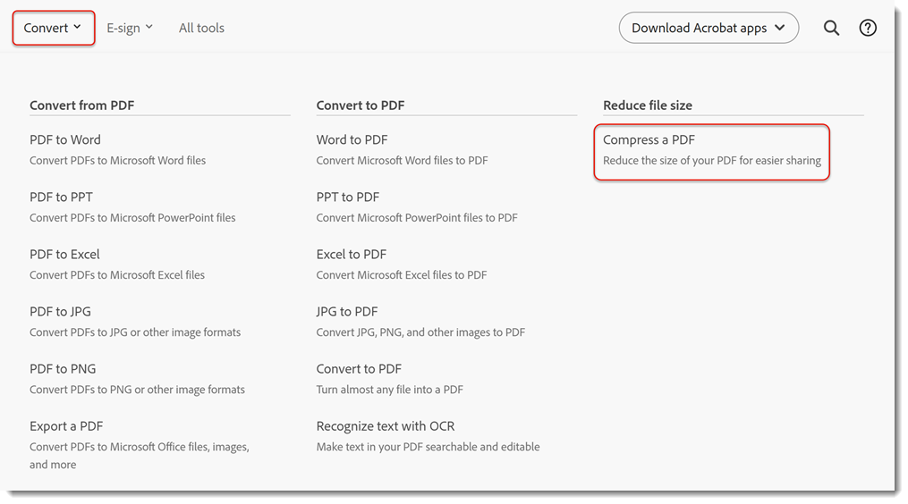
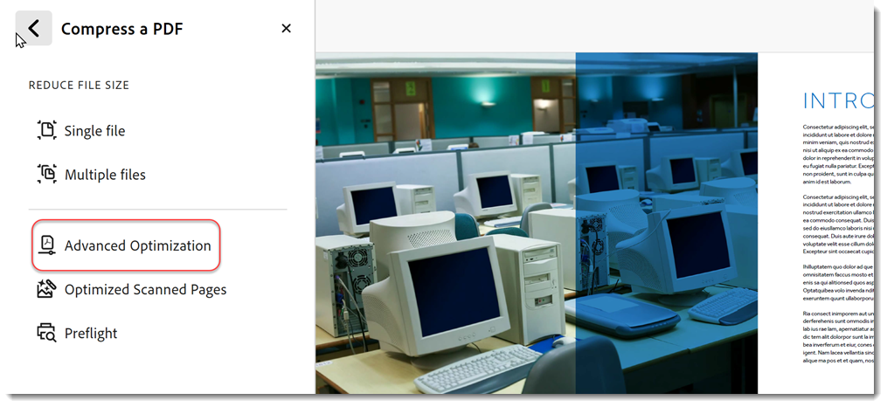
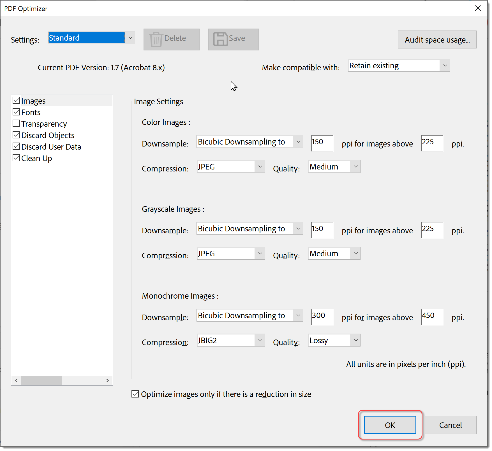
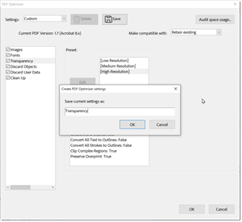

# Compress & Optimize

Learn how to compress and optimize the size of a PDF file. Compressing a PDF makes it easier to share via email or upload to websites with file size limitations. You can also enhance the viewing experience and save on storage costs by optimizing your PDF.

## How to compress a PDF in Acrobat on the desktop

1. Open a file and select **[!UICONTROL All tools]** from the toolbar, then choose **[!UICONTROL Compress a PDF]**.

    

1. Select **[!UICONTROL Single files]** or **[!UICONTROL Multiple files]** in the **[!UICONTROL Compress a PDF]** panel and choose **[!UICONTROL Save]**.

    The file is reduced to the smallest size possible while retaining the document's quality.

    

1. Select **[!UICONTROL Save]**.

## How to compress a PDF in Acrobat on the web

1. Sign in to [acrobat.adobe.com](https://acrobat.adobe.com/) in a browser.

1. Select **[!UICONTROL Convert > Compress a PDF]** from the top menu.

    

1. Choose **[!UICONTROL Select files]**, select your files, and choose [!UICONTROL Open].

    

1. Select a compression level and choose **[!UICONTROL Compress]**.

    

## How to optimize a PDF in Acrobat on the desktop

>[!NOTE]
>
>Optimizing a PDF is only available in Acrobat Pro on the desktop.

1. Select **[!UICONTROL Advance Optimization]** from the **[!UICONTROL Compress a PDF]** panel.

    

    By default **Standard** is selected in the **Settings** menu. If you change any settings in the PDF Optimizer dialog box, the **Settings** menu automatically switches to **Custom**.

1. From the **Make Compatible With** dropdown, choose **Retain Existing** to keep the current PDF version, or choose an Acrobat version. Select the check box next to a panel (for example, Images, Fonts, Transparency), and then select options in that panel, then choose **[!UICONTROL OK] and **[!UICONTROL Save]** the file. 

    

    To prevent all of the options in a panel from executing during optimization, deselect the check box for that panel.

1. (Optional) To save your customized settings, select **[!UICONTROL Save]** and name the settings. To delete a saved setting, choose it in the **Settings** menu and select **[!UICONTROL Delete]**.

    

>[!TIP]
>
>To optimize multiple PDF files, try using the [Action Wizard](../advanced-tasks/action.md).