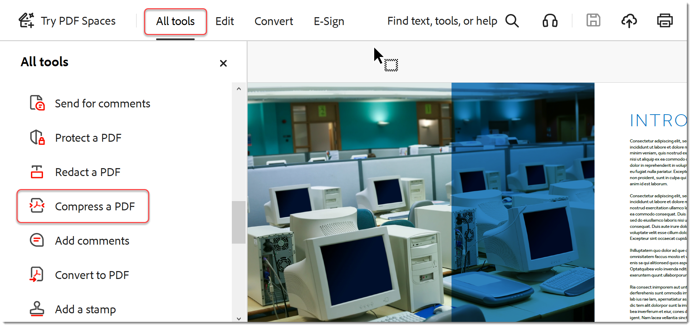
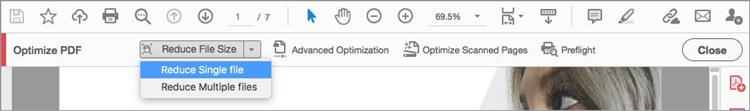
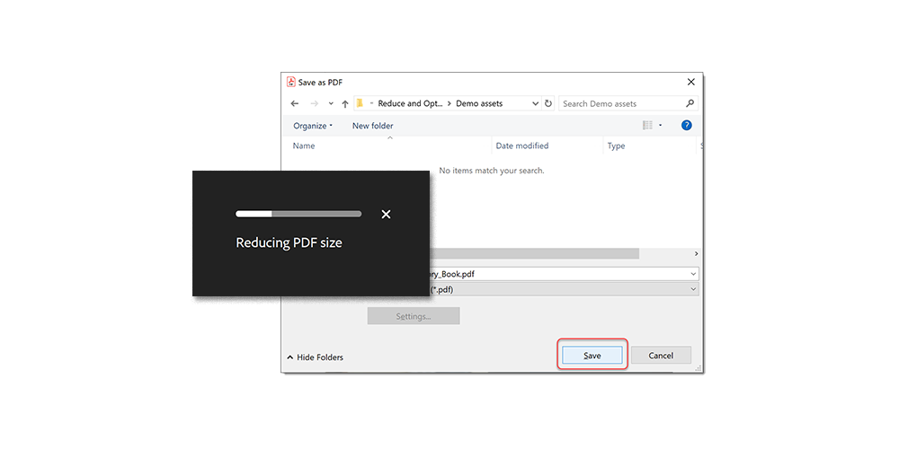
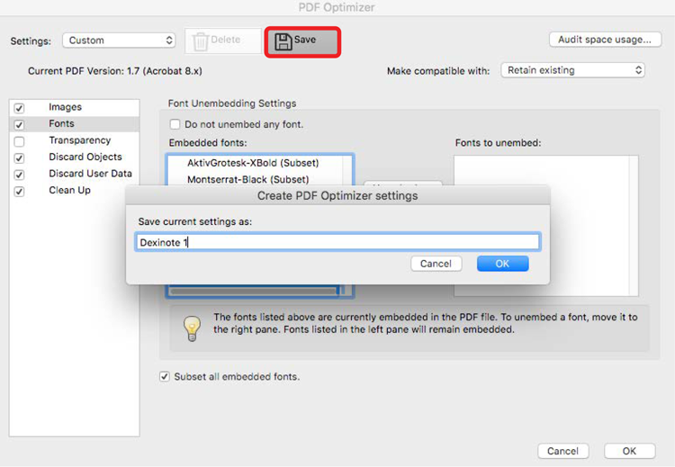

# Reduce file size & optimize

Reduce large files and optimize your PDFs without compromising quality for sharing, posting, or archiving.

>[!NOTE]
>
>Available in Acrobat Pro DC only.

1. In Acrobat Pro DC, select **Optimize PDF** from the Tools center or pane.

    

1. Select **Reduce File Size** and chose whether you want to reduce a single file or multiple files. The file will be reduced to the smallest size possible while retaining the documents quality.

    

1. To optimize your file, choose **Advance Optimization**. Then select from options in the PDF Optimizer.

    

1. To use the default settings, choose **Standard** from the **Settings** menu. If you change any settings in the **PDF Optimizer** dialog box, the **Settings** menu automatically switches to **Custom**.

1. From the **Make Compatible With** menu, choose **Retain Existing** to keep the current PDF version, or choose an Acrobat version. Select the check box next to a panel (for example, Images, Fonts, Transparency), and then select options in that panel. To prevent all of the options in a panel from executing during optimization, deselect the check box for that panel.

    

1. **(Optional)** To save your customized settings, click **Save** and name the settings. To delete a saved setting, choose it in the **Settings** menu and click **Delete**.

    

Click to download a PDF of the *Reduce file size & optimize* tutorial.    

.
