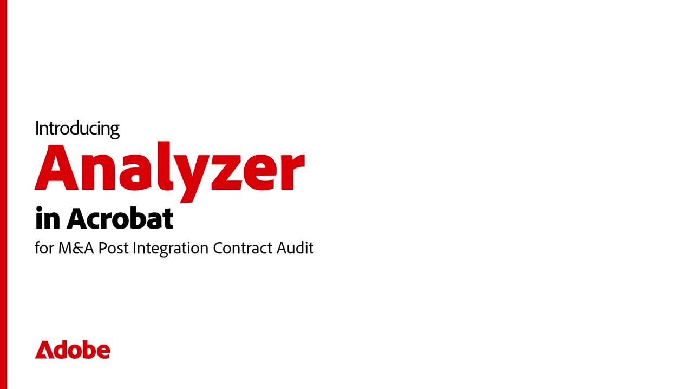

# Analyzer in Acrobat Studio overview

Analyzer in Acrobat Studio helps business users extract structured, auditable insights from tens of thousands of unstructured documents to automate document-centric business processes.

## What's new

>[!BEGINTABS]

>[!TAB Get started]

[Get started](get-started.md) learning how to pull structured, cited data out of large volumes of documents.

>[!TAB Use Collections]

Learn how to create manual and linked [Collections](collections.md), apply attributes, and keep documents organized as your content grows,

>[!ENDTABS]

## Analyzer in Acrobat Studio tutorials

<table style="table-layout:fixed">
<tr>
  <td>
    
    

    <a href="get-started.md"><strong>Get started</strong></a>
    

    Learn how Analyzer in Acrobat Studio helps you pull structured, cited data out of large volumes of documents
     
  </td>
  <td>
    
    

    <a href="collections.md"><strong>Use Collections</strong></a>
    

    Learn how to create manual and linked Collections, apply attributes, and keep documents organized as your content grows
     
  </td>
  <td>
    
    

    <a href="m-and-a-post-audit.md"><strong>M&A post integration contract audit</strong></a>
    

    Learn how Analyzer can help businesses run a M&A post integration contract audit in minutes instead of weeks
     
  </td>
  <td>
      
      

       
  </td>
</tr>
</table>