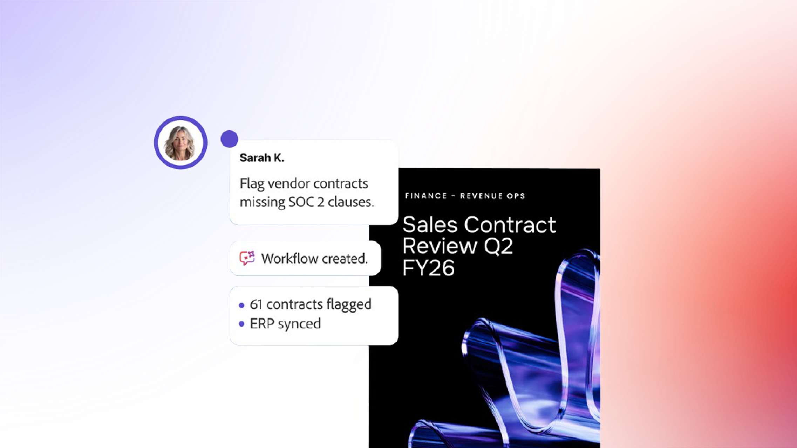
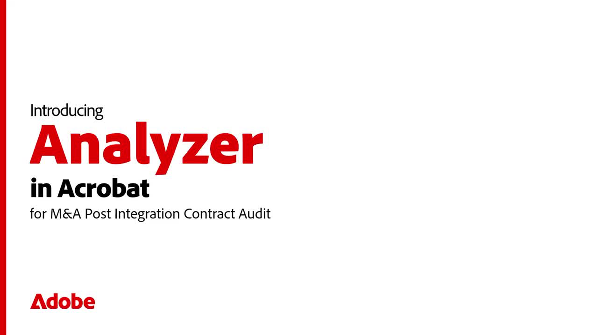
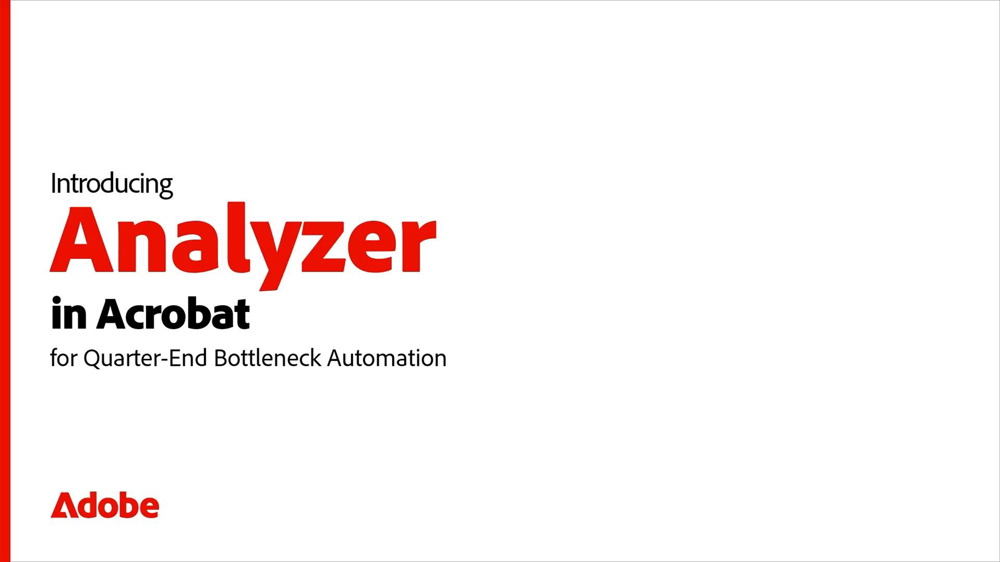
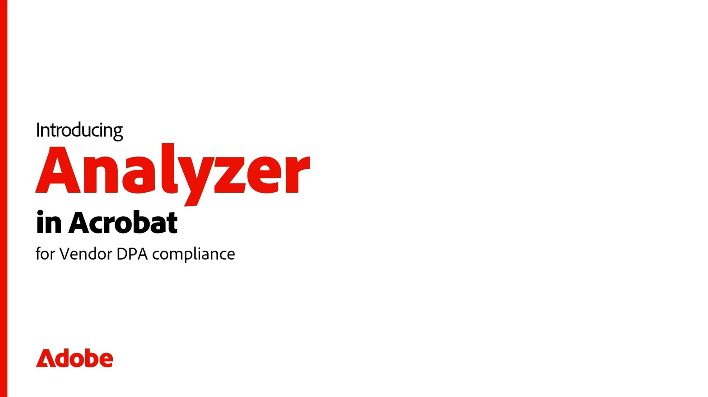

# Analyzer in Acrobat Studio overview

Analyzer in Acrobat Studio helps business users extract structured, auditable insights from tens of thousands of unstructured documents to automate document-centric business processes.

## What's new

>[!BEGINTABS]

>[!TAB Get started]

[Get started](get-started.md) learning how to pull structured, cited data out of large volumes of documents.

>[!TAB Use Collections]

Learn how to create manual and linked [Collections](collections.md), apply attributes, and keep documents organized as your content grows.

>[!TAB Work with Attributes]

Learn how to create, test, and refine [Attributes](attributes.md) with Analyzer in Acrobat Studio.

>[!TAB Explore advanced capabilities]

Learn how to [export extracted data, share a collection, compare two documents, and use AI Assistant](advanced.md) for quick, ad-hoc questions.

>[!TAB Use cases in action]

Learn about real [use cases](use-cases/use-case-overview.md) and how different teams leverage Analyzer in Acrobat Studio to work smarter and faster.

>[!ENDTABS]

## Essentials

Get started with the basics. Learn how to use Analyzer in Acrobat Studio to quickly understand, summarize, and interact with your documents.

<table style="table-layout:fixed">
<tr>
  <td>
    
    

    <a href="get-started.md"><strong>Get started</strong></a>
    

    Learn how Analyzer in Acrobat Studio helps you pull structured, cited data out of large volumes of documents
     
  </td>
  <td>
    
    

    <a href="collections.md"><strong>Use Collections</strong></a>
    

    Learn how to create manual and linked Collections, apply attributes, and keep documents organized as your content grows
     
  </td>
  <td>
    
    

    <a href="attributes.md"><strong>Work with Attributes</strong></a>
    

    Learn how to create, test, and refine attributes with Analyzer in Acrobat Studio
     
  </td>
  <td>
    
    

    <a href="advanced.md"><strong>Explore advanced capabilities</strong></a>
    

    Learn how to export extracted data, share a collection, compare two documents, and use AI Assistant for quick, ad-hoc questions
     
  </td>
</tr>
</table>

## Use cases in action

See real-world scenarios. Learn how different teams leverage Analyzer in Acrobat Studio to work smarter and faster.

<table style="table-layout:fixed">
<tr>
  <td>
    
    

    <a href="use-cases/m-and-a-post-audit.md"><strong>M&A: Audit contracts after an acquisition</strong></a>
    

    Learn how M&A teams can analyze large contract sets to identify key obligations, terms, and potential risks in minutes instead of weeks
     
  </td>
  <td>
    
    

    <a href="use-cases/accelerate-revenue.md"><strong>Finance: Review contracts for revenue recognition & audits</strong></a>
    

    Learn how finance teams can prepare for audits, support revenue recognition, and identify accounting risks faster
     
  </td>
  <td>
    
    

    <a href="use-cases/data-privacy-risk.md"><strong>Privacy & information security: Review data privacy agreements</strong></a>
    

    Learn how privacy and information security teams can identify compliance gaps and validate obligations with traceable results
     
  </td>
  <td>
    
    

    <a href="use-cases/identify-margin-erosion.md"><strong>Construction: Find margin risks in subcontracts</strong></a>
    

    Learn how construction and project teams can find missed change orders, aging RFIs, and gaps in subcontract protections before they affect margins
     
  </td>
<tr>
<td>
    
    

    <a href="use-cases/vendor-risk.md"><strong>Information security audit: Identifying vendor risk</strong></a>
    

    Learn how to pro-actively identify information security risk from vendor contracts
     
  </td>
  <td>
    
    

     
  </td>
  <td>
    
    

     
  </td>
  <td>
    
    

     
  </td>
</tr>
</tr>
</table>