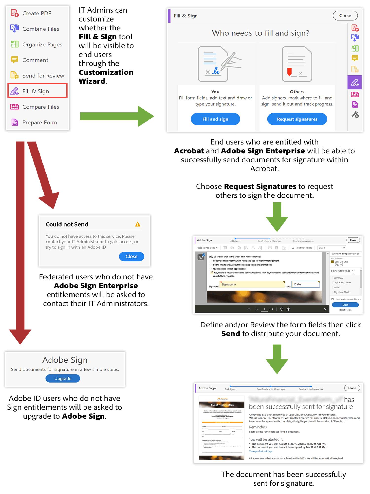
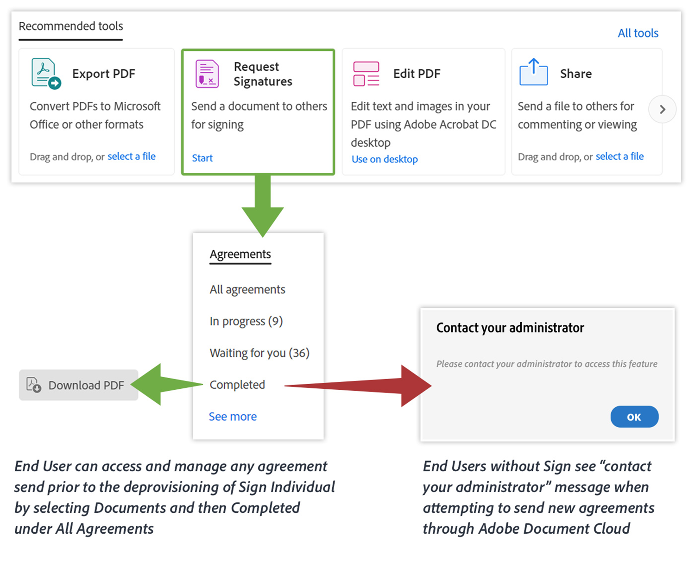

# Important Acrobat DC product updates for ETLA customers

[!DNL Adobe Sign Individual] (also known as Adobe Sign Pro) will be deprovisioned from all Acrobat DC entitlements included in ETLA (Enterprise Term License Agreement) offers only beginning August 2020 and will continue through November 20, 2020. [!DNL Adobe Sign Individual] does not provide enterprise-grade functionality and should be replaced with Adobe Sign Enterprise for enterprise customers. This includes Acrobat DC licensed as a stand-alone app and Acrobat DC licensed as part of Creative Cloud for enterprise – All Apps.

Access to [!DNL Adobe Sign Individual] is available in Acrobat via the **Adobe Sign** tool or the **Fill & Sign** tool ([Request signatures](https://www.adobe.com/acrobat/online/request-signature.html){target="_blank"}).

![[!DNL Adobe Sign Individual] access in Acrobat DC](../assets/Deploy_SignEntitle1.png)

If you have not updated Acrobat DC to the latest version, the tool may be labelled "Send for Signature".

## Why are we deprovisioning this?

[In October 2018, we released an all-new Acrobat DC](https://news.adobe.com/news/news-details/2018/Adobe-Redefines-What-Is-Possible-With-PDF-With-All-New-Acrobat-DC). This latest release includes new tools and functionality to better work with PDFs across mobile devices, the web and desktop, plus all-new collaboration tools. As an Acrobat DC subscriber, you should already have these great features available. Another major update we released was to our electronic signature solution Adobe Sign.

Prior to the October 2018 release, Acrobat DC users have been able to send documents out for e-signature using tools in Acrobat labelled "Fill & Sign" (or "Adobe Sign" or "Send for Signature") which were provisioned with [!DNL Adobe Sign Individual] entitlement.

While having this option has provided a great way to capture e-signatures, we are deprovisioning [!DNL Adobe Sign Individual] because it does not provide the Enterprise grade functionality that is available through Adobe Sign Enterprise, such as:

* Ability to centrally manage users who have permission to send agreements or sign
* Allowing admins to manage agreements that are sent and used across the organization
* Providing granular controls to manage electronic signatures across the organization

In addition, Adobe Sign Enterprise offers more functionality compared to what was available in the [!DNL Adobe Sign Individual] entitlement, including, but not limited to:

* Administration
  * Single Sign on
  * Account Delegation
* Integrations
  * Prebuilt Enterprise Integrations with Dropbox, Salesforce, Workday, etc.
  * Adobe Sign is the preferred e-signature solution across the [Microsoft](https://acrobat.adobe.com/us/en/business/integrations/microsoft.html) enterprise portfolio, including Office 365, SharePoint, Dynamics, Teams, and Flow
* Customization and Optimization
  * Enhanced e-signature authentication, Advanced ID-based signer identity verification, workflow designer, advanced language support, etc.

Adobe Sign is the industry-leading globally recognized solution for capturing legally compliant signatures. Adobe Sign is built from the ground up to meet any of your organization's e-signature needs, with IT admin-friendly tools to ensure you and your users are using e-signatures that fully comply with the various regional and industry regulations around e-signatures. Please visit [here](https://helpx.adobe.com/enterprise/using/adobe-sign-for-enterprise.html) for more info on managing Sign through [Adobe Admin Console](https://helpx.adobe.com/enterprise/using/admin-console.html).

Please reach out to your Adobe contact to discuss how you can continue providing your organization e-signature capabilities through our broader digital document platform that includes Acrobat DC and Adobe Sign Enterprise.

## Access to existing agreements

Users will still be able to access any agreements sent out prior to this action via Adobe Document Cloud by signing in with their Adobe ID at https://documentcloud.adobe.com. If this user is scheduled for migration to Sign Enterprise, they will need to follow these [instructions](https://helpx.adobe.com/sign/kb/how-to-download-signed-documents---adobe-sign.html).

## Acrobat DC experience without [!DNL Sign Individual] entitlement

Users who have Adobe Sign Enterprise entitlements will be able to send agreements within Acrobat using either the Adobe Sign or [!UICONTROL Fill & Sign] (Request signatures) tool.
Users who do not have Adobe Sign Enterprise entitlements will not be able to send out new agreements and will receive an error message. The graphic below outlines possible outcomes.

## Adobe Document Cloud Web experience without Sign Individual entitlement

Users will be able to login to https://documentcloud.adobe.com/ to access and download any agreements that have been sent out prior to deprovisioning Adobe Sign Individual entitlement.

## For more information, visit the below pages:

* [Sign in to Adobe Document Cloud](https://helpx.adobe.com/document-cloud/help/sign-in.html) 
* [Managing files (Where are my files?)](https://helpx.adobe.com/document-cloud/help/manage-files.html)
* [Using [!UICONTROL Acrobat Customization Wizard] for configuration](https://www.adobe.com/devnet-docs/acrobatetk/tools/Wizard/WizardDC/index.html)
* [Overview of [!UICONTROL Admin Console]](https://helpx.adobe.com/enterprise/using/admin-console.html)
* [Managing Adobe Sign on the [!UICONTROL Admin Console]](https://helpx.adobe.com/enterprise/using/adobe-sign-for-enterprise.html)

**Revisions** May 20, 2020; original post – August 2019
