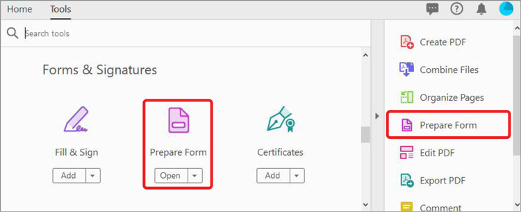
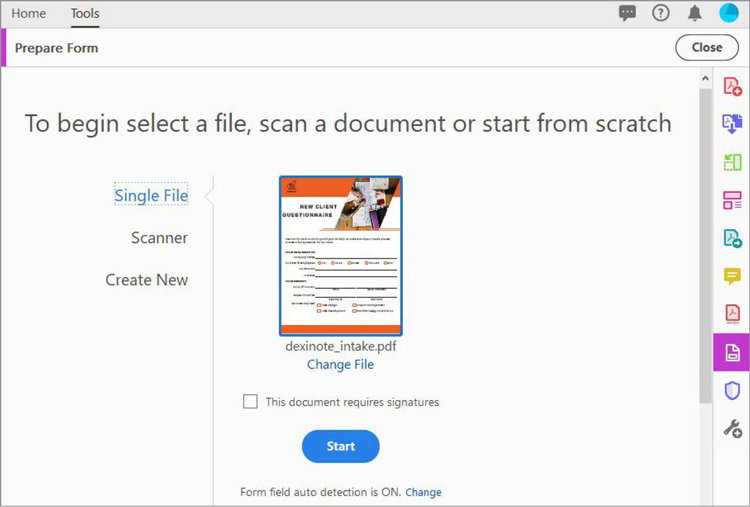
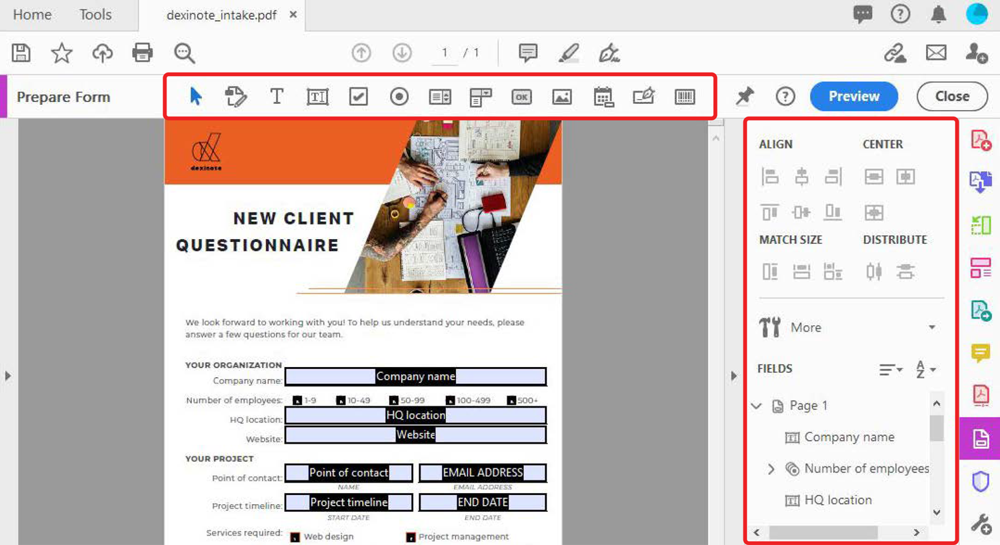
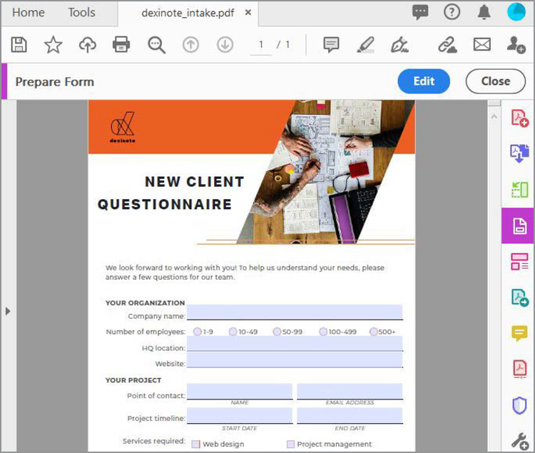
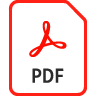

# Create fillable forms

Turn a scanned paper form or document created in InDesign, Microsoft Word, Excel, or other application into a fillable PDF form in Acrobat DC.

1. Select **[!UICONTROL Prepare Form]** from the [!UICONTROL Tools] center.

    

1. Select an existing document to use as your form (for example, a Word, Excel, InDesign, or PDF file). 

    If [!UICONTROL Form Field Auto Detection] is ON, Acrobat automatically detects form fields in the PDF. 

1. Click **[!UICONTROL Start]** to create the form.

    

    Edit the form using the options shown. Drag and drop fields from the top menu bar and edit form field details in the right pane. 

1. Click **[!UICONTROL Preview]** to see your form after fields are added.

    

    Easily return to **[!UICONTROL Edit]** to continue work.

    

1. Click **[!UICONTROL File > Save As]** to save the PDF form.

Click to download a PDF of the *Create fillable forms* tutorial.    

