# Getting started overview

Learn how to start using Adobe Acrobat through these brief step-by-step tutorials. From creating a document to protecting or [editing your PDF files](https://www.adobe.com/acrobat/online/pdf-editor.html){target="_blank"}, this content is designed to ease you into PDF workflows.

## What's new

* [New workspace experience](new-workspace.md)
  Learn about the new workspace in Acrobat that helps you quickly discover tools and complete your PDF tasks efficiently

* [Discover PDF insights with the AI Assistant](ai-assistant.md)
  Learn how to gain insights from your PDF files using the AI Assistant
  
* [Convert PDF to different file formats](export-pdf.md)
  Learn how to convert your PDF files to different file formats—like Microsoft Word, Excel, or PowerPoint

* [Edit text in a PDF](edit-pdf.md)
  Learn how to edit words, phrases, or even entire pages in your PDF

## Getting started tutorials

<table style="table-layout:fixed">
<tr>
  <td>
    
  </td>
  <td>
    
    

    <a href="get-to-know-the-acrobat-dc-interface.md"><strong>Workspace basics</strong></a>
    

    <em>See how the Acrobat workspace makes it easy to access files and tools across desktop, web, and mobile</em>
     
  </td>
  <td>
    
  </td>
  <td>
    <a href="acrobatweb.md">
      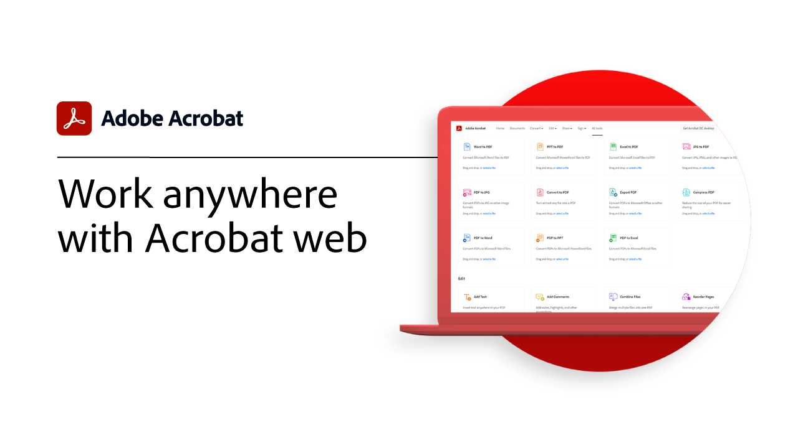
    </a>
    

    <a href="acrobatweb.md"><strong>Work anywhere with Acrobat web</strong></a>
    

    <em>Learn how to handle business document requests from anywhere using the Acrobat web tools in your browser</em>
     
  </td>
</tr>
<tr>
  <td>
    
    

     <a href="productivity.md"><strong>Productivity on the go</strong></a>
    

    <em>Do more right from your tablet or mobile phone with the Acrobat Reader mobile app</em>
     
  </td>
    <td>
      <a href="../integrate/integrate-overview.md#microsoft">
        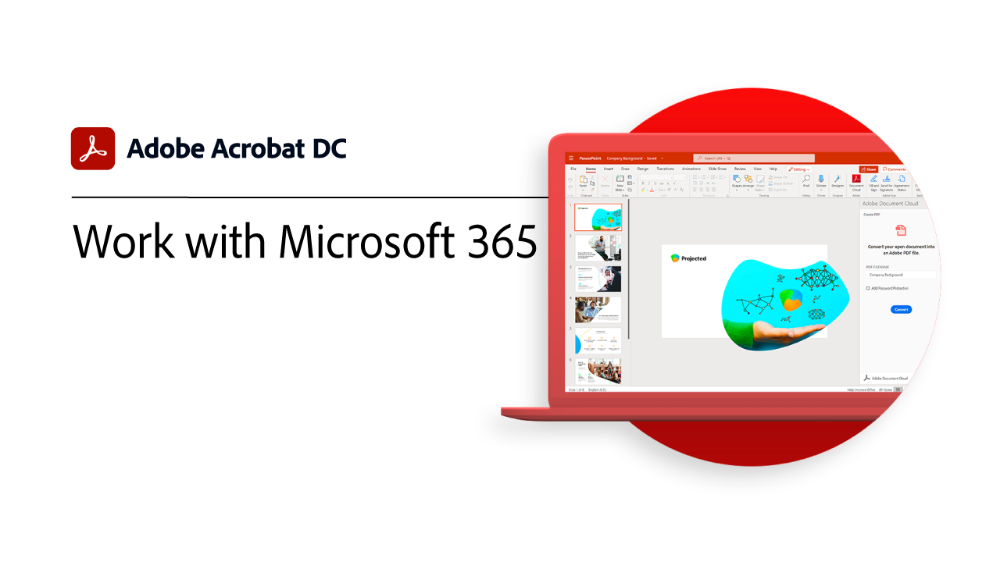
      </a>
      

      <a href="../integrate/integrate-overview.md#microsoft"><strong>Work with Microsoft 365</strong></a>
      

      <em>Increase productivity and business document workflows with Acrobat and [!DNL Microsoft 365]</em>
       
    </td>
    <td>
      
      

      <a href="where-do-pdfs-come-from.md"><strong>Where do PDFs come from?</strong></a>
      

      <em>Understand where PDFs come from and their uses</em>
       
    </td>
    <td>
    
      

       
    </td>
  </tr>
  </table>

## Creating, combining, and organizing tutorials

  <table style="table-layout:fixed">
  <tr>
    <td>
      
      

      <a href="create-pdf.md"><strong>Create a PDF</strong></a>
      

      <em>Create PDFs from all different kinds of documents</em>
       
    </td>
    <td>
      <a href="combine-to-pdf.md">
        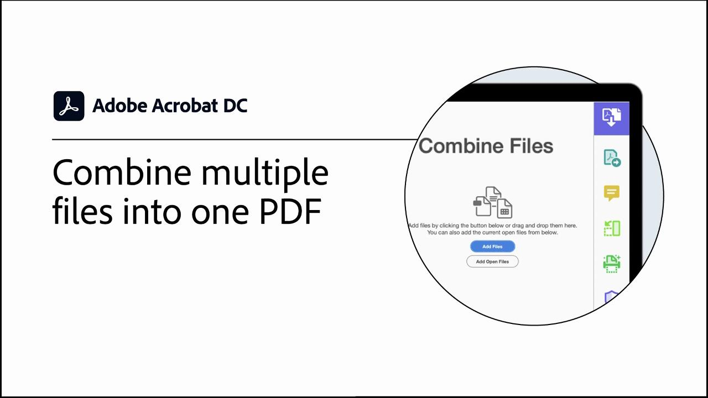
      </a>
      

      <a href="combine-to-pdf.md"><strong>Combine files to PDFs</strong></a>
      

      <em>Combine many different types of files into a single PDF</em>
       
    </td>
    <td>
      <a href="organize.md">
        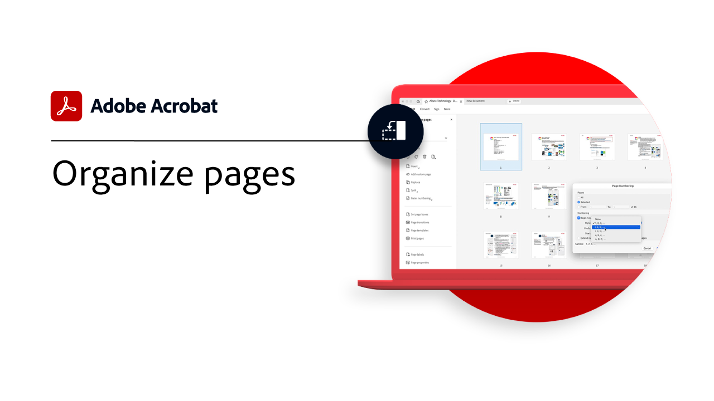
      </a>
      

      <a href="organize.md"><strong>Organize pages</strong></a>
      

      <em>Add, replace, extract, rotate, delete, and rearrange pages in your PDF</em>
       
    </td>
    <td>
      
      

      <a href="add-custom-page.md"><strong>Add custom page</strong></a>
      

      <em>Learn how to add custom pages to your PDF using the integrated Adobe Express app</em>
       
    </td>
  </tr>
  </table>

## Editing and exporting tutorials

  <table style="table-layout:fixed">
  <tr>
    <td>
      
      

      <a href="edit-pdf.md"><strong>Edit text in a PDF</strong></a>
      

      <em>Learn how to edit text in a PDF</em>
       
    </td>
    <td>
      <a href="stylize-this-PDF.md">
        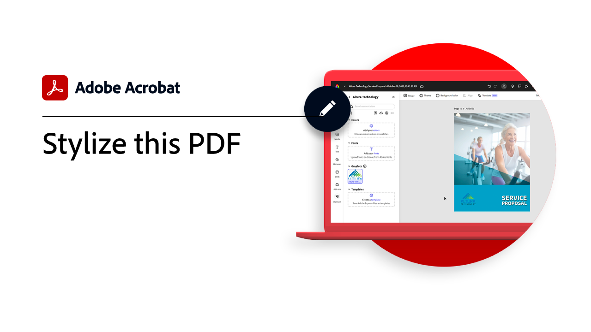
      </a>
      

      <a href="stylize-this-PDF.md"><strong>Stylize this PDF</strong></a>
      

      <em>Learn about the new editing mode that auto-adjusts content</em>
       
    </td>
   <td>
      <a href="auto-adjust-layout.md">
        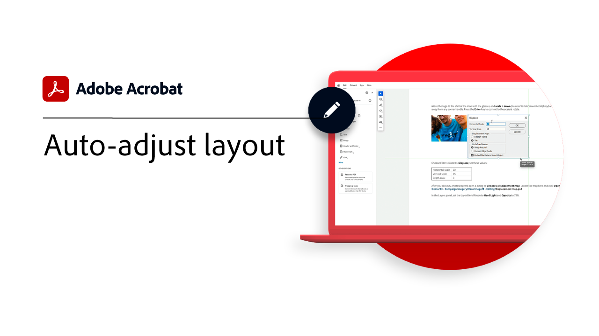
      </a>
      

      <a href="auto-adjust-layout.md"><strong>Auto-adjust layout</strong></a>
      

      <em>Learn about the new editing mode that auto-adjusts content</em>
       
    </td>
    <td>
      
      

      <a href="export-pdf.md"><strong>Convert PDF to different file formats</strong></a>
      

      <em>Learn how to convert your PDF files to different file formats—like Microsoft Word, Excel, or PowerPoint</em>
       
    </td>
  </tr>
  </table>

## Collaboration tutorials

  <table style="table-layout:fixed">
  <tr>
    <td>
      <a href="collaborate.md">
        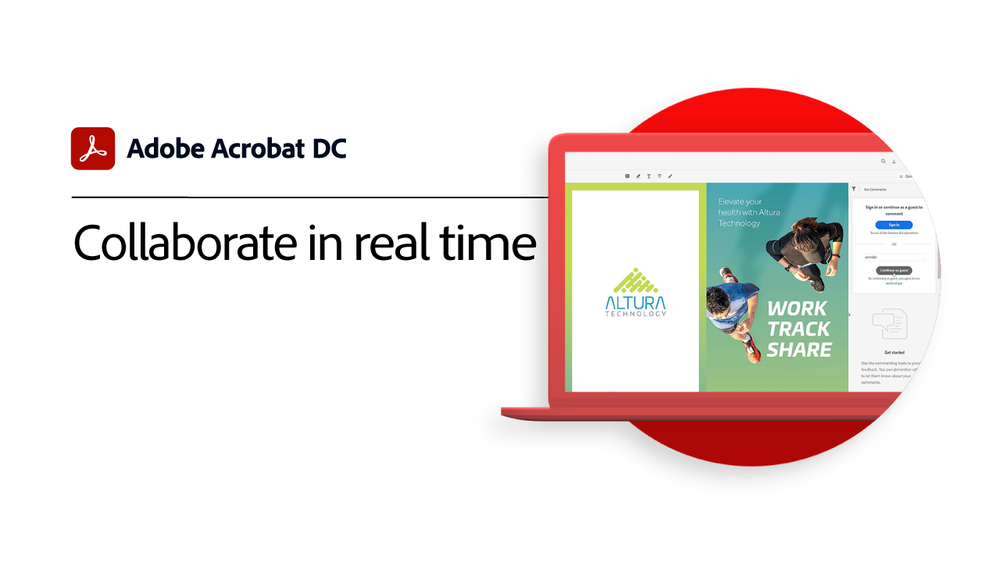
      </a>
      

      <a href="collaborate.md"><strong>Collaborate in real time</strong></a>
      

      <em>Move your projects forward by collecting comments, collaborating on responses, and tracking progress on your documents all in real-time, from anywhere</em>
       
    </td>
    <td>
      <a href="comment-on-pdf-files.md">
        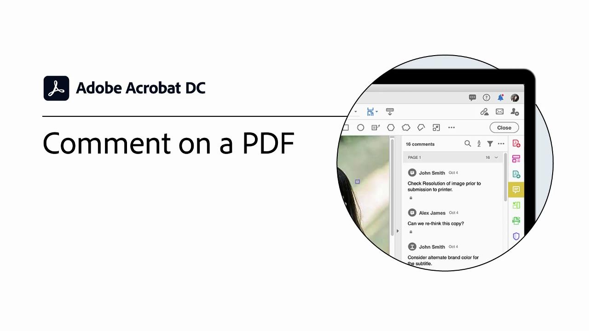
      </a>
      

      <a href="comment-on-pdf-files.md"><strong>Comment on a PDF</strong></a>
      

      <em>Add comments to a PDF file and then share it with others</em>
       
    </td>
    <td>
    
      

       
    </td>
    <td>
    
      

       
    </td>
</tr>
</table>

## Additional tutorials

<table style="table-layout:fixed">
<tr>
  <td>
    <a href="create-fillable-forms.md">
      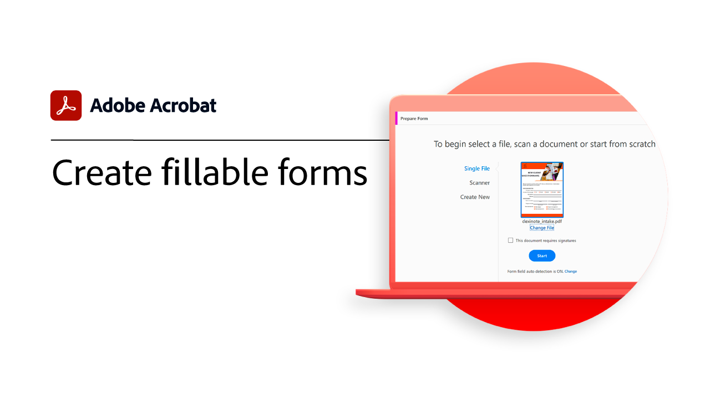
    </a>
    

    <a href="create-fillable-forms.md"><strong>Create fillable forms</strong></a>
    

    <em>Turn a document created in other application into a fillable PDF form</em>
     
  </td>
  <td>
    <a href="fill-and-sign.md">
      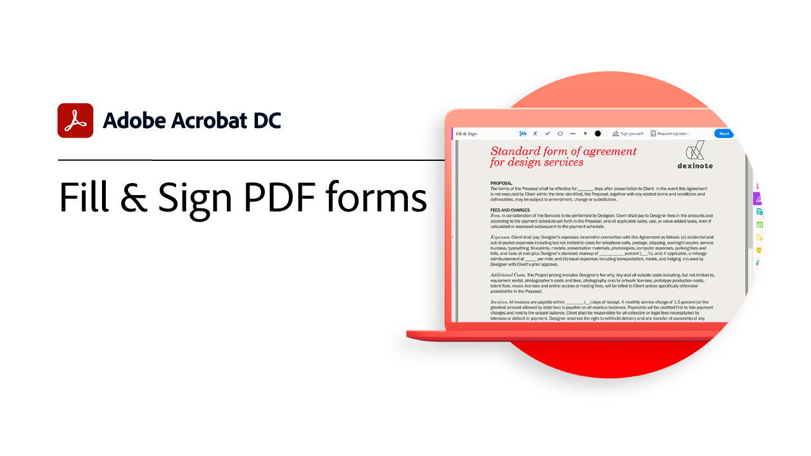
    </a>
    

    <a href="fill-and-sign.md"><strong>Fill & Sign PDF forms</strong></a>
    

    <em>Quickly fill in and sign a PDF form</em>
     
  </td>
  <td>
    <a href="scan-and-ocr.md">
      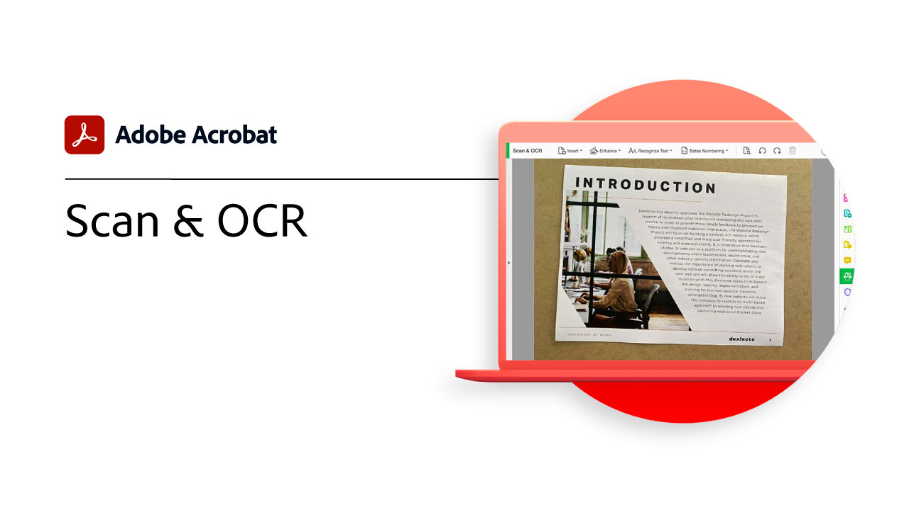
    </a>
    

    <a href="scan-and-ocr.md"><strong>Scan & OCR</strong></a>
    

    <em>Reduce large files and optimize your PDFs without compromising quality for sharing, posting, or archiving</em>
     
  </td>
  <td>
    <a href="password-protect.md">
      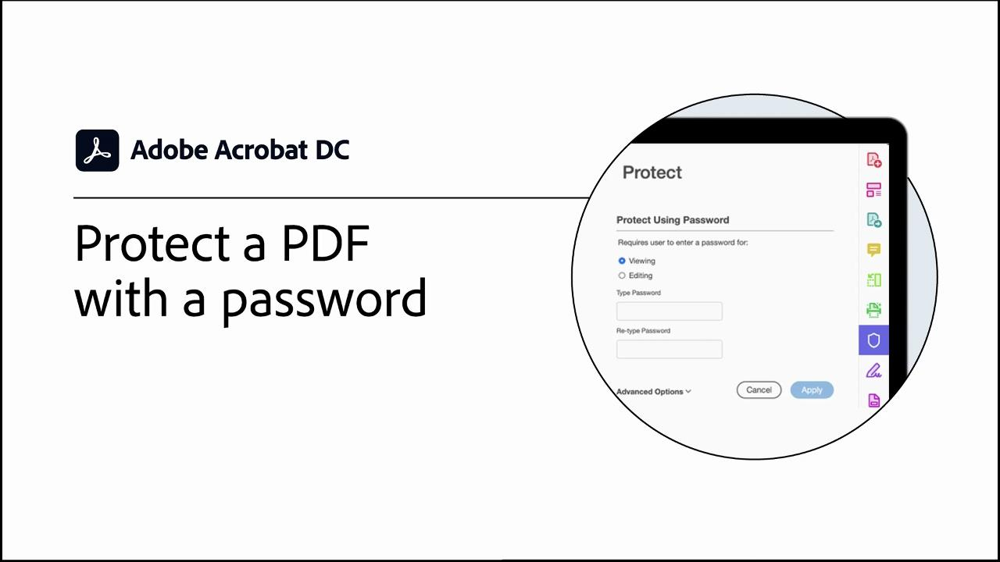
    </a>
    

    <a href="password-protect.md"><strong>Protect a PDF file with a password</strong></a>
    

    <em>Add a password to your PDF to protect others from opening or editing the file</em>
     
  </td>
</tr>
<tr>
  <td>
    <a href="signatures.md">
      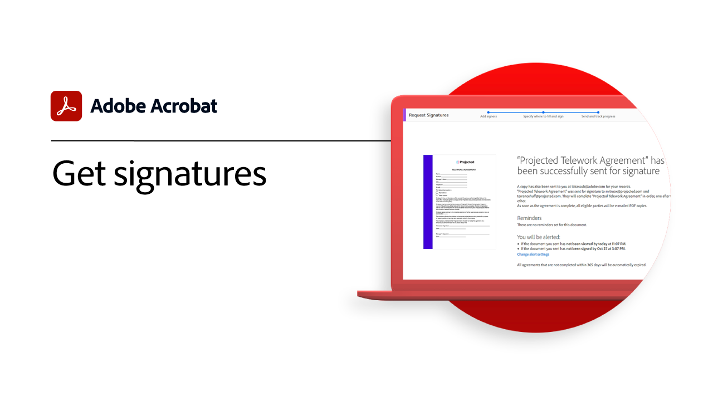
    </a>
    

    <a href="signatures.md"><strong>Get signatures</strong></a>
    

    <em>Keep business moving by collecting legally binding e-signatures from others — from anywhere</em>
     
  </td>
  <td>
    <a href="track.md">
      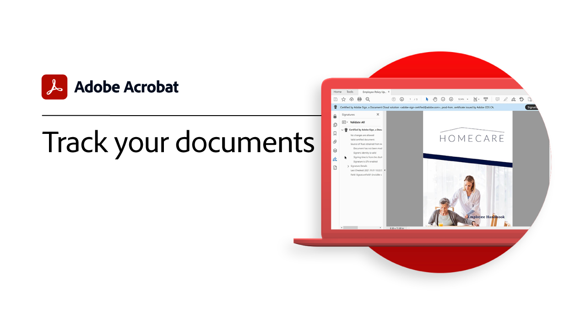
    </a>
    

    <a href="track.md"><strong>Track your documents</strong></a>
    

    <em>Always know which files are waiting on signatures and which have been signed</em>
     
  </td>
  <td>
   
    

     
  </td>
  <td>
   
    

     
  </td>
</tr>
</table>
