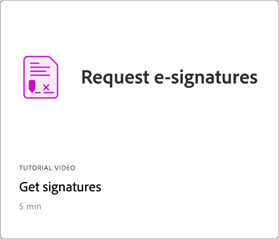

# Getting started overview

Learn how to start using Adobe Acrobat through these brief step-by-step tutorials. From creating a document to protecting or [editing your PDF files](https://www.adobe.com/acrobat/online/pdf-editor.html){target="_blank"}, this content is designed to ease you into PDF workflows.

## What's new

* [New workspace experience](new-workspace.md)
  Learn about the new workspace in Acrobat that helps you quickly discover tools and complete your PDF tasks efficiently
* [Discover PDF insights with the AI Assistant](ai-assistant.md)
  Learn how to gain insights from your PDF files using the AI Assistant
* [Convert PDF to different file formats](export-pdf.md)
  Learn how to convert your PDF files to different file formats—like Microsoft Word, Excel, or PowerPoint
* [Edit text in a PDF](edit-pdf.md)
  Learn how to edit words, phrases, or even entire pages in your PDF

## Getting started tutorials

<table style="table-layout:fixed">
<tr>
  <td>
    
  </td>
  <td>
    
  </td>
  <td>
    
  </td>
  <td>
    
  </td>
</tr>
<tr>
  <td>
    <a href="productivity.md">
      
  </td>
    <td>
      <a href="../integrate/integrate-overview.md#microsoft">
        
    </td>
    <td>
      
    </td>
    <td>
    
      

       
    </td>
  </tr>
  </table>

## Creating, combining, and organizing tutorials

  <table style="table-layout:fixed">
  <tr>
    <td>
      
    </td>
    <td>
      <a href="combine-to-pdf.md">
        
    </td>
    <td>
      
    </td>
    <td>
      
    </td>
  </tr>
  </table>

## Editing and exporting tutorials

  <table style="table-layout:fixed">
  <tr>
    <td>
      
    </td>
    <td>
      
    </td>
   <td>
      
    </td>
    <td>
      
    </td>
  </tr>
  </table>

## Collaboration tutorials

  <table style="table-layout:fixed">
  <tr>
    <td>
      
    </td>
    <td>
      
    </td>
    <td>
    
      

       
    </td>
    <td>
    
      

       
    </td>
</tr>
</table>

## Additional tutorials

<table style="table-layout:fixed">
<tr>
  <td>
    
  </td>
  <td>
    
  </td>
  <td>
    
  </td>
  <td>
    
  </td>
</tr>
<tr>
  <td>
    
  </td>
  <td>
    
  </td>
  <td>
   
    

     
  </td>
  <td>
   
    

     
  </td>
</tr>
</table>
