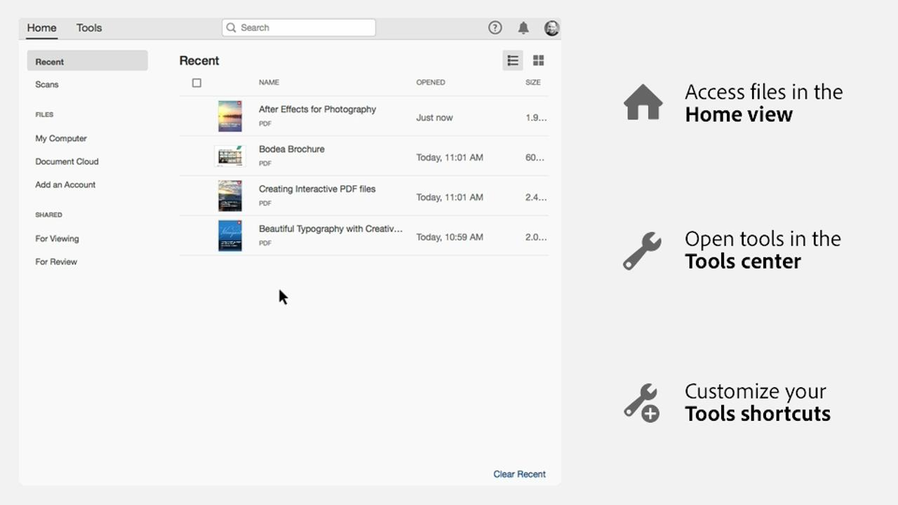
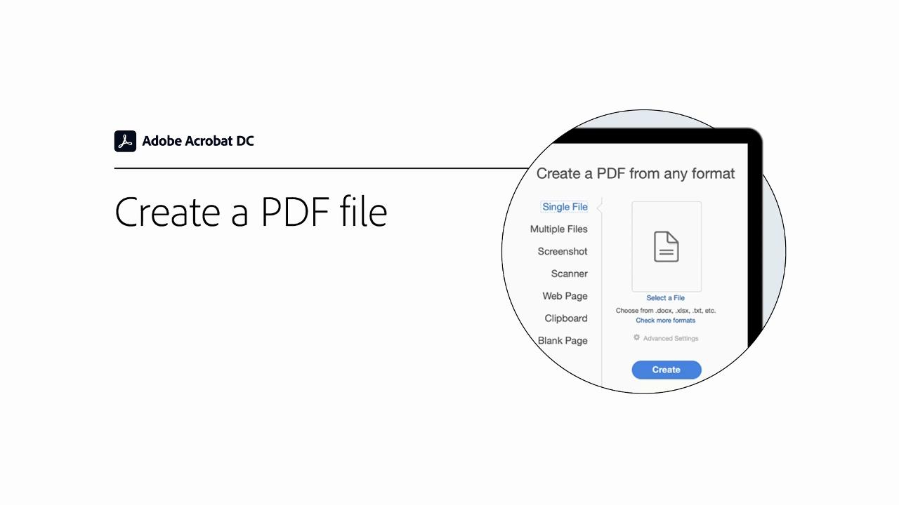
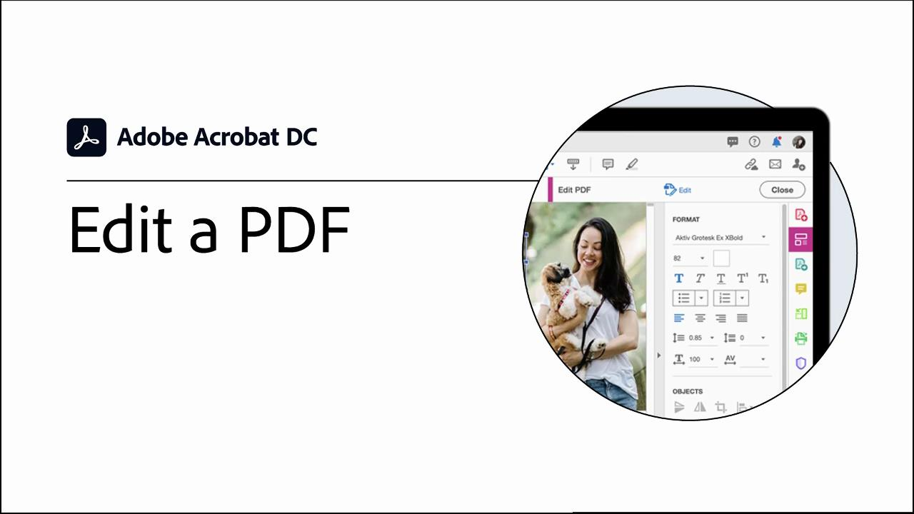
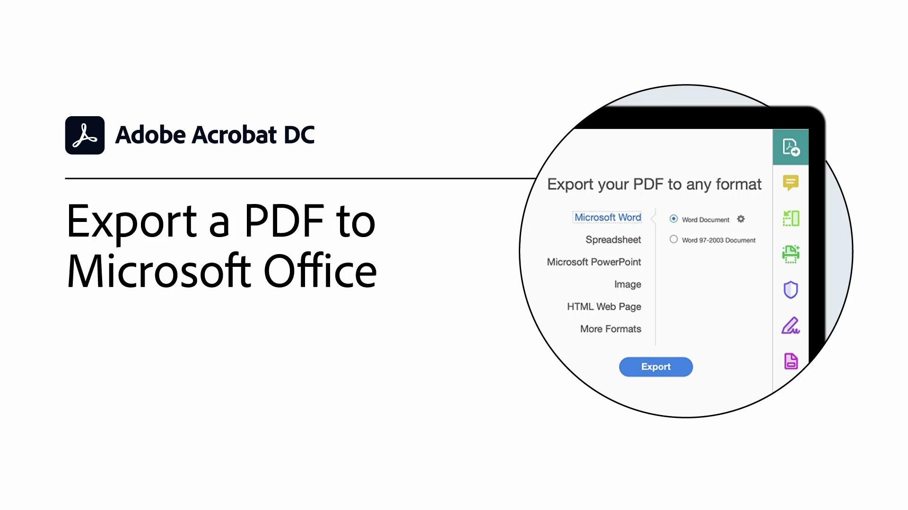
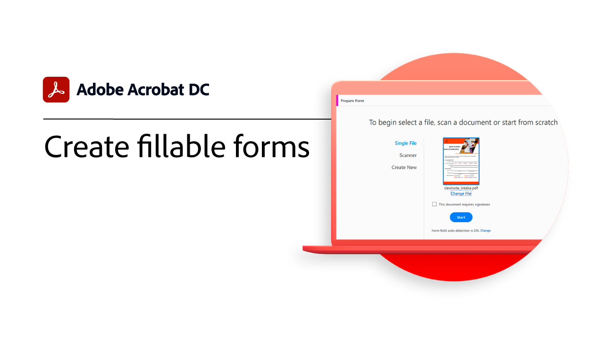
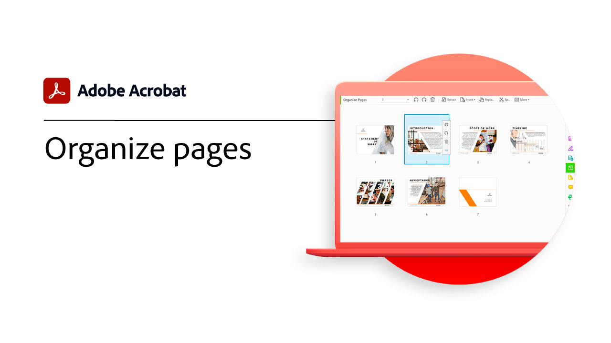
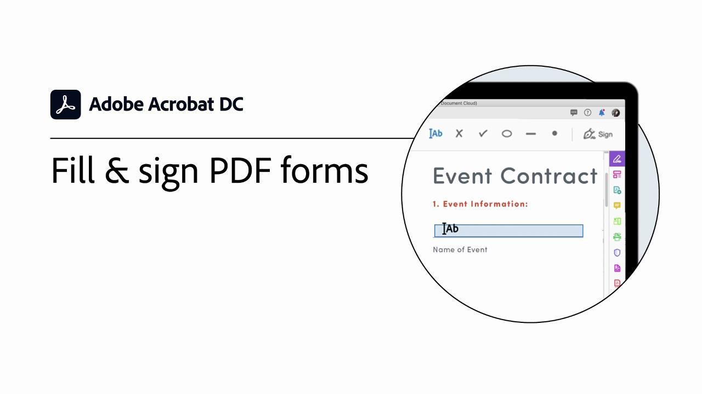

# Getting started overview

Learn how to start using Adobe Acrobat through these brief (1-2 min) step-by-step tutorials. From creating a document to protecting your PDF files, this content is designed to ease you into PDF workflows.

## Acrobat tutorials

<table style="table-layout:fixed">
<tr>
  <td>
    
    

    <a href="get-to-know-the-acrobat-dc-interface.md"><strong>Get to know the Acrobat DC interface</strong></a>
    

    <em>See how the Adobe Acrobat DC interface makes it easy to access files and tools across desktop, web, and mobile</em>
     
  </td>
  <td>
    
    

    <a href="acrobatweb.md"><strong>Work anywhere with Acrobat web</strong></a>
    

    <em>Learn how to handle business document requests from anywhere using the Acrobat web tools in your browser</em>
     
  </td>
  <td>
    
    

     <a href="combine-to-pdf.md"><strong>Combine files to PDFs</strong></a>
    

    <em>Combine many different types of files into a single PDF</em>
     
  </td>
</tr>
<tr>
  <td>
    
    

    <a href="create-pdf.md"><strong>Create PDF files</strong></a>
    

    <em>Create PDFs from all different kinds of documents</em>
     
  </td>
  <td>
    
    

    <a href="comment-on-pdf-files.md"><strong>Comment on PDF files in Acrobat DC</strong></a>
    

    <em>Add comments to a PDF file and then share it with others</em>
     
  </td>  
  <td>
    
    

    <a href="edit-pdf.md"><strong>Edit a PDF in Acrobat DC</strong></a>
    

    <em>Edit text and images in PDF files</em>
     
  </td>
</tr>
<tr>
  <td>
    
    

    <a href="export-pdf.md"><strong>Export a PDF to editable formats</strong></a>
    

    <em>Learn how to export your PDF files to editable formats</em>
     
  </td>
  <td>
    
    

    <a href="create-fillable-forms.md"><strong>Create fillable forms</strong></a>
    

    <em>Turn a document created in other application into a fillable PDF form</em>
     
  </td>  
  <td>
    
    

    <a href="scan-and-ocr.md"><strong>Scan & OCR</strong></a>
    

    <em>Reduce large files and optimize your PDFs without compromising quality for sharing, posting, or archiving</em>
     
  </td>
</tr>
<tr>
  <td>
    
    

    <a href="organize.md"><strong>Organize Pages</strong></a>
    

    <em>Add, replace, extract, rotate, delete, and move pages in your PDF</em>
     
  </td>
  <td>
    
    

    <a href="password-protect.md"><strong>Protect a PDF file with a password</strong></a>
    

    <em>Add a password to your PDF to protect others from opening or editing the file</em>
     
  </td>
  <td>
    
    

    <a href="fill-and-sign.md"><strong>Fill and sign a PDF form</strong></a>
    

    <em>Quickly fill in and sign a PDF form</em>
     
  </td>
</tr>
<tr>
  <td>
    
    

    <a href="where-do-pdfs-come-from.md"><strong>Where do PDFs come from?</strong></a>
    

    <em>Understand where PDFs come from and their uses</em>
     
  </td>
  <td>
   
    

     
  </td>
  <td>
   
    

     
  </td>
</tr>
</table>
