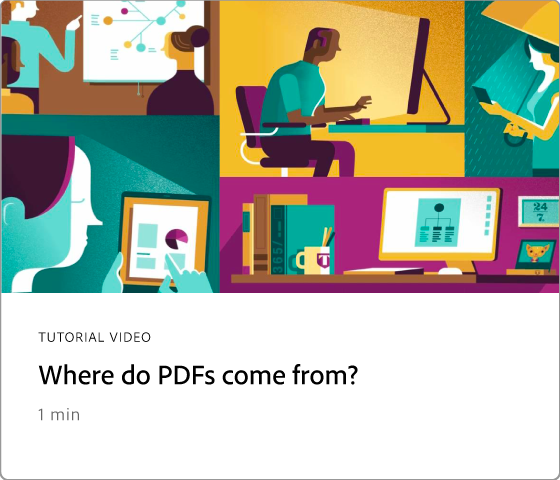
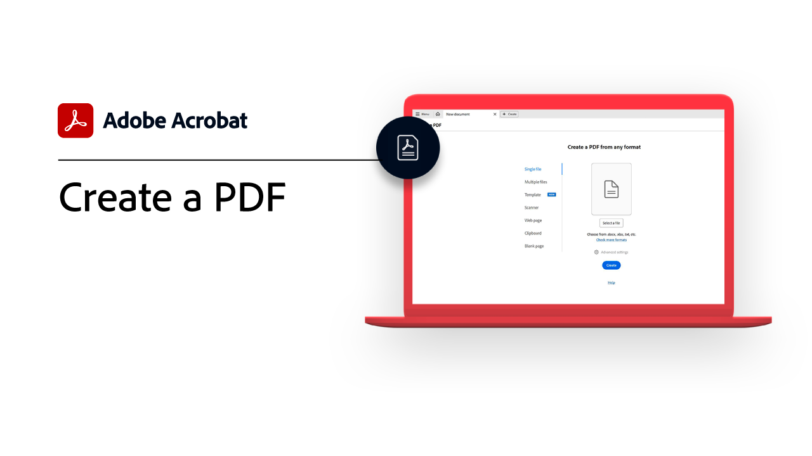
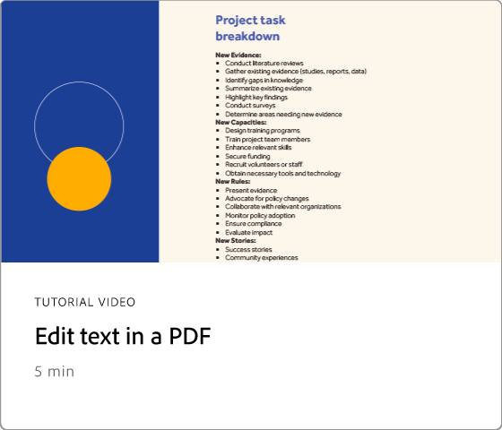
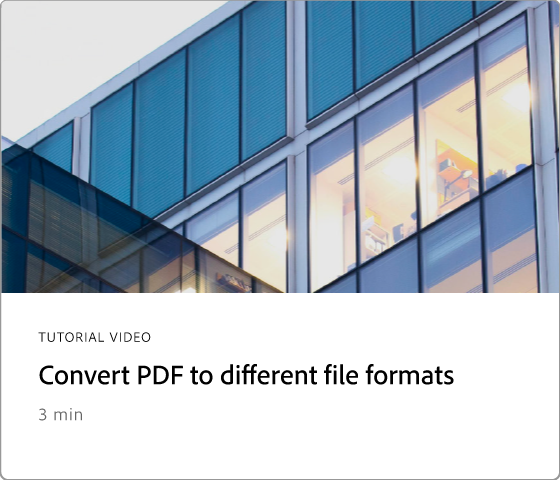
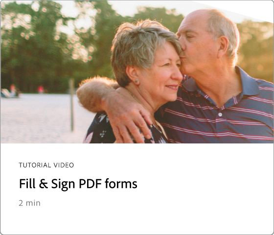
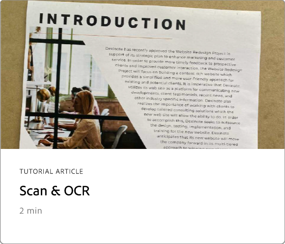
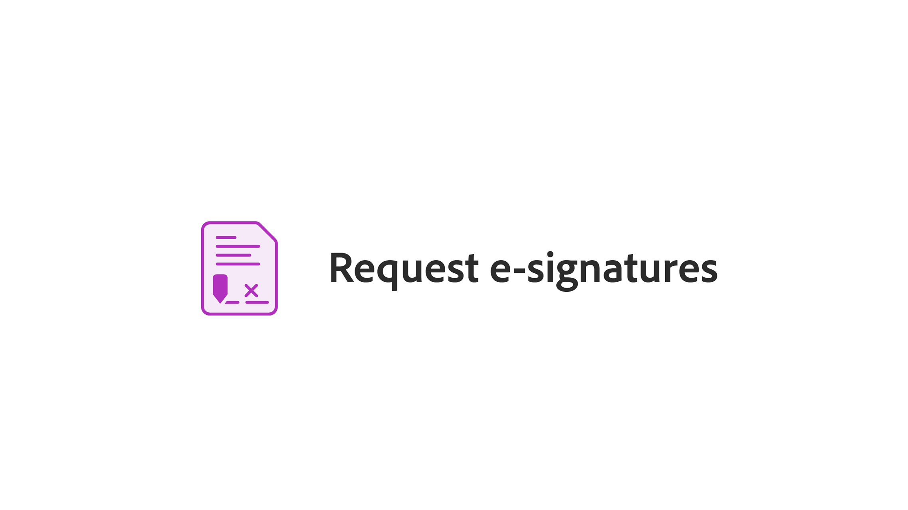

# Getting started overview

Learn how to start using Adobe Acrobat through these brief step-by-step tutorials. From creating a document to protecting or [editing your PDF files](https://www.adobe.com/acrobat/online/pdf-editor.html){target="_blank"}, this content is designed to ease you into PDF workflows.

## What's new

>[!BEGINTABS]

>[!TAB Design a new page]

Learn how to [design a new professional-looking page](add-custom-page.md) in your PDF using Adobe Express.

>[!TAB Edit graphics in a PDF]

Learn how to [create, edit, and enhance graphics](edit-graphics.md) in your PDF.

>[!TAB New workspace experience]

Learn about the [new workspace](new-workspace.md) in Acrobat that helps you quickly discover tools and complete your PDF tasks efficiently.

>[!TAB Discover PDF insights with the AI Assistant]

Learn how to gain insights from your PDF files using the [AI Assistant](ai-assistant.md).

>[!ENDTABS]

## Getting started tutorials

<table style="table-layout:fixed">
<tr>
  <td>
    
    

    <a href="new-workspace.md"><strong>New workspace experience</strong></a>
    

    Learn about the new workspace in Acrobat
     
  </td>
  <td>
    
    

    <a href="get-to-know-the-acrobat-dc-interface.md"><strong>Workspace basics</strong></a>
    

    Learn the basics of the Acrobat workspace
     
  </td>
  <td>
    
    

    <a href="ai-assistant.md"><strong>Discover PDF insights with the AI Assistant</strong></a>
    

    Gain insights from your PDF files using the AI Assistant
     
  </td>
  <td>
    
    

    <a href="acrobatweb.md"><strong>Work anywhere with Acrobat web</strong></a>
    

    Learn how to work from anywhere
     
  </td>
</tr>
<tr>
  <td>
    
    

    <a href="productivity.md"><strong>Productivity on the go</strong></a>
    

    Learn how to do more from your tablet or mobile phone
     
  </td>
    <td>
      
      

      <a href="../integrate/integrate-overview.md#microsoft"><strong>Work with Microsoft 365</strong></a>
      

      Work seamlessly with PDF files, right inside Microsoft 365
        
    </td>
    <td>
      
      

      <a href="where-do-pdfs-come-from.md"><strong>Where do PDFs come from?</strong></a>
      

      Learn where PDFs come from and how you can use them
       
    </td>
    <td>
    
      

       
    </td>
  </tr>
  </table>

## Creating, combining, and organizing tutorials

  <table style="table-layout:fixed">
  <tr>
    <td>
      
      

      <a href="create-pdf.md"><strong>Create PDF files</strong></a>
      

      Create PDFs from all different types of documents
       
    </td>
    <td>
      
      

      <a href="combine-to-pdf.md"><strong>Combine files into a single PDF</strong></a>
      

      Seamlessly combine many different types of files into a single PDF
       
    </td>
    <td>
      
      

      <a href="organize.md"><strong>Organize pages</strong></a>
      

      Learn how to rearrange pages just the way you like
       
    </td>
    <td>
      
      

      <a href="add-custom-page.md"><strong>Design a new page</strong></a>
      

     Learn how to create new professional-looking page in your PDF
       
    </td>
  </tr>
  </table>

## Editing and exporting tutorials

  <table style="table-layout:fixed">
  <tr>
    <td>
      
      

      <a href="edit-pdf.md"><strong>Edit text in a PDF</strong></a>
      

      Edit words, phrases, or even entire pages in your PDF
       
    </td>
    <td>
      
      

      <a href="edit-graphics.md"><strong>Edit graphics in a PDF</strong></a>
      

      Learn how to create, edit, and enhance graphics in your PDF
       
    </td>
    <td>
      
      

      <a href="stylize-this-pdf-delete.md"><strong>Stylize this PDF</strong></a>
      

      Learn how to create professional-looking PDFs
       
    </td>
   <td>
      
      

      <a href="auto-adjust-layout.md"><strong>Auto-adjust layout</strong></a>
      

      Learn about the new editing mode that reflows content
       
    </td>
  </tr>
    <td>
      
      

      <a href="export-pdf.md"><strong>Convert PDF to different file formats</strong></a>
      

      Convert your PDF files to different file formats
       
    </td>
    <td>
   
    

     
  </td>
  <td>
   
    

     
  </td>
   <td>
   
    

     
  </td>
</tr>
</table>

## Collaboration tutorials

  <table style="table-layout:fixed">
  <tr>
    <td>
      
      

      <a href="collaborate.md"><strong>Collaborate in real time</strong></a>
      

      Move your projects forward by collaborating in real time
    </td>
    <td>
      
      

      <a href="comment-on-pdf-files.md"><strong>Comment on a PDF</strong></a>
      

      Add comments and then share your PDF with others
       
    </td>
    <td>
    
      

       
    </td>
    <td>
    
      

       
    </td>
</tr>
</table>

## Additional tutorials

<table style="table-layout:fixed">
<tr>
  <td>
    
    

      <a href="create-fillable-forms.md"><strong>Create fillable forms</strong></a>
      

      Turn a scanned paper into a fillable form
       
  </td>
  <td>
    
    

    <a href="fill-and-sign.md"><strong>Fill & Sign a PDF form</strong></a>
    

    Learn how to quickly and easily fill and sign a PDF form
     
  </td>
  <td>
    
    

    <a href="scan-and-ocr.md"><strong>Scan & OCR</strong></a>
    

    Convert scans or images into searchable, editable PDF files
     
  </td>
  <td>
    
    

    <a href="password-protect.md"><strong>Protect a PDF file with a password</strong></a>
    

    Learn how to add a password to your PDF
     
  </td>
</tr>
<tr>
  <td>
    
    

    <a href="signatures.md"><strong>Get signatures</strong></a>
    

    Learn how to collect legally binding e-signatures
     
  </td>
  <td>
    
    

    <a href="track.md"><strong>Track your documents</strong></a>
    

    Track and manage your e-signature documents
     
  </td>
  <td>
   
    

     
  </td>
  <td>
   
    

     
  </td>
</tr>
</table>
