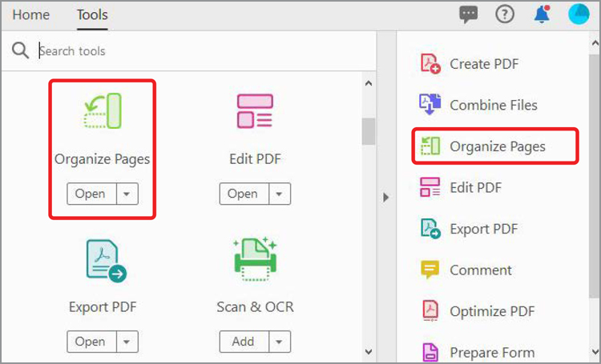
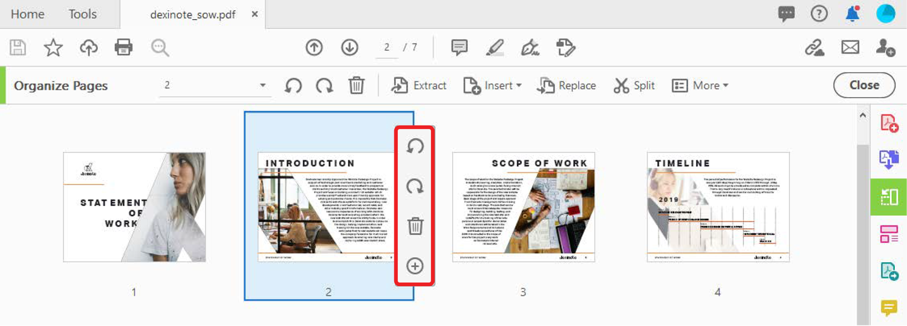
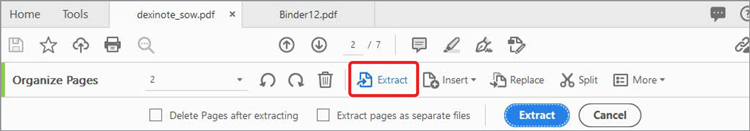
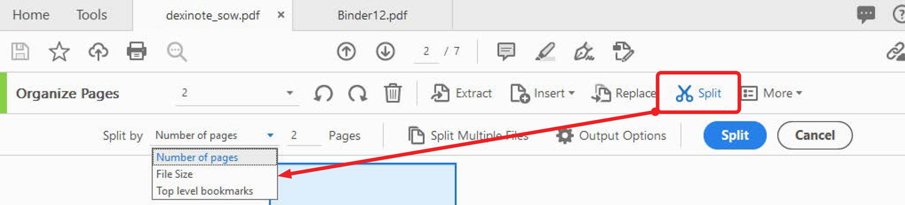

# Organize Pages

Use **[!UICONTROL Organize Pages]** in Acrobat DC to add, replace, extract, rotate, delete, and move pages in your PDF.

1. Select **[!UICONTROL Organize Pages]** from the [!UICONTROL Tools] center or right-hand pane.

    

1. Hover over a page to rotate the page clockwise or counter-clockwise or delete the page. 

    To move a page, select and drag the page to the new location.

    

1. Select **[!UICONTROL Extract]** in the toolbar, to create a PDF from one or more pages. 

1. Select the page or pages, then select **[!UICONTROL Extract]**. 

    You can also **[!UICONTROL Insert]** or **[!UICONTROL Replace]** pages, and see other options by selecting **[!UICONTROL More]**.

    

1. Select **[!UICONTROL Split]** to break apart one or more PDFs into multiple smaller PDFs. 

    When splitting a PDF, you can break apart by the number of pages, file size, or top-level bookmarks.

    

Click to download a PDF of the *Organize Pages* tutorial.    

