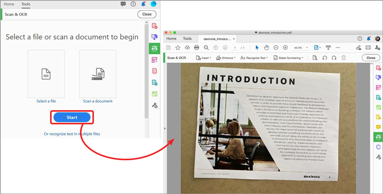
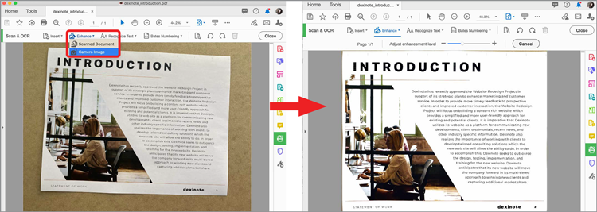
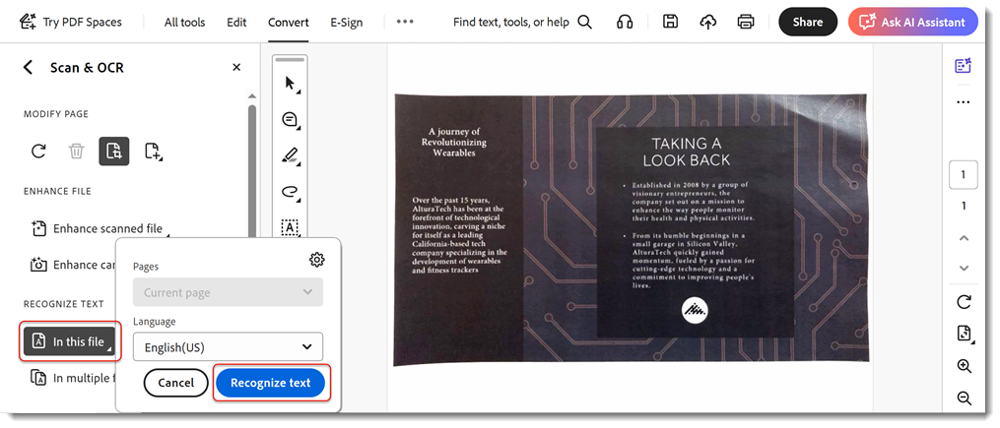
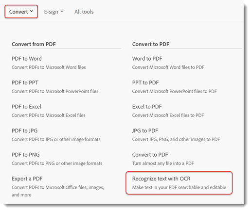
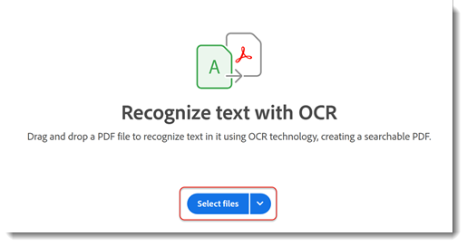
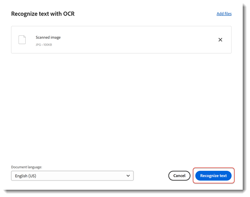
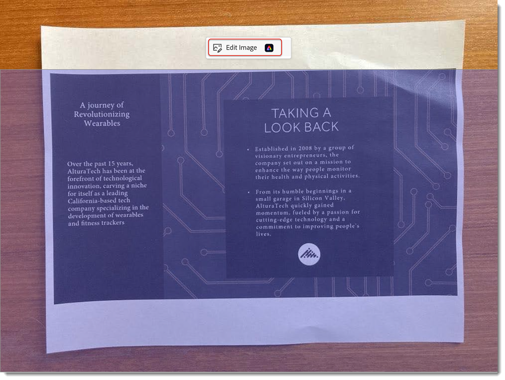
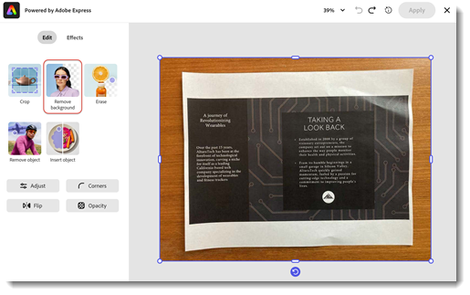
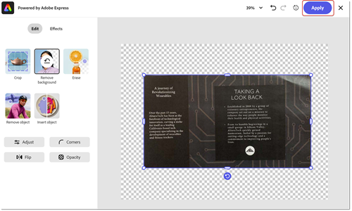

# Paper to PDF

Learn how to scan (or take a picture) of a paper document and turn it into a searchable and [editable PDF file](https://www.adobe.com/acrobat/online/pdf-editor.html){target="_blank"}. Converting paper to PDF increases your ability to quickly find information and make it accessible to those with disabilities. This tutorial shows the [new Acrobat experience](new-workspace.md).

## How to turn paper into a PDF in Acrobat on the desktop

1. Open a photo or scanned image of a document. Or, create a new file using a connected scanner or use the free [Adobe Scan mobile app](https://adobescan.app.link/GpBqG8Bkoeb). 

1. Select **[!UICONTROL All tools]** from the toolbar and choose **[!UICONTROL Scan & OCR]** in the left-hand pane.

    

1. Choose **[!UICONTROL Enhance scanned image]** or **[!UICONTROL Enhance camera image]** depending on your file type.

     

1. Drag the handles to adjust page borders and select **[!UICONTROL Enhance]**.

     

    Acrobat automatically cleans and straightens the image.

1. Select **[!UICONTROL In this file]** and choose **[!UICONTROL Recognize text]** to make the text searchable and editable.

    

The file is now a searchable, editable PDF file.

## How to turn paper into a PDF in Acrobat web

1. Sign in to [acrobat.adobe.com](https://acrobat.adobe.com/) in a browser.

1. Select **[!UICONTROL Convert > Recognize text with OCR]** from the top menu.

     

1. Choose **[!UICONTROL Select files]**, choose  your file, and seletc **[!UICONTROL Open]**.

     

1. Select **[!UICONTROL Recognize text]**.

     

     The text in the file is now searchable and editable.

1. To remove the background select the image and choose **[!UICONTROL Edit image]**.

     

1. Select **[!UICONTROL Remove background]** from the Adobe Express editor.

     

1. Drag the handles to adjust page borders and select **[!UICONTROL Apply]**.

     

>[!TIP]
>
>To OCR multiple PDF files, try using the [Action Wizard](../advanced-tasks/action.md) in Acrobat Pro on the desktop.