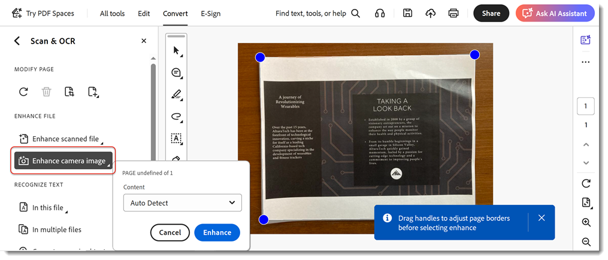

# Scan & OCR

Convert scans or images of documents into searchable, editable PDF files, and adjust the quality of the resulting file.

1. In Acrobat DC, select **Scan & OCR** from the Tools center or pane.

    

1. Select a file. This file could be a photo of a document, or an already scanned file created using a scanner or the Adobe Scan mobile app. Or you can scan a document to create a new file using a connected scanner.

    

1. To enhance the document, choose which type of file you opened, a **Scanned Document** or a **Camera Image**. Click **Enhance** to clean up the image.

    

1. Acrobat automatically recognizes text from scanned documents. To manually recognize text on image files select **Recognize Text**. The file is now a searchable, editable PDF file.

    

Click to download a PDF of the *Scan & OCR* tutorial.    

.
