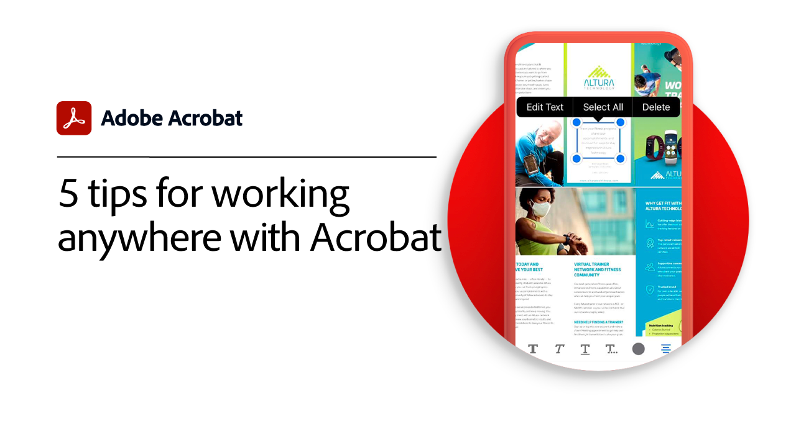
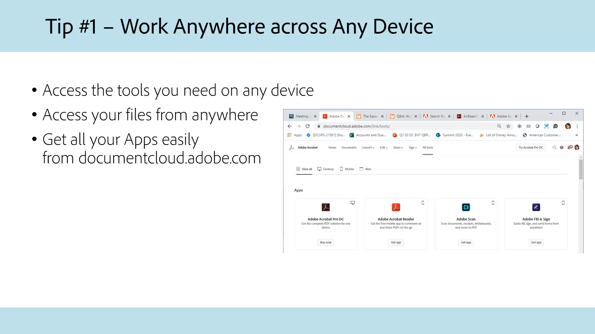
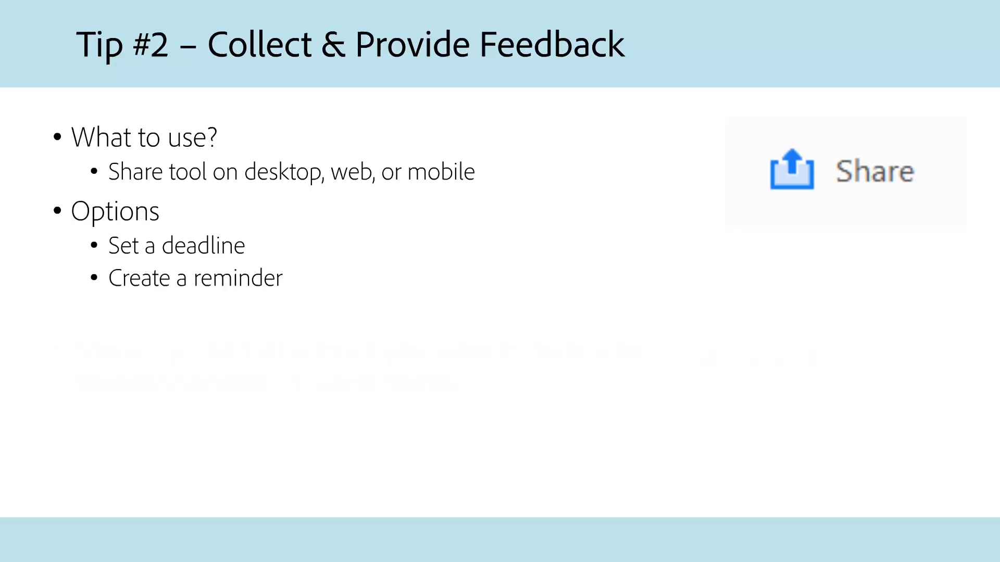
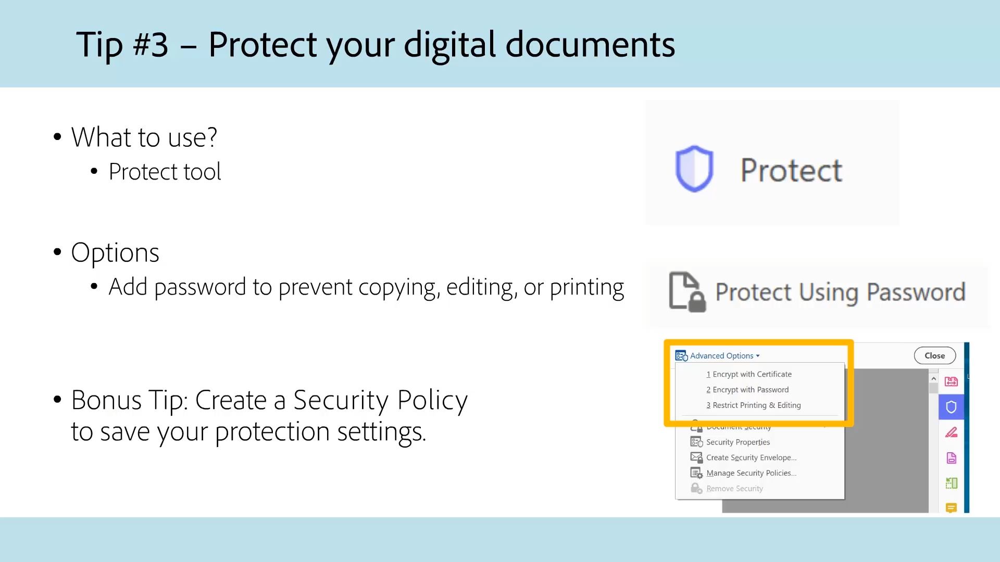
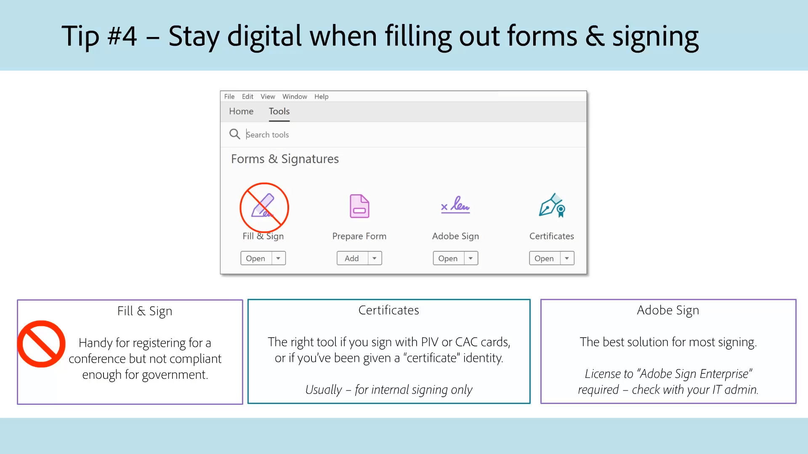
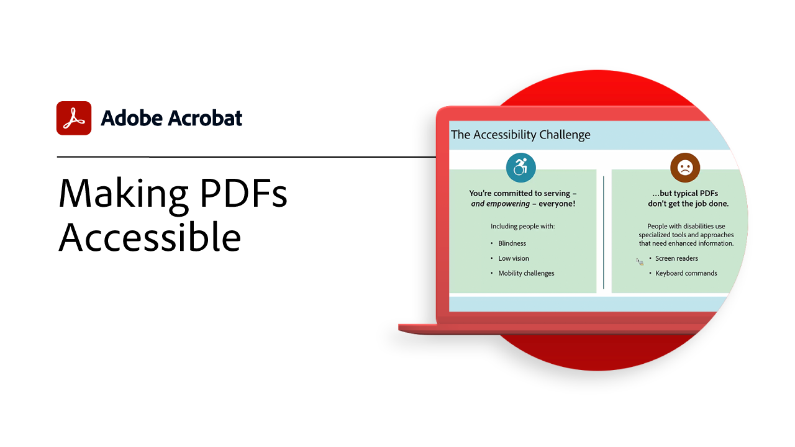
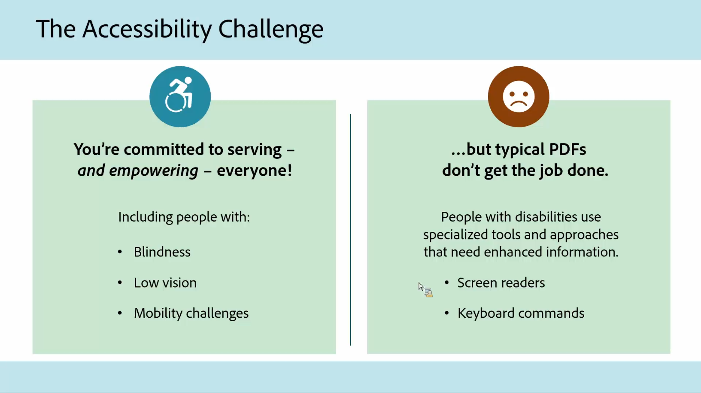
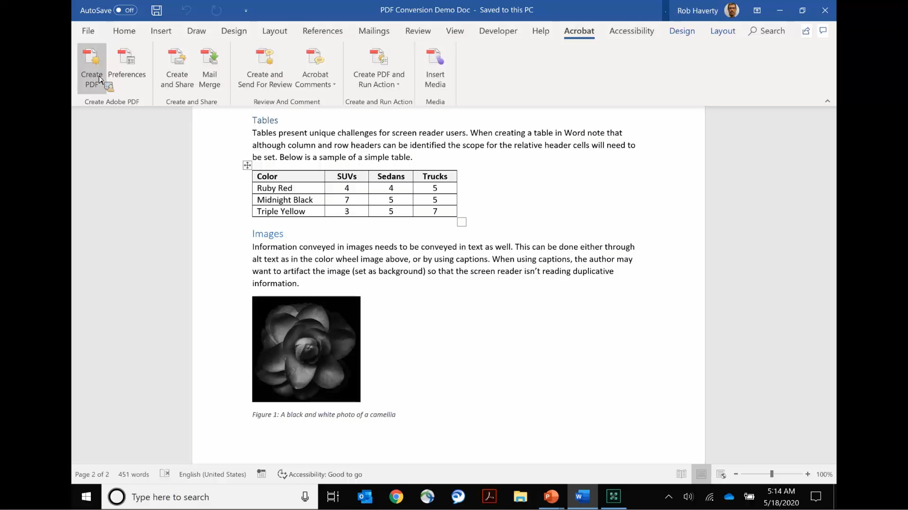
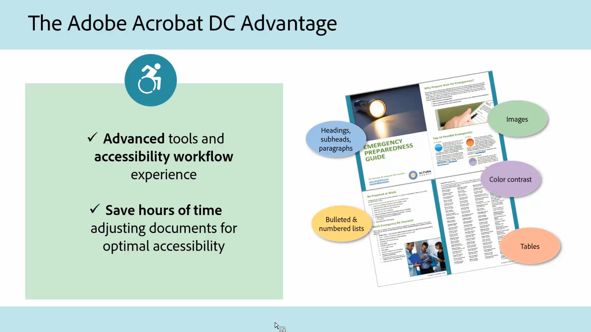
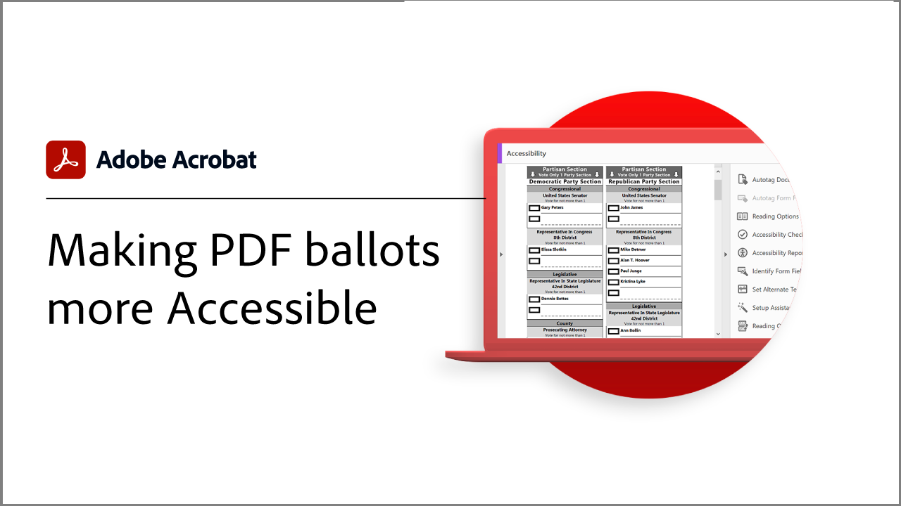

# Acrobat for government

Explore our Acrobat tutorials specifically designed for federal, state, and local government.

## 5 tips for working anywhere with Acrobat

<table style="table-layout:fixed">
<tr>
  <td>
    
    

    <a href="5-tips-for-working-anywhere-with-acrobat-dc-for-government.md"><strong>5 Tips for Working Anywhere with Acrobat (Complete 15:12)</strong></a>
    

    <em>Learn how to get and use the tools in Acrobat and its companion mobile apps to work from anywhere</em>
     
  </td>
  <td>
    
    

    <a href="get-your-tools.md"><strong>Tip 1: Get your tools</strong></a>
    

    <em>The first step to start working from anywhere is to get your Acrobat tools and companion mobile apps</em>
     
  </td>  
  <td>
    
    

    <a href="collaborate-on-documents.md"><strong>Tip 2: Collaborate on documents</strong></a>
    

    <em>Create simple and effortless workflows for collaborating on documents</em>
     
  </td>  
</tr>
<tr>
  <td>
    
    

    <a href="protect-digital-documents.md"><strong>Tip 3: Protect digital documents</strong></a>
    

    <em>Add a password to your PDF to prevent copying, editing, or printing</em>
     
  </td>
  <td>
    
    

    <a href="work-with-forms-and-signatures.md"><strong>Tip 4: Work with forms and signatures</strong></a>
    

    <em>Learn how to stay digital when filling out forms</em>
     
  </td>
  <td>
    
    

    <a href="scan-and-edit-on-mobile.md"><strong>Tip 5: Scan and edit on mobile</strong></a>
    

    <em>Learn how to work with Adobe Scan and Acrobat Reader mobile apps to get work done from anywhere</em>
     
  </td>
</tr>
</table>

## Accessibility

<table>
<tr>
  <td>
    
    

    <a href="making-pdfs-accessible.md"><strong>Making PDFs Accessible (Complete 14:11)</strong></a>
    

    <em>Learn about the optimal workflow for creating accessible PDF files</em>
     
  </td>
  <td>
    
    

    <a href="understanding-accessibility.md"><strong>Making PDFs Accessible: Understanding Accessibility</strong></a>
    

    <em>Learn what it means to make a PDF accessible for people with disabilities</em>
     
  </td>  
  <td>
    
    

    <a href="collaborate-on-documents.md"><strong>Making PDFs Accessible: Authoring in Word</strong></a>
    

    <em>Learn best practices for creating PDF files that are authored in [!DNL Microsoft Word]</em>
     
  </td>  
</tr>
<tr>
  <td>
    
    

    <a href="finishing-in-acrobat.md"><strong>Making PDFs Accessible: Finishing in Acrobat</strong></a>
    

    <em>Learn how to finish making your PDF file accessible using the tools in Acrobat Pro</em>
     
  </td>
  <td>
    
    

    <a href="making-pdf-ballots-accessible.md"><strong>Making PDF ballots more Accessible</strong></a>
    

    <em>This webinar covers key areas of PDF accessibility necessary to allow users of assistive technologies, such as screen readers, to read and complete their ballots</em>
     
  </td>  
  <td>
   
    

     
  </td>
</tr>
</table>
