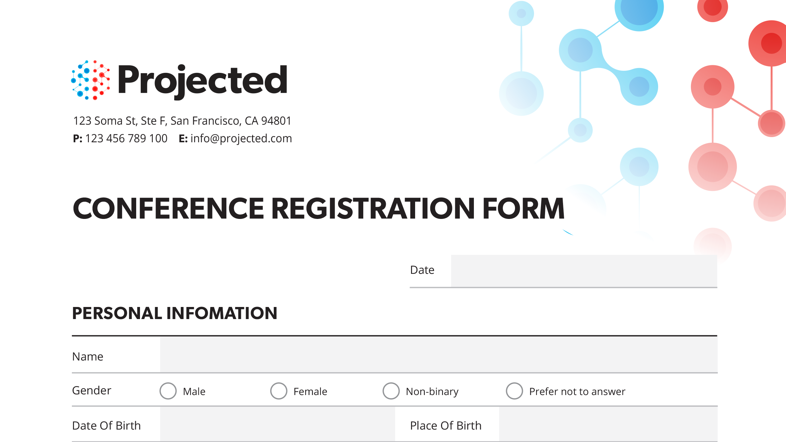
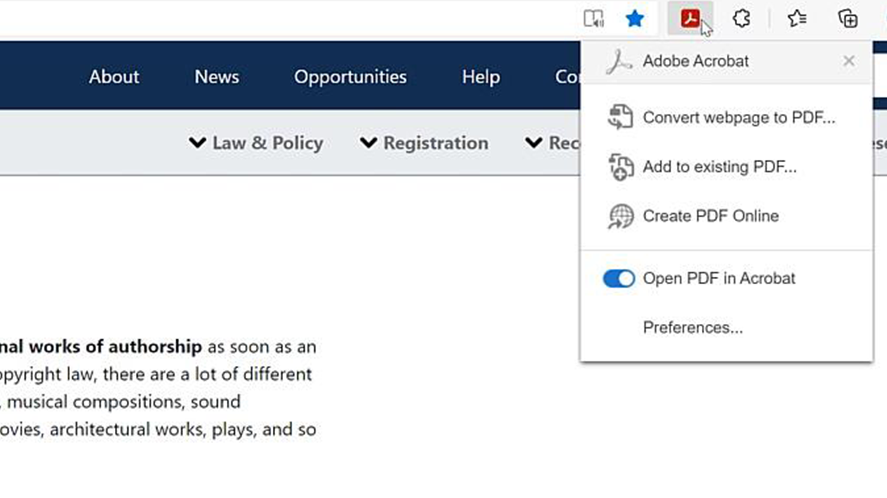
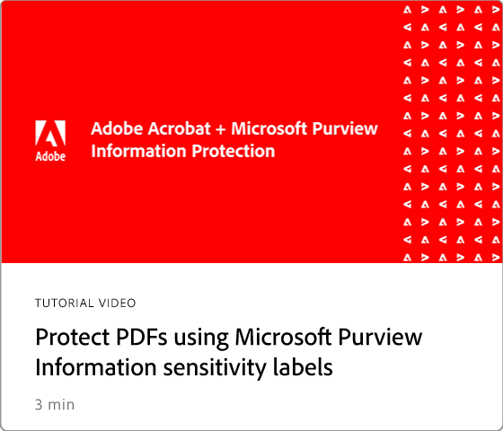
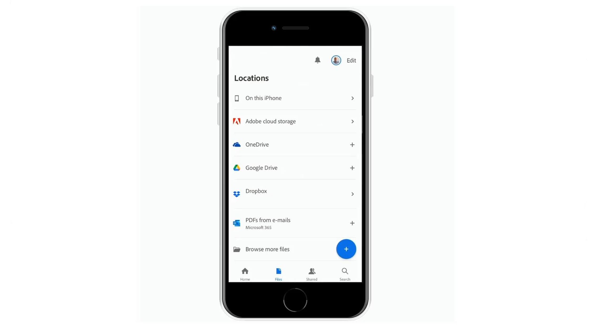

# Integrations overview

Integrate Acrobat with [!DNL Box], [!DNL Dropbox], [!DNL Google Drive], [!DNL OneDrive], and [!DNL Microsoft] apps. 

## Microsoft

Learn how everyone on your team can work seamlessly with PDF files, right inside [Microsoft 365](https://www.adobe.com/documentcloud/integrations/microsoft-office-365.html). Check out this expertly curated [playlist](https://experienceleague.adobe.com/en/playlists/acrobat-integrate-microsoft-365) on Acrobat and Microsoft 365 integrations.

<table style="table-layout:fixed">
<tr>
  <td>
    
    

    <a href="createfromword.md"><strong>Create PDF files from Microsoft Word</strong></a>
    

    Learn how to create rich, robust PDF files from directly from Microsoft Word
     
  </td>
  <td>
    
    

    <a href="createofficeweb.md"><strong>Create PDFs in [!DNL Office] for the web</strong></a>
    

    Learn how to create PDF files without ever leaving your [!DNL Microsoft Office] for web apps
     
  </td> 
  <td>
    
    

    <a href="acrobatandsp.md"><strong>Work with your [!DNL SharePoint] files</strong></a>
    

    Streamline document workflows with [!DNL SharePoint] and Acrobat
     
  </td>
  <td>
    
    

    <a href="acrobatandteams.md"><strong>PDF collaboration in [!DNL Microsoft Teams]</strong></a>
    

    Collaborate and reviewing PDFs without ever leaving [!DNL Microsoft Teams]
     
  </td>
</tr>
<tr>
  <td>
    
    

    <a href="outlook.md"><strong>Convert email messages and attachments to PDF in Outlook</strong></a>
    

    Learn how to deliver information in a more professional and secure manner inside of [!DNL Outlook]
     
  </td>
  <td>
    
    

    <a href="edge.md"><strong>Create PDF content while browsing with [!DNL Microsoft Edge]</strong></a>
    

    Learn how to turn web pages to PDF on the fly with the Adobe Acrobat extension for [!DNL Microsoft Edge]
     
  </td>
  <td>
    
    

    <a href="microsoftsensitivitylabels.md"><strong>Protect PDFs using [!DNL Microsoft Purview Information] sensitivity labels</strong></a>
    

    Learn how to protect PDFs with Microsoft Purview Information sensitivity labels directly in Acrobat
     
  </td>
  <td>
   
    

     
  </td>
</tr>
</table>

## Google Drive

Learn how to get more done in less time with essential PDF and e-signature tools inside [!DNL Google Drive].

<table style="table-layout:fixed">
<tr>
  <td>
    
    

    <a href="acrobatandgoogle.md"><strong>Adobe Acrobat for Google Drive</strong></a>
    

    Learn how to get access to time-saving PDF tools and e-signature workflows directly inside the [!DNL Google Drive] app
     
  </td>
  <td>
   
    

     
  </td>
  <td>
   
    

     
  </td>
  <td>
   
    

     
  </td>
</tr>
</table>

## Dropbox 

Learn how easy it is to access and work with files stored in [!DNL Dropbox].

<table style="table-layout:fixed">
<tr>
  <td>
    
    

    <a href="acrobat-dropbox.md"><strong>Work with files from [!DNL Dropbox]</strong></a>
    

    Learn how to open, create, edit, sign, and save changes to your [!DNL Dropbox] files from inside Acrobat
     
  </td>
  <td>
   
    

     
  </td>
  <td>
   
    

     
  </td>
  <td>
   
    

     
  </td>
</tr>
</table>

## Box

Learn how Acrobat and [Box](https://www.adobe.com/documentcloud/integrations/box.html){target="_blank"} make it simpler for everyone in your organization to keep business moving.
