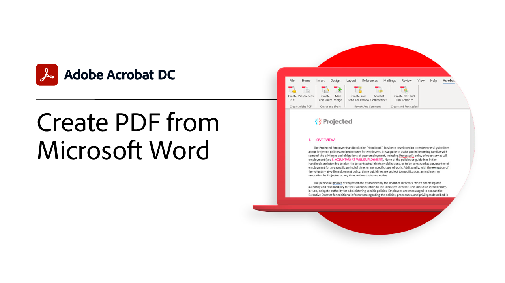
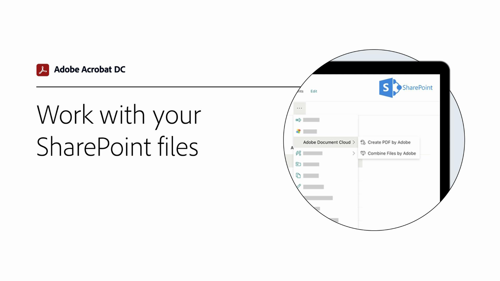
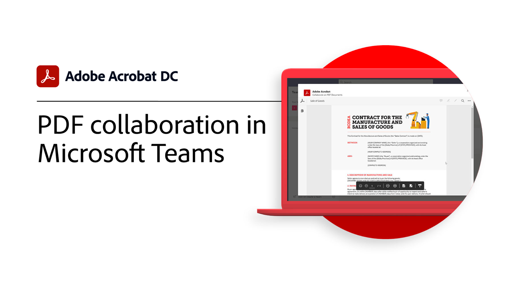
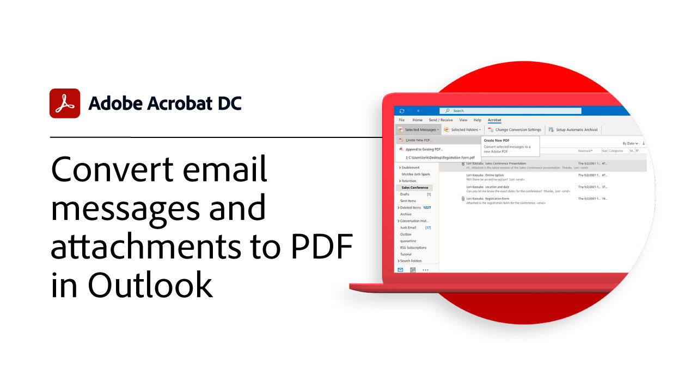
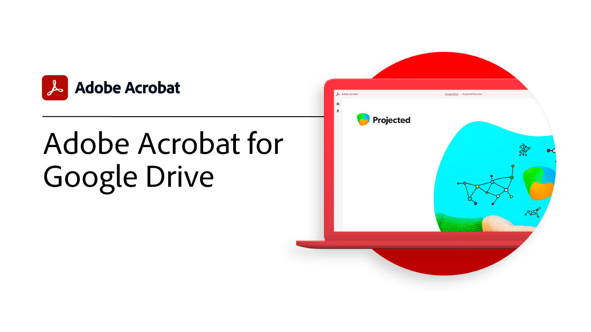

# Integrate overview

Integrate Acrobat with [!DNL Box], [!DNL Dropbox], [!DNL Google Drive], [!DNL OneDrive], and [!DNL Microsoft] apps.

## Microsoft

Learn how everyone on your team can work seamlessly with PDF files, right inside [Microsoft 365](https://www.adobe.com/documentcloud/integrations/microsoft-office-365.html).

<table style="table-layout:fixed">
<tr>
  <td>
    
    

    <a href="createfromword.md"><strong>Create PDF files from Microsoft Word</strong></a>
    

    <em>Create rich, robust PDF files with hyperlinked table of contents and cross-references, bookmarks, and even attachments directly from Microsoft Word</em>
     
  </td>
  <td>
    
    

    <a href="acrobatandsp.md"><strong>Work with your SharePoint files</strong></a>
    

    <em>Streamline document workflows with SharePoint and Acrobat DC</em>
     
  </td>  
  <td>
    
    

    <a href="acrobatandteams.md"><strong>PDF collaboration in [!DNL Microsoft Teams]</strong></a>
    

    <em>Collaborate and work with colleagues by viewing, annotating, and reviewing PDFs without ever leaving [!DNL Microsoft Teams]</em>
     
  </td>
</tr>
<tr>
  <td>
    
    

    <a href="outlook.md"><strong>Convert email messages and attachments to PDF in Outlook</strong></a>
    

    <em>Learn how to deliver information in a more professional and secure manner inside of Outlook</em>
     
  </td>
  <td>
   
    

     
  </td>
  <td>
   
    

     
  </td>
</tr>
</table>

## Google Drive

Learn how to get more done in less time with essential PDF and e-signature tools inside Google Drive.

<table style="table-layout:fixed">
<tr>
  <td>
    
    

    <a href="acrobatandgoogle.md"><strong>Adobe Acrobat for Google Drive</strong></a>
    

    <em>Get access to time-saving PDF tools and e-signature workflows directly inside the Google Drive app</em>
     
  </td>
  <td>
   
    

     
  </td>
  <td>
   
    

     
  </td>
</tr>
</table>

## Box

Learn how Acrobat DC and [Box](https://www.adobe.com/documentcloud/integrations/box.html){target="_blank"} make it simpler for everyone in your organization to keep business moving.

## Dropbox 

Learn how easy it is to access and work with PDFs stored in [Dropbox](https://www.adobe.com/documentcloud/integrations/dropbox.html){target="_blank"}.
