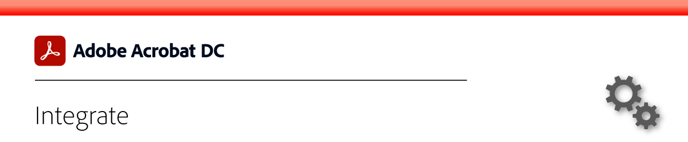

# Integrate overview

Integrate Acrobat with Box, Dropbox, Google Drive, OneDrive, and Microsoft apps.

## Microsoft

Learn how everyone on your team can work seamlessly with PDF files, right inside [Microsoft 365](https://acrobat.adobe.com/us/en/business/integrations/microsoft-office-365.html).

<table>
<tr>
  <td>
    
    

    <a href="createfromword.md"><strong>Create PDF files from Microsoft Word</strong></a>
    

    <em>Create rich, robust PDF files with hyperlinked table of contents and cross-references, bookmarks, and even attachments directly from Microsoft Word</em>
     
  </td>
  <td>
    
    

    <a href="acrobatandsp.md"><strong>Work with your SharePoint files</strong></a>
    

    <em>Streamline document workflows with SharePoint and Acrobat DC</em>
     
  <td>
    
    

    <a href="acrobatandteams.md"><strong>PDF collaboration in Microsoft Teams</strong></a>
    

    <em>Collaborate and work with colleagues by viewing, annotating, and reviewing PDFs without ever leaving Microsoft Teams</em>
     
  </td>
</tr>
</table>

## Google Drive

Learn how to be more productive with time-saving PDF and e-signature tools that integrate seamlessly with [Google Drive](https://acrobat.adobe.com/us/en/business/integrations/google-drive.html).

## Box

Learn how Acrobat DC and [Box](https://acrobat.adobe.com/us/en/business/integrations/box.html) make it simpler for everyone in your organization to keep business moving.

## Dropbox 

Learn how easy it is to access and work with PDFs stored in [Dropbox](https://acrobat.adobe.com/us/en/business/integrations/dropbox.html).