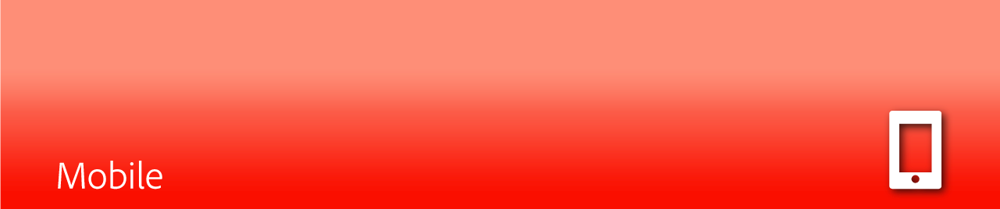
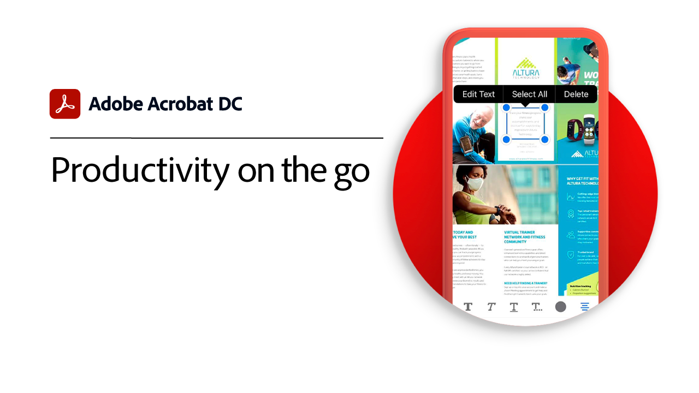

# Mobile overview

Create, fill, and sign PDFs on your mobile device.

## Acrobat Reader mobile app tutorials

<table style="table-layout:fixed">
<tr>
  <td>
    
    

     <a href="../getting-started/productivity.md"><strong>Productivity on the go</strong></a>
    

    <em>Do more right from your tablet or mobile phone with the Acrobat Reader mobile app</em>
     
  </td>
  <td>
   
    

     
  </td>
  <td>
   
    

     
  </td>
</tr>
</table>

Download [Adobe Acrobat Reader mobile app](https://www.adobe.com/acrobat/mobile/acrobat-reader.html){target="_blank"} the free global standard for reliably viewing, annotating, and signing PDFs.

[Acrobat Reader for iOS mobile guide](https://www.adobe.com/devnet-docs/acrobat/ios/en/){target="_blank"}
[Acrobat Reader for Android mobile guide](https://www.adobe.com/devnet-docs/acrobat/android/en/){target="_blank"}

Download [Adobe Scan mobile app](https://www.adobe.com/acrobat/mobile/scanner-app.html){target="_blank"} to capture any paper document and transform it into a high-quality PDF with text you can search.

[Adobe Scan for iOS mobile guide](https://www.adobe.com/devnet-docs/adobescan/ios/en/){target="_blank"}
[Adobe Scan for Android mobile guide](https://www.adobe.com/devnet-docs/adobescan/android/en/){target="_blank"}

Download [Adobe Fill & Sign mobile app](https://www.adobe.com/acrobat/mobile/fill-sign-pdfs.html){target="_blank"} to fill, sign, and send any form from anywhere, on any device, using nothing more than your finger or a stylus.
