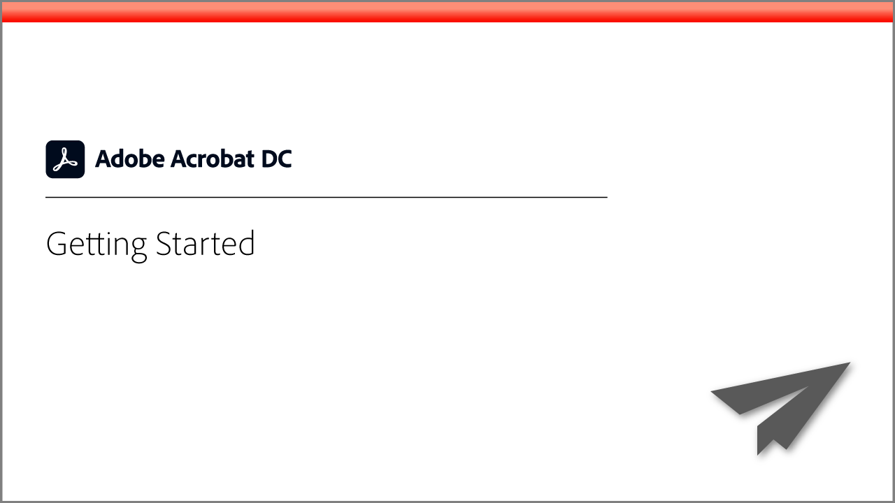
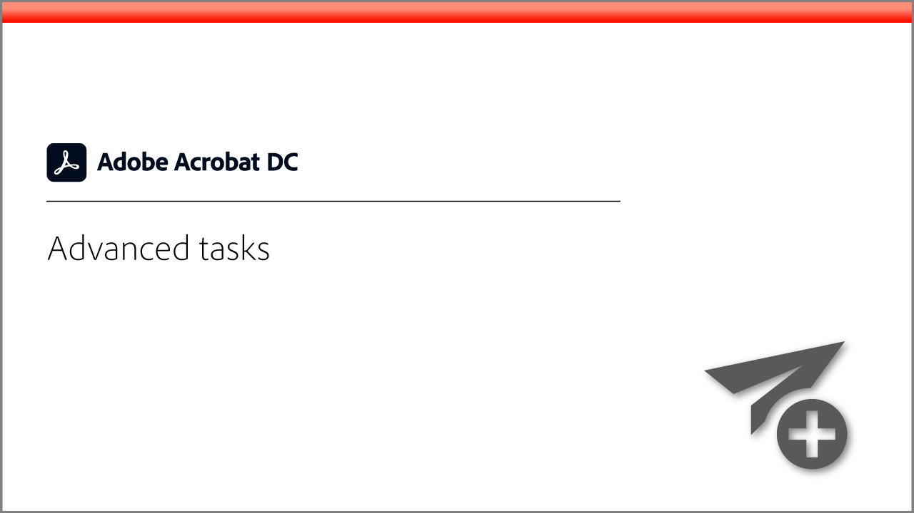
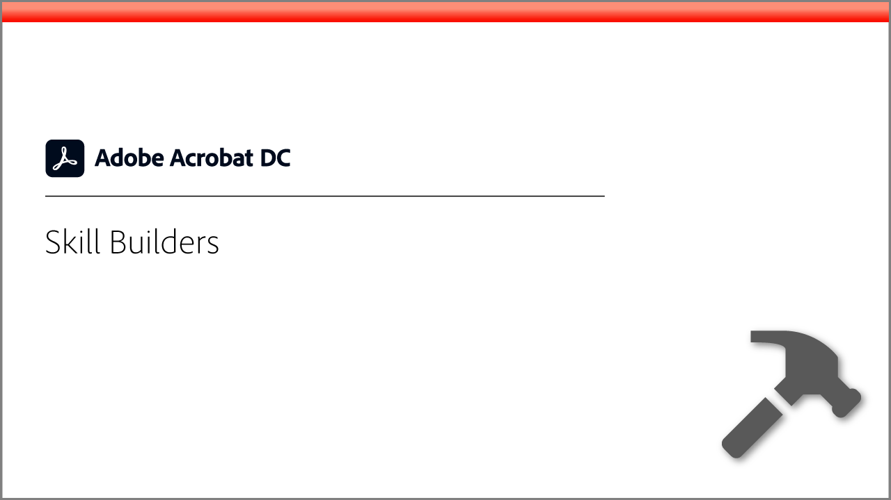
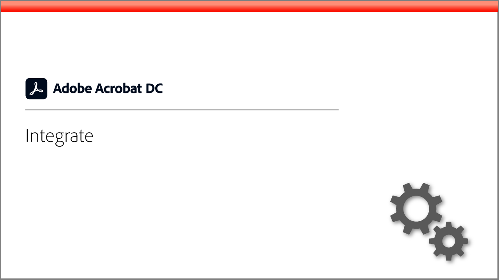
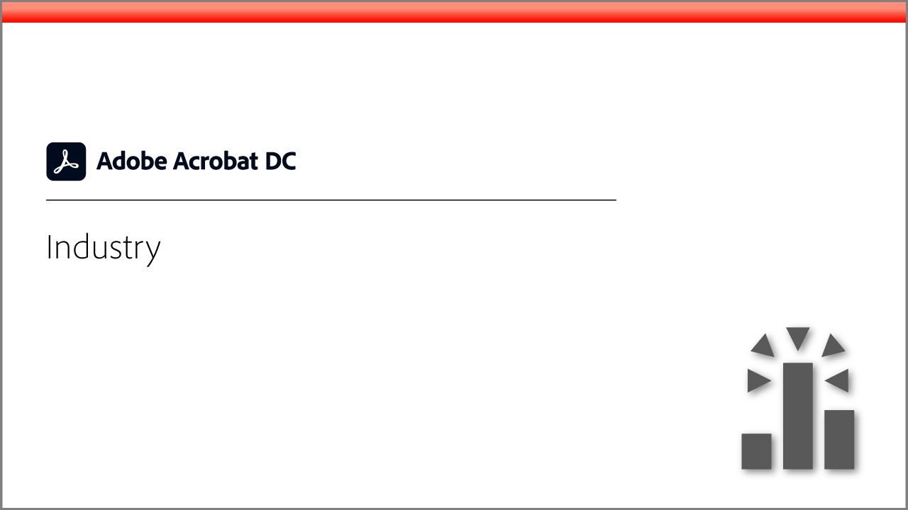
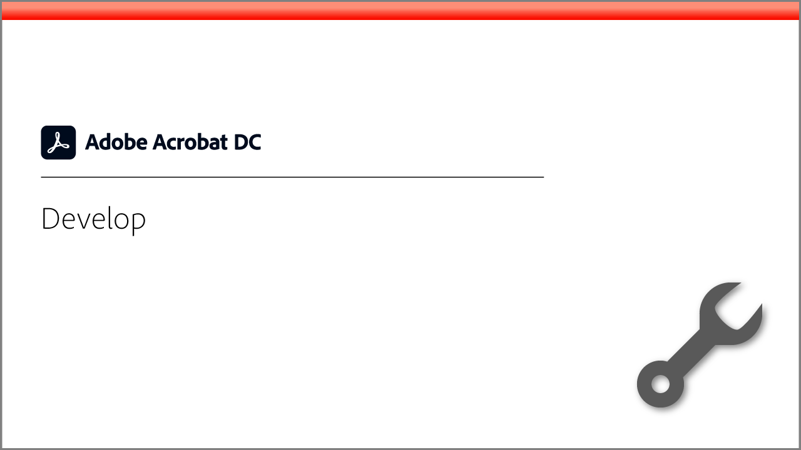
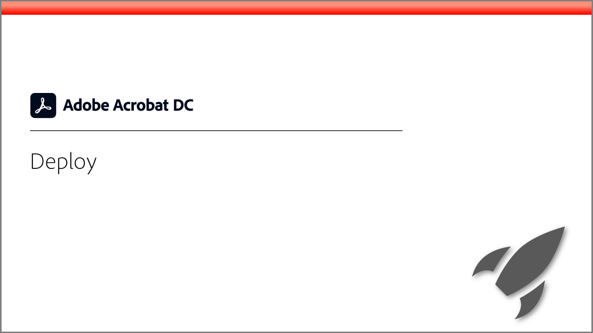
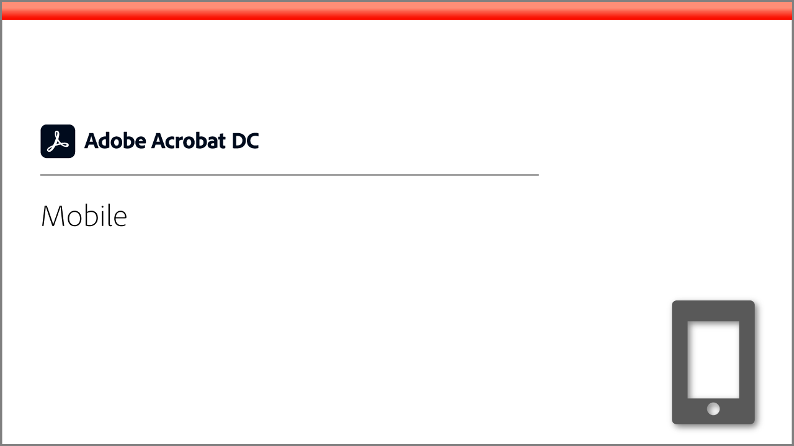

# Adobe Acrobat Learning Hub

Welcome to the [!DNL Acrobat] Learning Hub. The Adobe Acrobat Learning Hub contains a wide range of learning experiences focused on Adobe Acrobat. Our tutorials, webinars, and use cases are designed to quickly bring both beginners and IT administrators up-to-speed on Adobe Acrobat.

<table>
<tr>
  <td>
    
    

    <a href="Getting-started/getting-started-overview.md"><strong>Getting started</strong></a>
    

    <em>Get up-to-speed on how to create, edit, convert, protect, and more with PDF files.</em>
     
  </td>
  <td>
    
    

    <a href="Advanced-tasks/advanced-tasks-overview.md"><strong>Advanced tasks</strong></a>
    

    <em>Go beyond the basics with specific tasks and automation</em>
     
  <td>
    
    

    <a href="Skill-builder/Skill-builder-overview.md"><strong>Skill Builders</strong></a>
    

    <em>Task-based tips to help you go digital, stay digital, and get work done</em>
     
  </td>
</tr>
<tr>
  <td>
    
    

    <a href="Integrate/Integrate-overview.md"><strong>Integrate</strong></a>
    

    <em>Add Acrobat to your existing systems, processes, and applications</em>
     
  </td>
  <td>
    
    

    <a href="Industry/Industry-overview.md"><strong>Industry</strong></a>
    

    <em>Explore how real-world business go 100% digital</em>
     
  <td>
    
    

    <a href="Develop/Develop-overview.md"><strong>Develop</strong></a>
    

    <em>Get development resources on Adobe Acrobat I/O</em>
     
  </td>
</tr>
<tr>
  <td>
    
    

    <a href="Deploy/Deploy-overview.md"><strong>Deploy</strong></a>
    

    <em>Insight and best practices for deploying Acrobat within your organization</em>
     
  </td>
  <td>
    
    

    <a href="Mobile/Mobile-overview.md"><strong>Mobile</strong></a>
    

    <em>Create, fill, and sign PDFs on your mobile device</em>
     
  <td>
   
    

     
  </td>
</tr>
</table>
