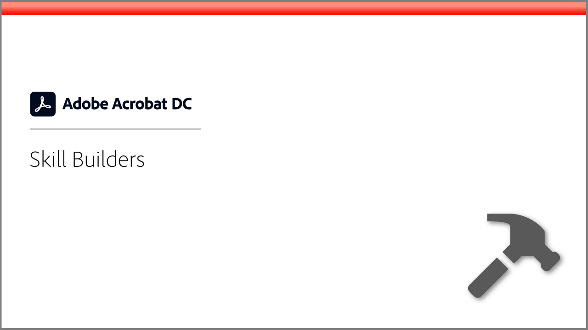
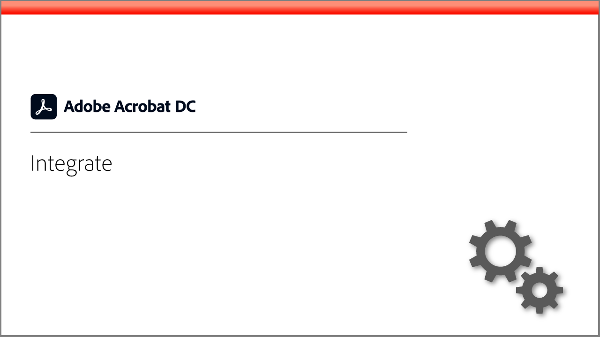
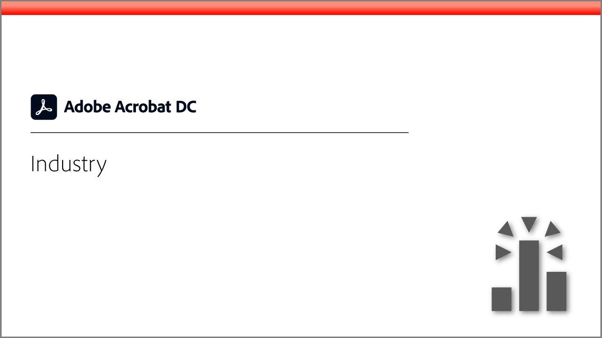
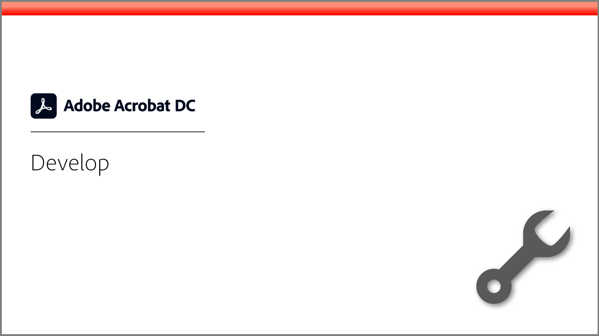

# Acrobat tutorials

Adobe Acrobat, an Adobe Document Cloud solution, helps keep business moving by converting, editing, sharing, and signing PDFs. Here you'll find a wide range of learning experiences designed to quickly bring both beginners and advanced users up-to-speed on Adobe Acrobat.

## Learning paths

<table style="table-layout:fixed">
<tr>
  <td>
    
  </td>
  <td>
    
  </td>
  <td>
    
  </td>
  <td>
    
  </td>
</tr>
<tr>
  <td>
    
  </td>  
  <td>
    
  </td>
  <td>
  
  </td>
  <td>
    
  </td>
</tr>
</table>
