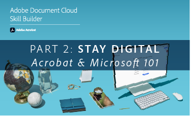
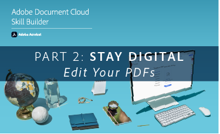
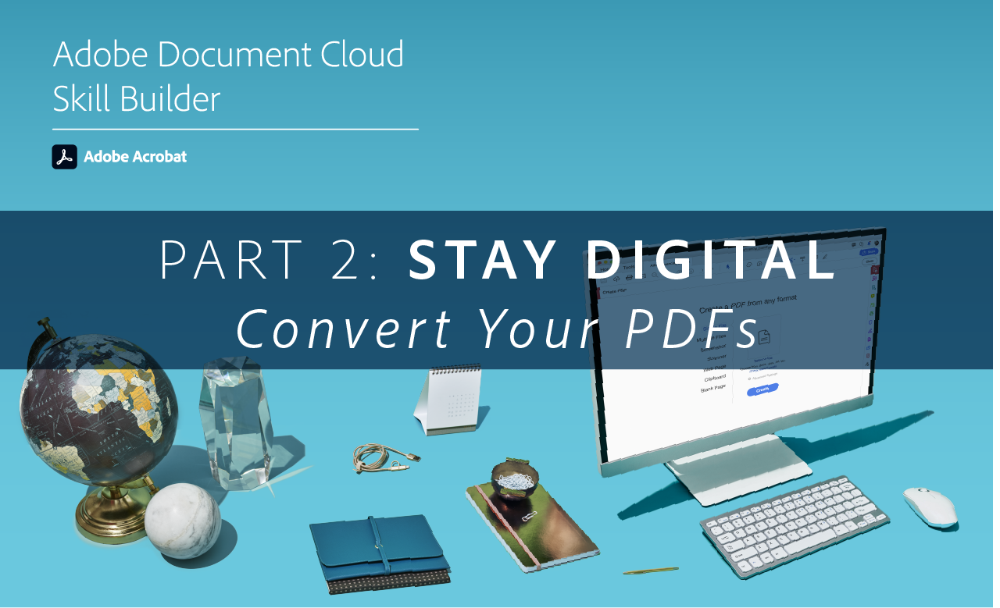
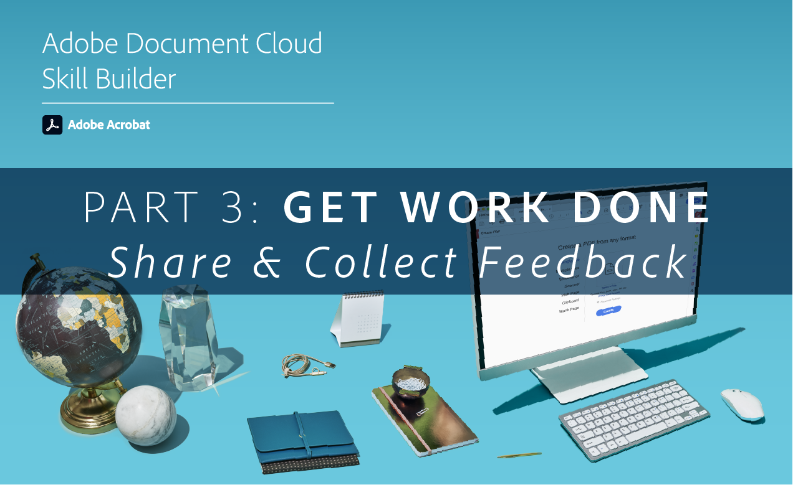

# Acrobat Skill Builders

Get up-to-speed on Acrobat DC with these interactive skill builders.

## Go Digital

<table style="table-layout:fixed">
<tr>
  <td>
    
    

    <a href="https://doccloud.adobeconnect.com/paperpdf/"><strong>Go From Paper to PDF</strong></a>
    

    <em>Digitally transform any paper document to PDF</em>
     
  </td>
  <td>
    
    

    <a href="https://doccloud.adobeconnect.com/skillbuilder-sigforms/"><strong>Prepare for Signature</strong></a>
    

    <em>Build PDFs with e-signature fields</em>
     
  </td>
  <td>
   
    

     
  </td>
</tr>
</table>

## Stay Digital

<table style="table-layout:fixed">
<tr>
 <td>
    
    

    <a href="https://doccloud.adobeconnect.com/createpdfs/"><strong>Create and Organize PDFs</strong></a>
    

    <em>Create and organize PDFs starting from any type of file</em>
     
  </td>
  <td>
    
    

    <a href="https://doccloud.adobeconnect.com/micro/"><strong>Acrobat and Microsoft 101</strong></a>
    

    <em>Create and manage PDFs directly in SharePoint</em>
     
  </td>
  <td>
    
    

    <a href="https://doccloud.adobeconnect.com/editpdf/"><strong>Edit Your PDFs</strong></a>
    

    <em>Add text, images, links, and watermarks to your PDF</em>
     
  </td>
</tr>
<tr>
  <td>
    
    

    <a href="https://doccloud.adobeconnect.com/sign/"><strong>Sign Your Work</strong></a>
    

    <em>Sign documents directly in Microsoft Outlook</em>
     
  </td>
  <td>
    
    

    <a href="https://doccloud.adobeconnect.com/convertpdfs/"><strong>Convert Your PDFs</strong></a>
    

    <em>Convert PDFs to Word, Excel, and PowerPoint</em>
     
  </td>
  <td>
    
    

    <a href="https://doccloud.adobeconnect.com/fillsign/"><strong>Fill and Sign Anywhere</strong></a>
    

    <em>Fill, sign, and send forms electronically on any device</em>
     
  </td>
</tr>
<tr>
  <td>
    
    

    <a href="https://doccloud.adobeconnect.com/paperpdf/"><strong>Optimize Your PDFs</strong></a>
    

    <em>Prepare PDFs for distribution</em>
     
  </td>
  <td>
   
    

     
  </td>
  <td>
   
    

     
  </td>
</tr>
</table>

## Get Work Done

<table style="table-layout:fixed">
<tr>
  <td>
    
    

    <a href="https://doccloud.adobeconnect.com/skillbuilder-share/"><strong>Share and Collect Feedback</strong></a>
    

    <em>Gather and get feedback on your PDFs</em>
     
  </td>
  <td>
    
    

    <a href="https://doccloud.adobeconnect.com/securepdfs/"><strong>Secure Your PDFs</strong></a>
    

    <em>Redact and protect sensitive information in your PDFs</em>
     
  </td>
  <td>
   
    

     
  </td>
</tr>
</table>
