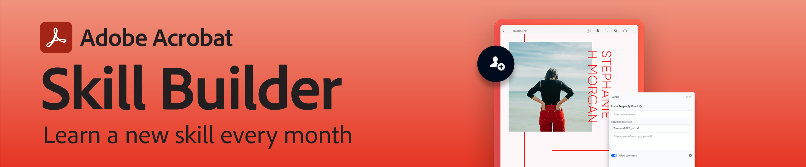

# Adobe Acrobat Skill Builder webinars

Adobe Acrobat Skill Builders are 30-minute sessions designed to take your PDF workflows to the next level. Each month a new topic is highlighted.

## Monthly sessions

**[PDF Forms 101: Creating Fillable Forms](https://adobe-acrobat-skill-builder.joinus.adobeevents.com/attendease/networking/experience/795f4bc7-db42-4022-a624-8a53c51174c6/9d685d0f-4a5b-4236-a1ef-081d1403fb41){target="_blank"}**
Date: June 29, 2023
Turn your old forms and paper documents into digital, fillable PDFs with ease. Acrobat offers a variety of methods and tools that will get you on the road to digital document transformation. We'll be covering the following in this session:

* Creating a form template from a variety of files (PDF, scanned image, Word)
* Understanding available field types (text, checkboxes, radio buttons, drop-downs, calendar)
* Working with field properties and productivity tools (appearance, formatting, calculations, validations)

**[Add interactivity to your PDFs](https://adobe-acrobat-skill-builder.joinus.adobeevents.com/attendease/networking/experience/4ff4d607-8c9f-47dd-ac4f-3b351a0a0fe3/2eb92255-d963-4ff7-b278-2a95a11db755){target="_blank"}**
Date: May 25, 2023
Make your PDFs easier and more compelling for your audience to interact with. Join this session to learn how simple it is to add interactivity to your PDFs by:

* Adding hyperlinks and bookmarks to make document navigation easier
* Including video, sound, 3D, and more in your PDFs
* Organizing different types of content in a single document

**[Reusing PDF Content: Edit and Export](https://adobe-acrobat-skill-builder.joinus.adobeevents.com/attendease/networking/experience/aac3b9af-7d54-4ea5-a6fa-61bc7acea87f/8d7341ee-ff0f-492a-b3fd-935bd11d4ed0){target="_blank"}**
Date: April 27, 2023
Why recreate the wheel when you can simply edit and export PDFs? In this session, we'll teach you how to modify your existing PDFs with Acrobat's editing and exporting tools. You'll learn how to:

* Edit text & images
* Add hyperlinks & bookmarks to make document navigation easier
* Export to familiar formats like Microsoft Word, PowerPoint and Excel
* Export an entire document, or choose specific text, images or tables

**[PDF Collaboration: Share, review, and work together](https://adobe-acrobat-skill-builder.joinus.adobeevents.com/attendease/networking/experience/0ef4709b-0a04-418e-a185-7efdd676c2dd/6a95bece-6f24-46f5-a17f-b408464281be){target="_blank"}**
Date: March 23, 2023
Get up and running with Adobe Acrobat and PDFs. Join us to learn the fundamentals with an introduction to the Acrobat interface and key features that will help you be more productive. We'll show you how to:

* Create PDFs from image files and documents — including Word, Excel, and PowerPoint
* Combine multiple files — PDF, Word, images, and much more — into one editable PDF
* Get work done anywhere at any time with Acrobat Web and Acrobat Mobile

**[Get Started with Acrobat](https://adobe-acrobat-skill-builder.joinus.adobeevents.com/attendease/networking/experience/5d8acc24-47a1-4db8-b419-8587bfb12708/fe8ec392-f29a-4e25-b7a3-61f48eea45ab){target="_blank"}**
Date: February 23, 2023
Get up and running with Adobe Acrobat and PDFs. Join us to learn the fundamentals with an introduction to the Acrobat interface and key features that will help you be more productive. We'll show you how to:

* Create PDFs from image files and documents — including Word, Excel, and PowerPoint
* Combine multiple files — PDF, Word, images, and much more — into one editable PDF
* Get work done anywhere at any time with Acrobat Web and Acrobat Mobile

**[Productivity, wherever you are](https://adobe-acrobat-skill-builder.joinus.adobeevents.com/attendease/networking/experience/9ab6c7a2-5ca2-4670-9a33-2ac11a1cb542/0b591876-aeae-45af-b41a-07a8326043f2){target="_blank"}**
Date: January 26, 2023
This session will teach you how to access your favorite Acrobat tools from any web browser or from your mobile device. Acrobat on the Web gives you the ability to work from anywhere you are, and the Acrobat mobile app extends your productivity to on-the-go contexts.

**[Work with PDFs in your Microsoft apps](https://adobe-acrobat-skill-builder.joinus.adobeevents.com/attendease/networking/experience/f7e3961b-e322-4253-bfa4-ff1957a08d99/c1111644-e958-41bf-ad6e-dffafafa7fa0){target="_blank"}**
Date: December 15, 2022
Acrobat is fully integrated into Microsoft 365 apps, so you don't have to move between screens and can get more done within the flow of your work. In this Skill Builder session, you'll learn how you can add PDF workflows to the Microsoft apps you use every day, including Teams, Outlook, SharePoint, Word, PowerPoint, & Excel.

**[PDF Collaboration: Share, review, and work together](https://adobe-acrobat-skill-builder.joinus.adobeevents.com/attendease/networking/experience/d1eb8544-6268-4855-8500-2370b1e68045/0dd92858-0587-49f4-be60-8d48c140ef39){target="_blank"}**
Date: November 17, 2022
This Skill Builder is all about digital document collaboration. Come learn the easy way to review documents with your team, and get a tour of the commenting tools available to you. We'll also talk about reviewing PDFs with others in Microsoft Teams, and how to give feedback from anywhere using the Acrobat mobile app and Acrobat Web.

**[Reuse your PDF content: Edit and Export](https://adobe-acrobat-skill-builder.joinus.adobeevents.com/attendease/networking/experience/68a9bbf2-91ca-40f0-baa1-812dd0730e0b/48c2399c-7392-4d7d-ba51-f623dead313a){target="_blank"}**
Date: October 27, 2022
Learn how to [modify your existing PDFs](https://www.adobe.com/acrobat/online/pdf-editor.html){target="_blank"}: edit text and images, add hyperlinks and bookmarks, convert to Microsoft Word, PowerPoint, and Excel files, and more.

**[Get Started with Acrobat](https://adobe-acrobat-skill-builder.joinus.adobeevents.com/attendease/networking/experience/360c9159-3f6f-47ae-8320-d0ad391883e1/e54db15b-af50-40ff-a274-6e927a22c6e7){target="_blank"}**
Date: September 22, 2022
Get up and running with Adobe Acrobat and PDFs. We'll introduce you to the Acrobat interface and show you how to: * [Create PDFs from image files](https://www.adobe.com/acrobat/online/convert-pdf.html){target="_blank"} and documents — including Word, Excel, and PowerPoint. * [Combine multiple files](https://www.adobe.com/acrobat/online/merge-pdf.html){target="_blank"} — PDF, Word, images, and much more — into one editable PDF. * Get work done anywhere at any time with Acrobat Web and Mobile.

**[PDF Security](https://adobe-acrobat-skill-builder.joinus.adobeevents.com/attendease/networking/experience/ad3778d2-f2c3-4966-98ed-8b1bb90e4b2b/180ad785-1b5b-4c80-80ab-1df345f082ff){target="_blank"}**
Date: August 25, 2022
Get all the info you need on [protecting your PDF](https://www.adobe.com/acrobat/online/password-protect-pdf.html){target="_blank"} content. This session will share techniques for adding passwords to prevent viewing, editing, or printing a PDF, and show you how to permanently remove sensitive information - even from non-visible metadata!

**[Simple Automation with Action Wizard](https://adobe-acrobat-skill-builder.joinus.adobeevents.com/attendease/networking/experience/45ef14f7-e5e4-4fe0-ba26-905adac092a2/24bf421e-f489-47dc-a5a4-d8d70858348c){target="_blank"}**
Date: July 28, 2022
Stop repeating simple manual tasks! This session will teach you how to use Action Wizard in Acrobat to batch process your PDF files and perform serial, repetitive tasks automatically.

**[Readability for all: Creating Accessible PDFs](https://adobe-acrobat-skill-builder.joinus.adobeevents.com/attendease/networking/experience/18c111bd-9c63-4636-a4fd-8dc045a20423/8484f6c9-e2c9-4e1c-8d03-c2ca1d4db77c){target="_blank"}**
Date: June 23, 2022
Adding accessibility features to your PDFs help all readers access the content. Join this session to learn how you can create compliant, accessible PDFs with Acrobat.