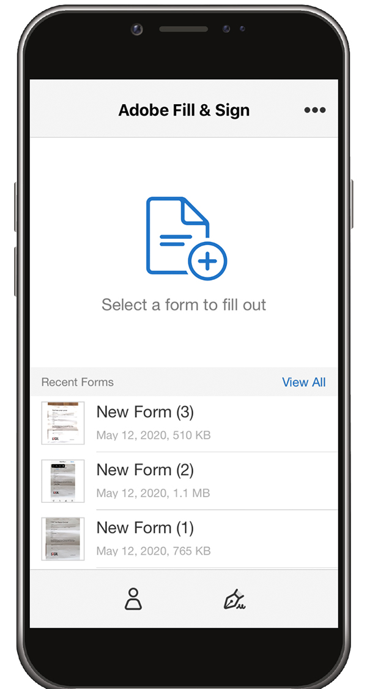
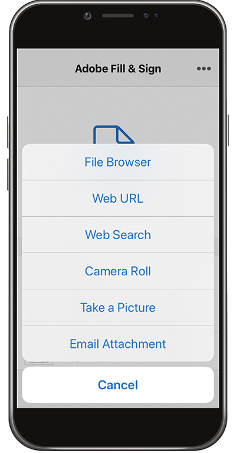
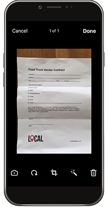
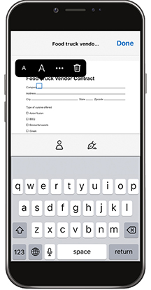
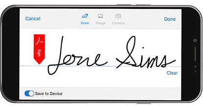
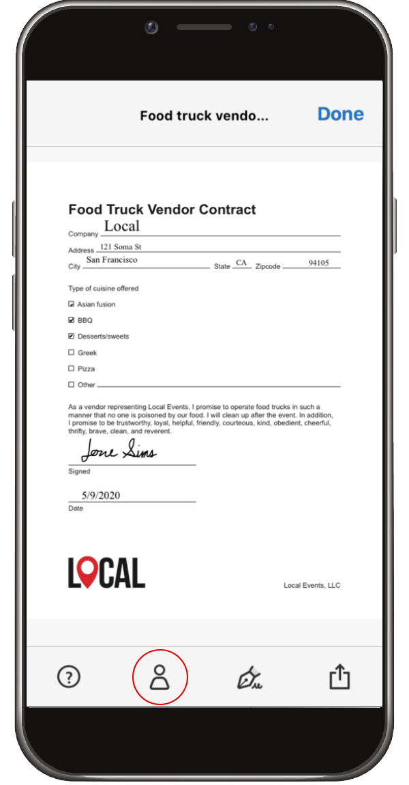

# Fill and Sign any form on desktop or mobile

Fill, sign, and send forms fast from your desktop, browser, or mobile app. Adobe Sensei recognizes and saves commonly used data for use in a PDF form. Create a signature by drawing, importing a scan, or typing your name then securely apply it to a document.

In this exercise, you will import, fill, sign, and send a from using your mobile device.

Here are the [demo files](assets/03_FillSignScan.zip) for this exercise.

**Step 1:** Download the [!DNL Adobe Fill & Sign] app from the [!DNL Apple App] store or [!DNL Google Play].

**Step 2:** Open the app, tap **[!UICONTROL Select a form to fill out]**.

**Step 3:** Choose one of the import options. For this exercise, we will "Take a Picture".  

**Step 4:** Use the white button to take a picture, and then tap **[!UICONTROL Use Photo]**. Tap **[!UICONTROL Done]** in the upper right corner.

**Step 5:** At the bottom of the app, tap the **[!UICONTROL Crop]** tool and use the guides to [crop the image](https://www.adobe.com/acrobat/online/crop-pdf.html). Tap **[!UICONTROL Done]** when finished.

**Step 6:** Use the Magic Wand tool to clean the image if necessary. Tap **[!UICONTROL Done]** when finished.

**Step 7:** Tap anywhere on the page to create a field and add the necessary information to your doc. Select the ellipse to view more options.

**Step 8:** Tap the **[!UICONTROL Signature]** button at the bottom of the app to add your signature. 

**Step 9:** Use a stylus or your finger to sign in the signature field. Move and place the signature field.

**Step 10:** Tap the **[!UICONTROL Profile]** button at the bottom of the app to get pre-filled values such as your name and date. You just need to fill in this information once, and then you can use it on all future forms you complete with the Fill & Sign app.

**Step 11:** Once the form is complete, tap the Share button in the lower right corner to email.

## Recap:

* Open a file from an email or snap a picture of a paper form with your device camera. 

* Tap to enter text or checkmarks in the form fields. And for speed, use custom autofill entries.

* Create your signature using your finger or stylus. Then, apply it to the form or add your initials wherever needed.
