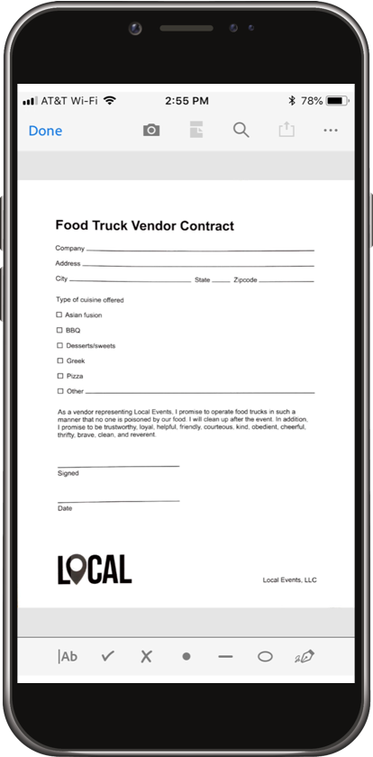

# Fill and sign any form—on desktop or mobile.

* Save commonly used data—Sensei detects field types.
* Sign it your way—draw or type.
* Send—and track.
* Secure—the document cannot be changed after signing. 
