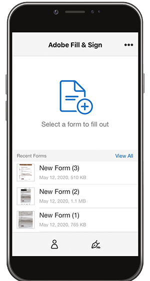

# Fill and Sign any form on desktop or mobile

Fill, sign, and send forms fast from your desktop, browser, or mobile app. Adobe Sensei recognizes and saves commonly used data for use in a PDF form. Create a signature by drawing, importing a scan, or typing your name then securely apply it to a document.

In this exercise, you will import, fill, sign, and send a from using your mobile device.

Here are the [demo files](assets/03_FillSignScan.zip) for this exercise.

Step 1: Download the Adobe Fill & Sign app from the Apple App store or Google Play.

Step 2: Open the app, tap "Select a form to fill out".

Step 3: Choose one of the import options. For this exercise, we will "Take a Picture".  

Step 3: Use the white button to take a picture, and then tap "Use Photo" and tap "Done" in the upper right corner.

Step 4: At the bottom of the app, tap the "Crop" tool and use the guides to crop the image. Tap "Done" when finished.

Step 5: Use the “Magic Wand” tool to clean the image if necessary. Tap “Done” when finished.

Step 6: Tap anywhere on the page to create a field and add the necessary information to your doc. Select the ellipse to view more options

Step 7: Tap the “Signature” button at the bottom of the app to add your signature. 

Step 8: Use a stylus or your finger to sign in the signature field. Move and place the signature field.

Step 9: Tap the Profile button at the bottom of the app to get pre-filled values such as your name and date. You just need to fill in this information once, and then you can use it on all future forms you complete with the Fill & Sign app.

Step 10: Once the form is complete, tap the Share button in the lower right corner to email.

* Save commonly used data—Sensei detects field types.
* Sign it your way—draw or type.
* Send—and track.
* Secure—the document cannot be changed after signing. 

## Recap:

* Open a file from an email or snap a picture of a paper form with your device camera. 

* Tap to enter text or checkmarks in the form fields. And for speed, use custom autofill entries.

* Create your signature using your finger or stylus. Then, apply it to the form or add your initials wherever needed.

