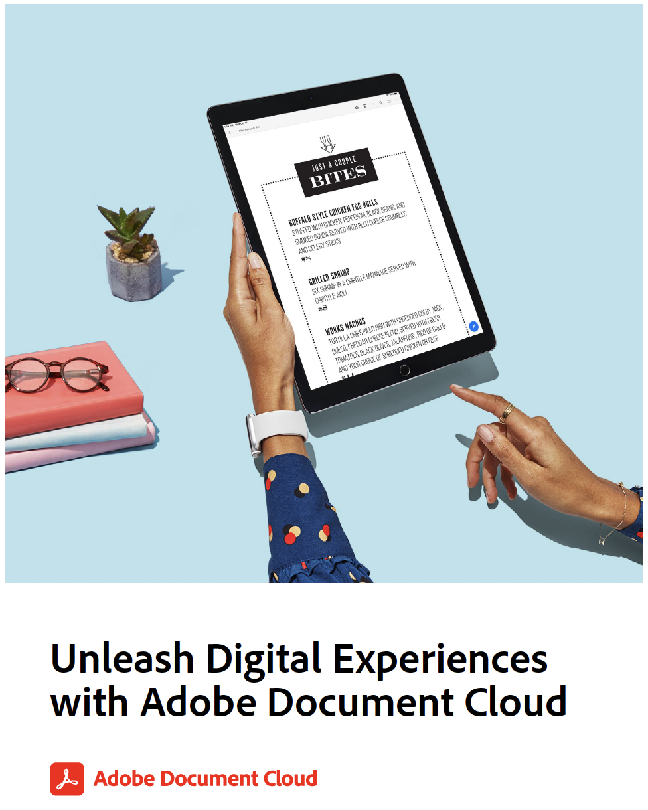

# Exercises for Unleash Digital Experiences with Adobe Document Cloud

This handout contains more exercises and a review of the workflows covered. Below are the demo files we use in the following exercises. Each exercise also relists this content:

* Ex.1: Scan any form - use your own business cards, receipt, or other paper document
* [Ex.2: Fill and Sign any form](assets/03_FillSignScan.zip)
* [Ex.3: Share PDF files and review online](assets/01_Review.zip)
