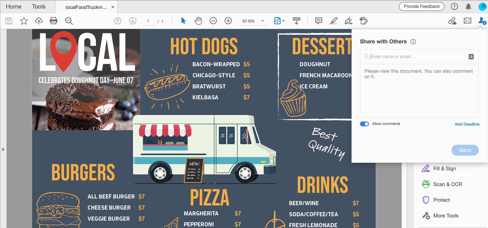
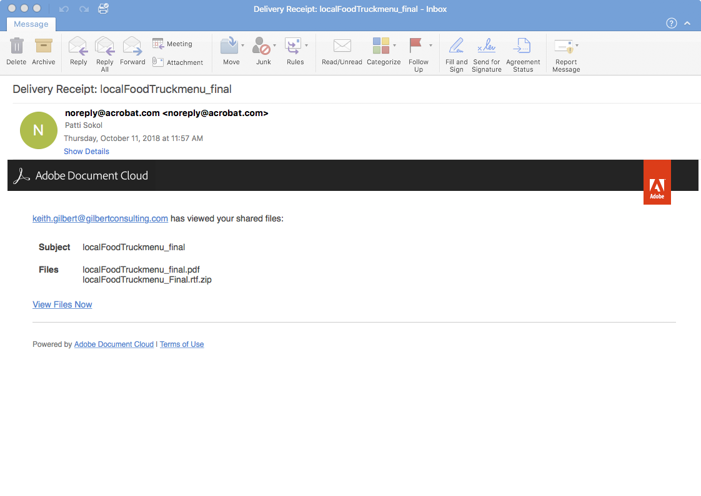
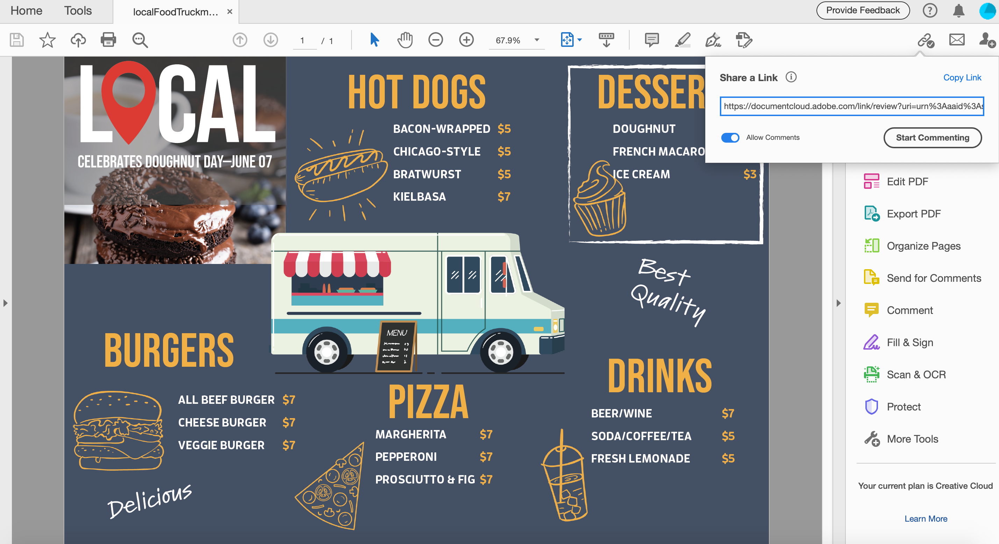
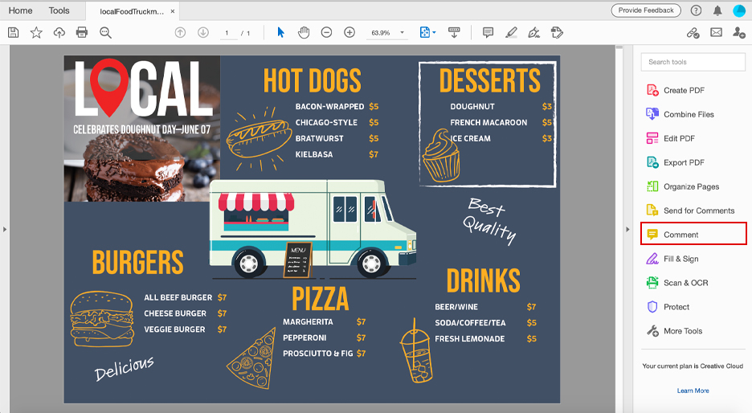
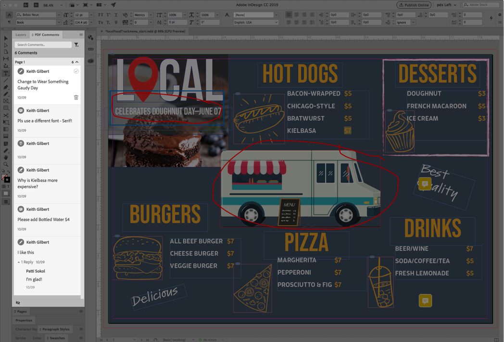

# Share PDF files and review online

Use the Adobe Document Cloud review service to easily share PDF files for review from Acrobat DC desktop application, the Document Cloud web, or Acrobat Reader mobile app. When reviewers click the URL in the email invitation from their computer, they can easily provide their feedback in a browser without having to sign in or install any additional software.

* Send personalized invitations for commenting
* Send an anonymous or public link in an email

Here are the [demo files](assets/01_Review.zip) for this exercise. 

## Send personalized invitations for commenting

Step 1: Open the localFoodTruckmenu_start.pdf file in Adobe Acrobat.

 Step 2: Click on “Send for Comments” in the right-hand panel or the "Share This File With Others"   icon at the top right corner. 

Step 3:Enter the email addresses of the recipients. You have the option of entering a message to the recipients and/or adding a deadline for review.

You will receive an email notice once recipients have viewed your file.

## Reviewer Experience

The reviewers receive an email invitation with a link to the review PDF. When they click the link or the Review button in the invitation, the PDF opens in a web browser. They can use the commenting tools to add comments to the PDF. They can also use Acrobat Reader DC or Acrobat DC desktop applications to add comments. 

## Send an anonymous or public link in an email

Step 1: Open the localFoodTruckmenu_start.pdf file in Adobe Acrobat.

Step 2: Click the "Share A Link" icon . The shared link is generated instantly; you won’t have to wait for the file to be uploaded to the cloud. By default, the "Allow Comments" switch is turned on. 

Step 3: Click "Copy Link" and share the link with the recipients.

## Making Comments

Step 1: Select the “Comment” button on the right-hand panel.

Step 5: Use the top ribbon tools to make any comment.

Step 6: Save the file with your comments.

## Import PDF Comments to InDesign

InDesign CC 2019 allows you to import comments directly from PDF files. You can import, accept, and apply the changes with just one click. Selecting a comment in the new PDF Comments panel will locate and highlight the comment in your InDesign file.

Step 1: Download the PDF file that contains the comments.

Step 2: Open your InDesign file.

Step 3: Select “File” from the top menu. 

Step 4: Select “Import PDF Comments” from the dropdown.

Step 5: Open the PDF that contains the comments. 

Comments will appear in the UI.

## Takeaway

 Review and share design versions with Acrobat. Acrobat allows you to,

* Send a link to a PDF for others to review. 
* Review anywhere—desktop, browser, mobile.
* Collect in a single document.
* Manage feedback in one organized place.
* All you need is a browser.

It’s easy to send and track comments, all in one place. Recipients can view even if they don’t have Acrobat! You can invite someone to comment via a browser. Save time and effort.

