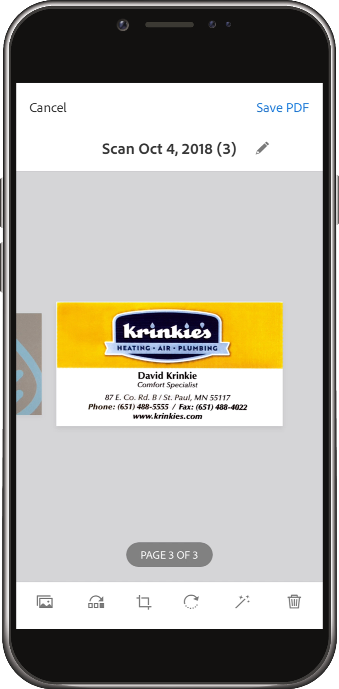
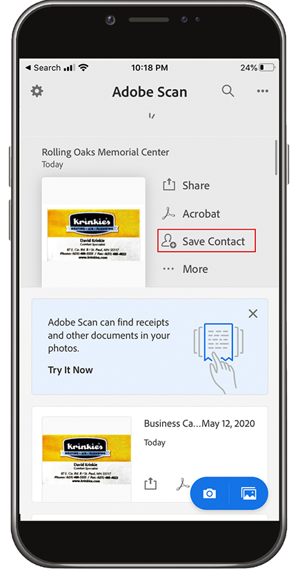
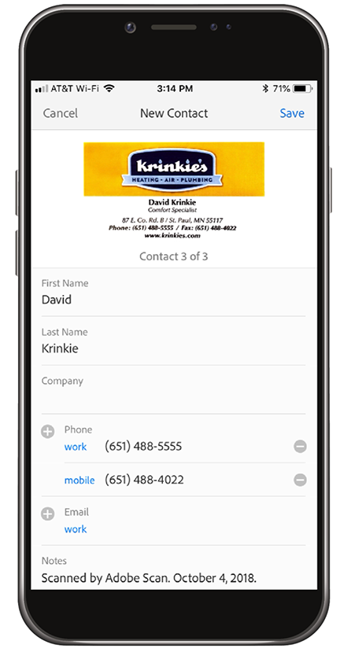
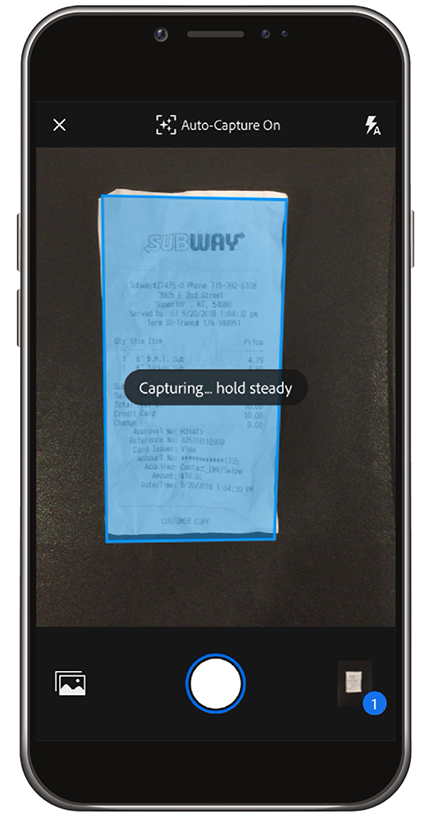
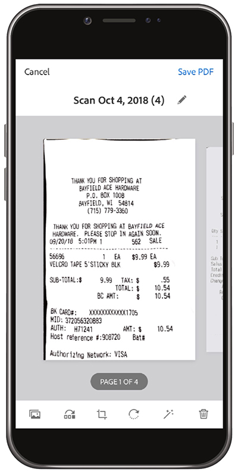

# Go Digital with Adobe Scan

De-clutter, organize, or share! There’s no need to keep piles of paper on your desk or stuff receipts in your wallet. The Adobe Scan mobile app scans paper documents directly into PDFs, and automatically recognizes text.

In this exercise, you will upload contents from a business card directly into your contacts. Scan and store a receipt.

Collect a business card, receipt, or some other paper item that you'd like to work with.

## Scan a business card

**Step 1:** Download the Adobe Scan app from the Apple App store or Google Play.

**Step 2:** Open the Adobe Scan app.

**Step 3:** From the app, take a photo of the business card containing the contact information you’d like to save to your phone.

**Step 4:** Once scanning is complete, make the adjustments needed to ensure your card is within the bounding box.

**Step 5:** Tap "Save PDF" at the upper right-hand corner. Then, tap "Save Contact".

**Step 6:** Make any desired edits or additions to the contact information before storing in your phone. Tap "Save" once more to finalize saving to contacts.

## Scan and store a receipt

The Adobe Scan app can also be useful to scan and store a receipt you'll need at a later time (e.g. an expense report or other reimbursement).

**Step 1:** With the Adobe Scan app open, take a photo of the receipt you’d like to store.

**Step 2:** Observe as the app auto-detects your receipt, and captures its contents.

**Step 3:** Tap "Save PDF" at the upper-right hand corner to store the reciept in your phone.

## Recap:

* Scan paper documents and forms to PDF.
* Convert JPG images to PDF.
* Edit right on your device. 
* Add business card info directly to your Contacts. 

Ditch the paper!