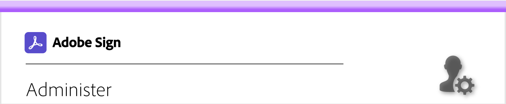
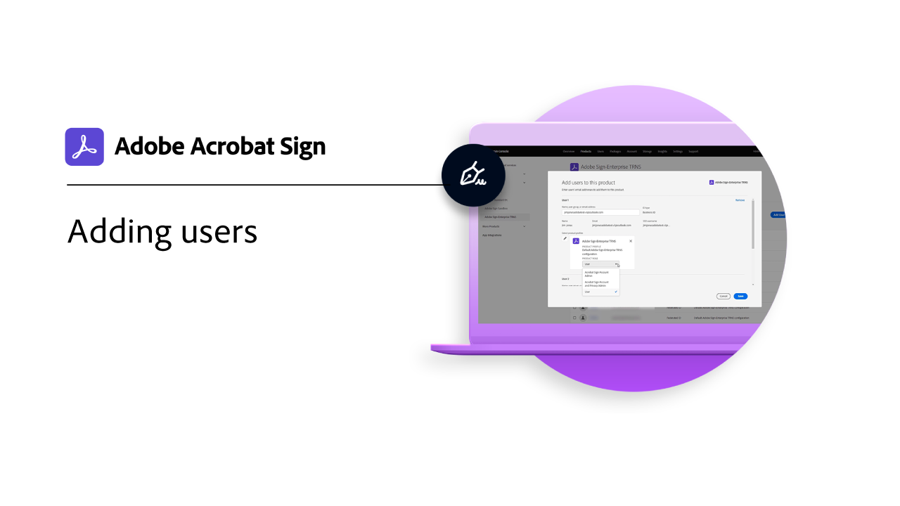
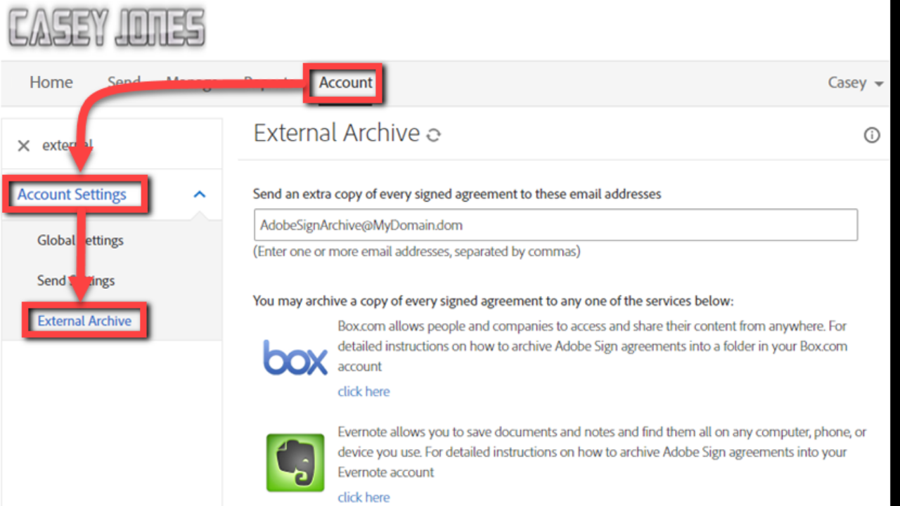
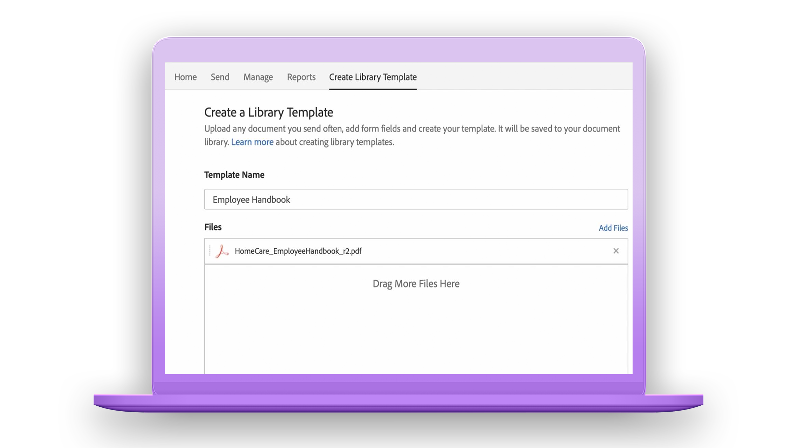
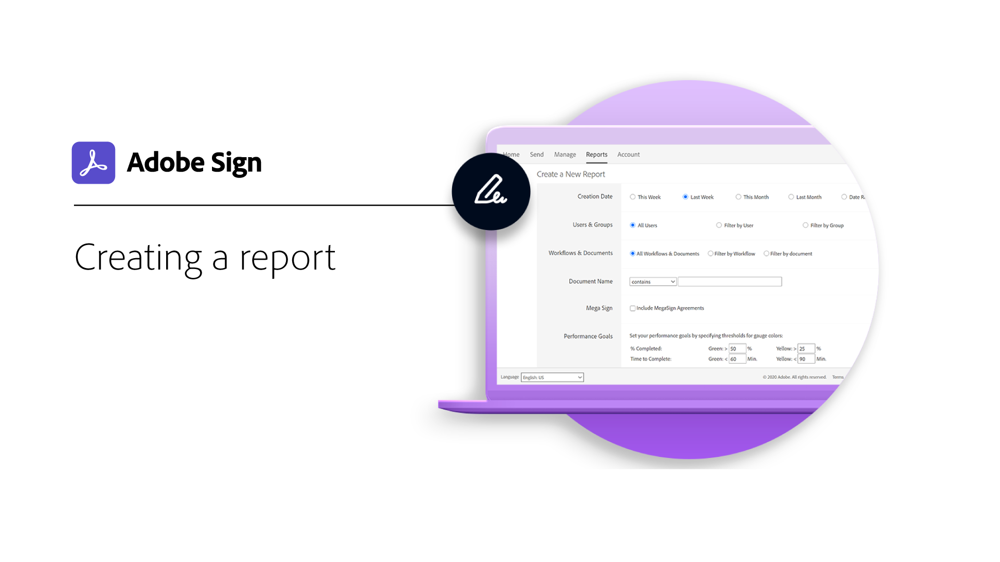
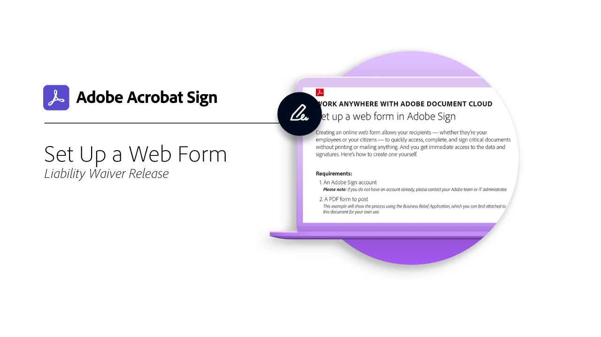
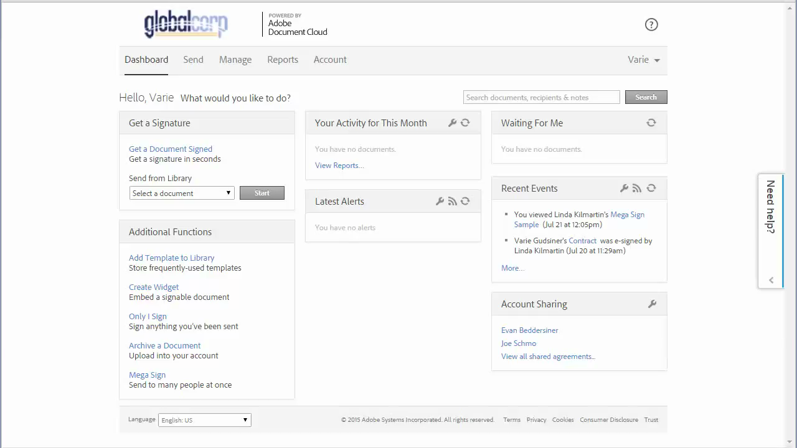
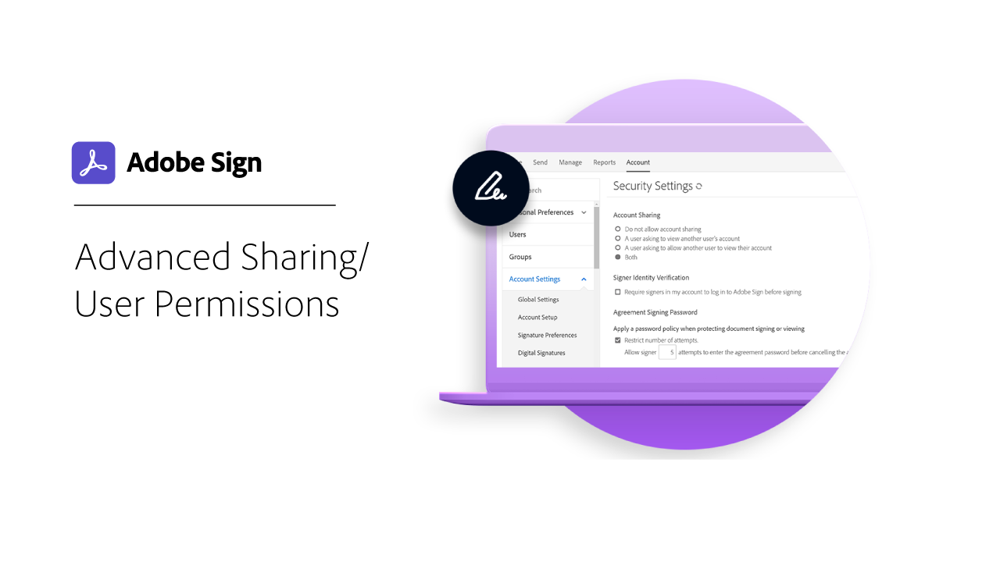
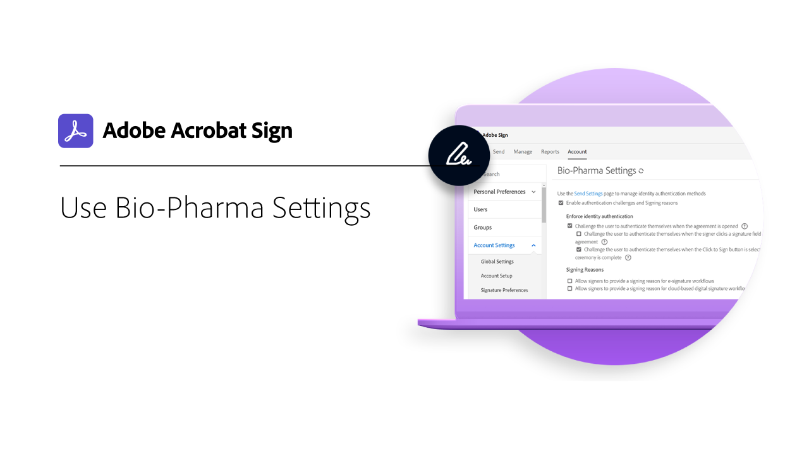

# Administrators overview

Learn about adding users to your account, setting up groups, sharing access, and setting up a workflow, external archive, and shared events and alerts. These tutorials are designed for administrators who are past the installation phase, and are ready to start administering Adobe Sign. The Advanced Tasks cover topics that expand past the admin set up portion and move into defining global settings, account access and sharing, and text tagging.

## Getting started

<table style="table-layout:fixed">
<tr>
  <td>
    
    

    <a href="up-and-running-admin.md"><strong>Up and Running for Admins</strong></a>
    

     
    <em>Overview of 7 key areas for administrators to get up & running quickly in Adobe Sign</em>
  </td>
  <td>
    
    

    <a href="set-up-shared-events-and-alert.md"><strong>Setting up Shared Events and Alerts</strong></a>
    

     
    <em>Configure event and alert settings for your organization</em>
  </td>
  <td>
    
    

    <a href="add-users-to-your-account.md"><strong>Adding Users</strong></a>
    

     
    <em>Add users individually or in bulk to your Adobe Sign account</em>
  </td>
</tr>
<tr>
  <td>
    
    

    <a href="create-and-manage-groups.md"><strong>Creating and Managing Groups</strong></a>
    

     
    <em>Create groups, add users to groups, and edit group settings</em>
  </td>
  <td>
    
    

    <a href="set-up-your-external-archive.md"><strong>Setting up an External Archive</strong></a>
    

     
    <em>Create an external archive for backup copies of agreements that have been sent</em>
  </td>
  <td>
    
    

    <a href="../sign-advanced-users/create-a-template.md"><strong>Creating a Document Template</strong></a>
    

     
    <em>Create a reusable document template for speed and consistency</em>
  </td>
</tr>
<tr>
  <td>
    
    

    <a href="create-a-report.md"><strong>Creating a Report</strong></a>
    

     
    <em>Create and schedule reports to gain visibiity into your organization's use of Adobe Sign</em>
  </td>
  <td>
    
    

    <a href="../sign-advanced-users/webform.md"><strong>Set Up a Web Form</strong></a>
    

     
    <em>Create a document that can be signed electronically directly on your website</em>
  </td>
  <td>
    
    

    <a href="../sign-advanced-users/megasign.md"><strong>Collect Signatures in Bulk</strong></a>
    

     
    <em>Collect hundreds of signatures at once for any document</em>
  </td>
</tr>
<tr>
  <td>
    
    

    <a href="building-a-custom-workflow.md"><strong>Setting up a Workflow</strong></a>
    

     
    <em>Automate document workflows to quickly get electronic signatures and data</em>
  </td>
  <td>
    
    

     
  </td>
  <td>
    
    

     
  </td>
</tr>
</table>

## Advanced tasks

<table style="table-layout:fixed">
<tr>
  <td>
    
    

    <a href="learn-about-global-settings.md"><strong>Global Settings</strong></a>
    

     
    <em>Edit product settings globally for your entire organization or for specific groups</em>
  </td>
  <td>
      
    

    <a href="share-account-access.md"><strong>Sharing Account Access</strong></a>
    

     
    <em>Set up view-only access to transactions in another user's account</em>
  </td>
  <td>
    
    

    <a href="advanced-account-sharing.md"><strong>Advanced Account Sharing</strong></a>
    

     
    <em>Set up account sharing to allow admins and users to delegate their send, modify, and view permissions</em>
  </td>
</tr>
<tr>
  <td>
    
    

    <a href="use-bio-pharma-settings.md"><strong>Using Bio-Pharma Settings</strong></a>
    

     
    <em>Set up Bio-pharma settings that allow you to meet FDA 21 CFR Part 11 requirements</em>
  </td> 
  <td>
     
    

    <a href="../sign-advanced-users/adobe-sign-text-tagging.md"><strong>Adobe Sign Text Tagging</strong></a>
    

     
    <em>Build Adobe Sign form fields by text tagging using Adobe Acrobat DC</em>
  </td>
  <td>
    
    

     
  </td>
</tr>
</table>