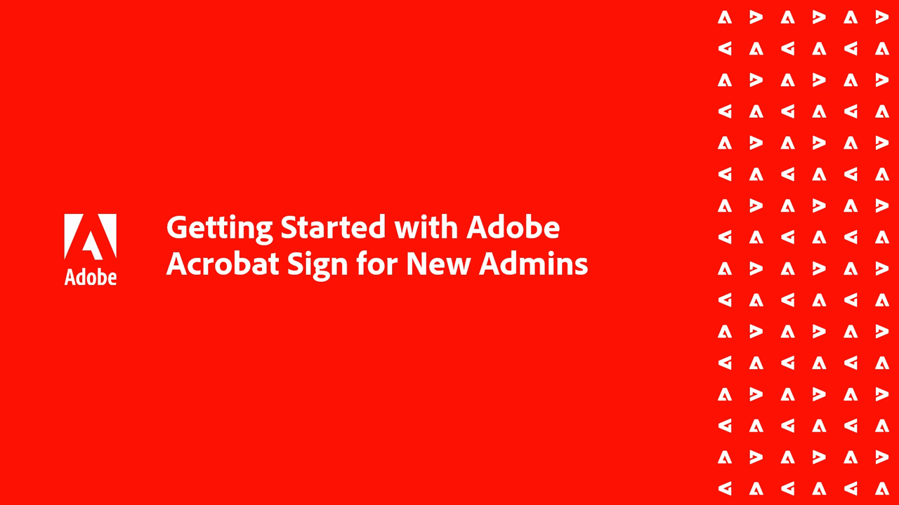
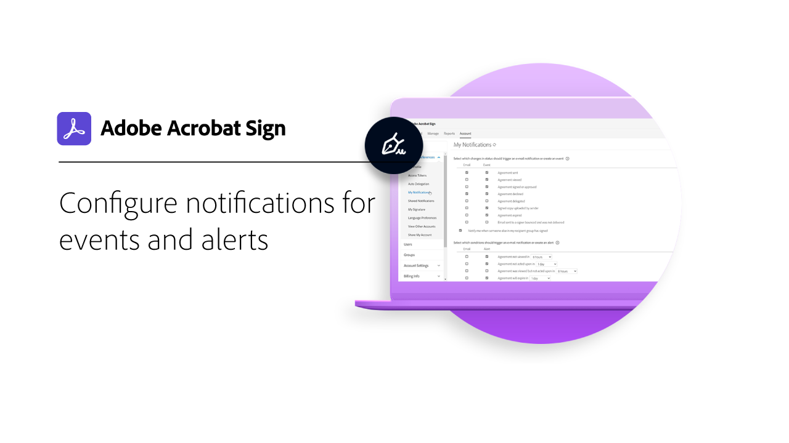
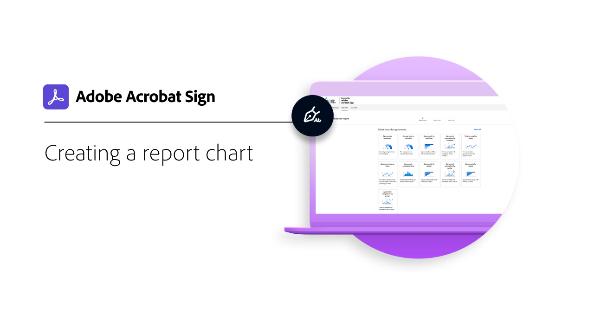
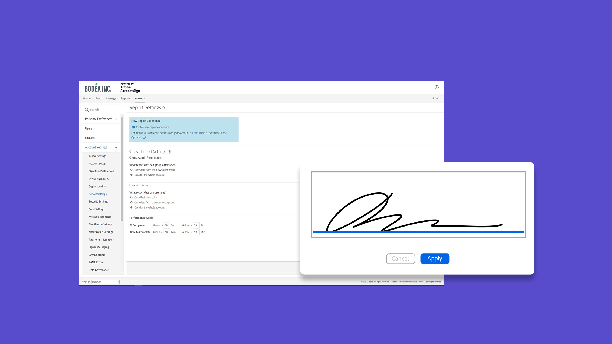
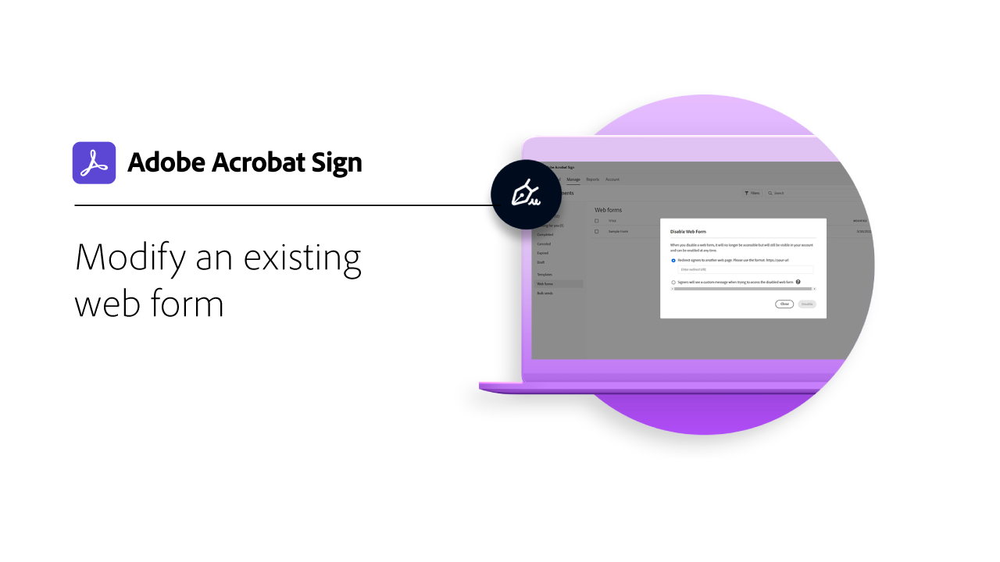

# Administrators overview

Learn about adding users to your account, setting up groups, sharing access, and setting up a workflow, external archive, and shared events and alerts. These tutorials are designed for administrators who are past the installation phase, and are ready to start administering Acrobat Sign. The Advanced Tasks cover topics that expand past the admin setup and move into defining global settings, account access and sharing, and text tagging.

## What's new

* [Report options](report-options.md)
  Learn how to set up report options for users
* [Adding users](add-users-to-your-account.md)
  Learn how to add and manage users for Acrobat Sign

## Getting started

<table style="table-layout:fixed">
<tr>
  <td>
    
    

    <a href="get-started-admin.md"><strong>Getting started for new administrators</strong></a>
    

    <em>In this comprehensive video guide, learn about all the tools necessary to get your organization up and running with Acrobat Sign</em>
     
  </td>
  <td>
    
    

    <a href="up-and-running-admin.md"><strong>Up &  running for Admins</strong></a>
    

    <em>Overview of 7 key areas for administrators to get up & running quickly in Acrobat Sign</em>
     
  </td>
  <td>
    
    

    <a href="set-up-shared-events-and-alert.md"><strong>Configure notifications for events and alerts</strong></a>
    

    <em>Configure notifications for events and alerts for your account</em>
     
  </td>
  <td>
    
    

    <a href="add-users-to-your-account.md"><strong>Adding users</strong></a>
    

    <em>Add and manage users for Acrobat Sign</em>
     
  </td>
</tr>
<tr>
 <td>
    
    

    <a href="create-and-manage-groups.md"><strong>Creating and managing groups</strong></a>
    

    <em>Create groups, add users to groups, and edit group settings</em>
     
  </td>
  <td>
    
    

    <a href="set-up-your-external-archive.md"><strong>Setting up an external archive</strong></a>
    

    <em>Create an external archive for backup copies of agreements that have been signed</em>
     
  </td>
  <td>
    
    

    <a href="../sign-advanced-users/create-a-template.md"><strong>Creating a document template</strong></a>
    

    <em>Create a reusable document template for speed and consistency</em>
     
  </td>
  <td>
    
    

    <a href="create-a-report.md"><strong>Creating a report chart</strong></a>
    

    <em>Learn how to build, save, and manage your own custom reports and data exports</em>
     
  </td>
</tr>
<tr>
  <td>
    
    

    <a href="report-options.md"><strong>Report options for users</strong></a>
    

    <em>Learn how to set up report options for users</em>
     
  </td>
  <td>
    
    

    <a href="../sign-advanced-users/webform.md"><strong>Creating a web form</strong></a>
    

    <em>Create a document that can be signed electronically directly on your website</em>
     
  </td>
  <td>
    
    

    <a href="../sign-advanced-users/modify-webform.md"><strong>Modify an existing web form</strong></a>
    

    <em>Learn how to disable, edit, and re-enable an existing web form</em>
     
  </td>
  <td>
    
    

    <a href="../sign-advanced-users/megasign.md"><strong>Send & collect signatures in bulk</strong></a>
    

    <em>Collect hundreds of signatures at once for any document</em>
     
  </td>
</tr>
<tr>
  <td>
    
    

    <a href="building-a-custom-workflow.md"><strong>Setting up a workflow</strong></a>
    

    <em>Automate document workflows to quickly get electronic signatures and data</em>
     
  </td>
  <td>
    
    

     
  </td>
  <td>
    
    

     
  </td>
  <td>
    
    

     
  </td>
</table>

## Advanced tasks

<table style="table-layout:fixed">
<tr>
  <td>
    
    

    <a href="learn-about-global-settings.md"><strong>Global settings</strong></a>
    

    <em>Edit product settings globally for your entire organization or for specific groups</em>
     
  </td>
  <td>
      
    

    <a href="share-account-access.md"><strong>Sharing account access</strong></a>
    

    <em>Set up view-only access to transactions in another user's account</em>
     
  </td>
  <td>
    
    

    <a href="advanced-account-sharing.md"><strong>Advanced account sharing</strong></a>
    

    <em>Set up account sharing to allow admins and users to delegate their send, modify, and view permissions</em>
     
  </td>
  <td>
    
    

    <a href="use-bio-pharma-settings.md"><strong>Using Bio-Pharma settings</strong></a>
    

    <em>Set up Bio-pharma settings that allow you to meet FDA 21 CFR Part 11 requirements</em>
     
  </td> 
</tr>
<tr>
   <td>
     
    

    <a href="../sign-advanced-users/adobe-sign-text-tagging.md"><strong>Acrobat Sign Text Tagging</strong></a>
    

    <em>Build Acrobat Sign form fields by text tagging using Adobe Acrobat</em>
     
  </td>
  <td>
    
    

     
  </td>
  <td>
    
    

     
  </td>
  <td>
    
    

     
  </td>
</tr>
</table>
