# Administrators overview

Learn about adding users to your account, setting up groups, sharing access, and setting up a workflow, external archive, and shared events and alerts. These tutorials are designed for administrators who are past the installation phase, and are ready to start administering Acrobat Sign. The Advanced Tasks cover topics that expand past the admin setup and move into defining global settings, account access and sharing, and text tagging.

## What's new

>[!BEGINTABS]

>[!TAB Enable automatic user assignment rules]

Learn how to set up [automatic assignment rules](automatic-assignment-rules.md) granting users access to Acrobat Sign in the Admin Console.

>[!TAB Migrate Docusign templates]

Learn how to seamlessly [migrate Docusign templates](docusign-templates.md) and workflows in three easy steps.

>[!TAB Add a new user]

Learn how to [add new users to Acrobat Sign](add-users-to-your-account.md).

>[!ENDTABS]

## Getting started

<table style="table-layout:fixed">
<tr>
  <td>
    <a href="get-started-admin.md">
      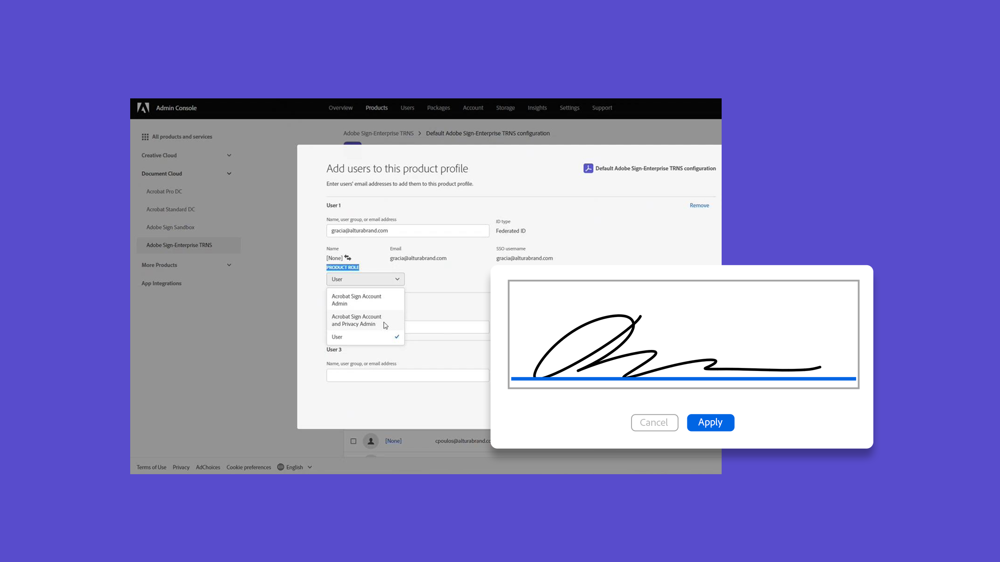
    </a>
    

    <a href="get-started-admin.md"><strong>Getting started for new administrators</strong></a>
    

    <em>In this comprehensive video guide, learn about all the tools necessary to get your organization up and running with Acrobat Sign</em>
     
  </td>
  <td>
    <a href="up-and-running-admin.md">
      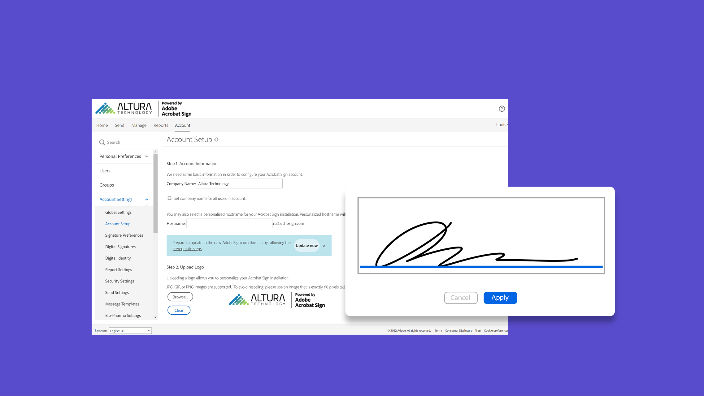
    </a>
    

    <a href="up-and-running-admin.md"><strong>Up &  running for Admins</strong></a>
    

    <em>Overview of 7 key areas for administrators to get up & running quickly in Acrobat Sign</em>
     
  </td>
  <td>
    <a href="docusign-templates.md">
      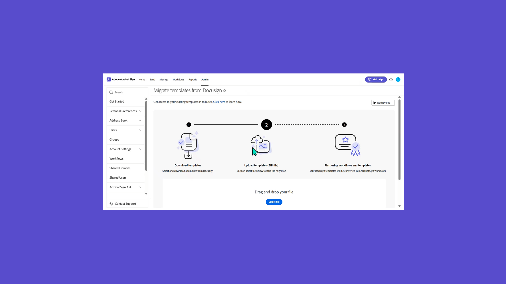
    </a>
    

    <a href="docusign-templates.md"><strong>Migrate Docusign templates</strong></a>
    

    <em>Learn how to seamlessly migrate Docusign templates and workflows</em>
     
  </td>
  <td>
    <a href="add-users-to-your-account.md">
      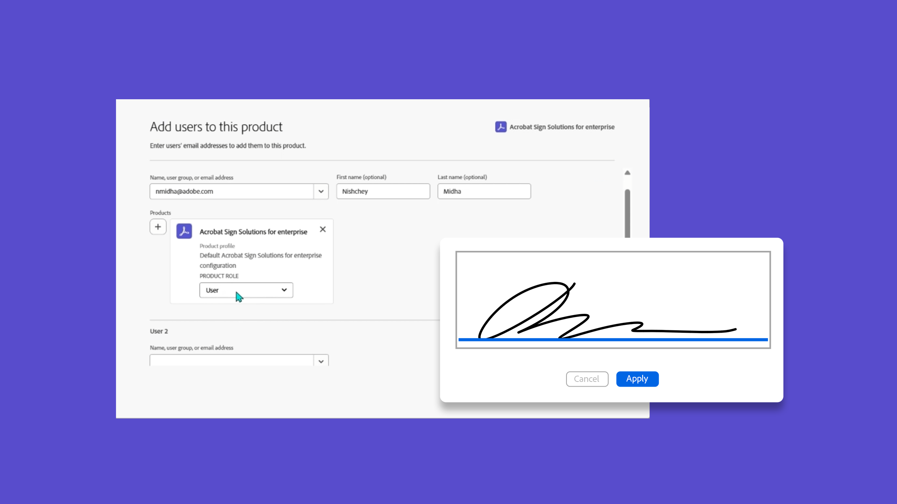
    </a>
    

    <a href="add-users-to-your-account.md"><strong>Add a new user</strong></a>
    

    <em>Learn how to add new users to Acrobat Sign</em>
     
  </td>
</tr>
<tr>
  <td>
    <a href="automatic-assignment-rules.md">
      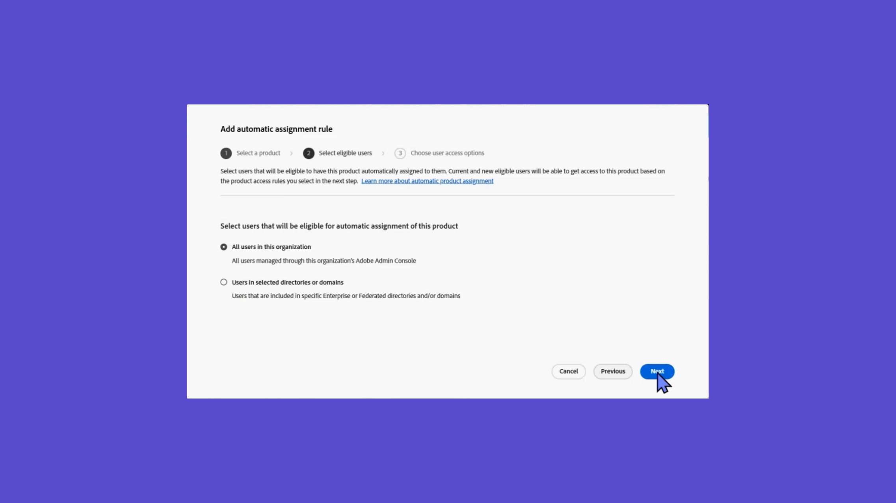
    </a>
    

    <a href="automatic-assignment-rules.md"><strong>Enable automatic user assignment rules</strong></a>
    

    <em>Learn how to set up automatic assignment rules granting users access to Acrobat Sign in the Admin Console</em>
     
  </td>
  <td>
    
    

    <a href="add-admin.md"><strong>Add a new account administrator</strong></a>
    

    <em>Learn how to create a new user or promote an existing user to the Acrobat Sign Admin role</em>
     
  </td>
    <td>
      <a href="promote-admin.md">
        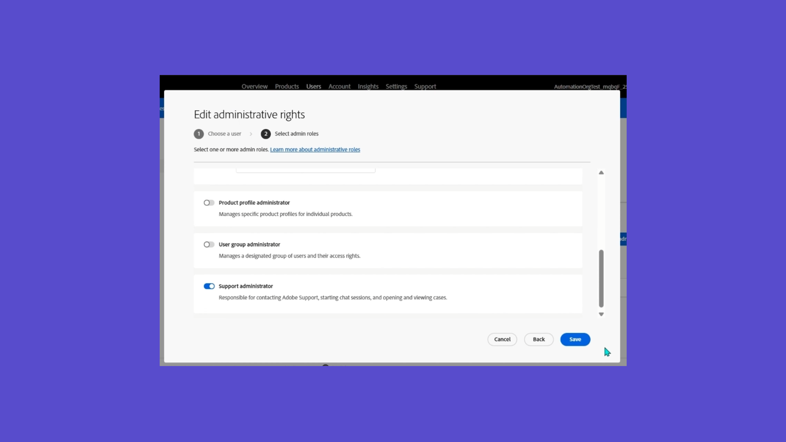
      </a>
      

      <a href="promote-admin.md"><strong>Assign Product & Support Admin roles</strong></a>
      

      <em>Learn how to assign an Acrobat Sign user Product Admin and Support Admin role in the Admin Console</em>
       
    </td>
    <td>
      <a href="create-and-manage-groups.md">
        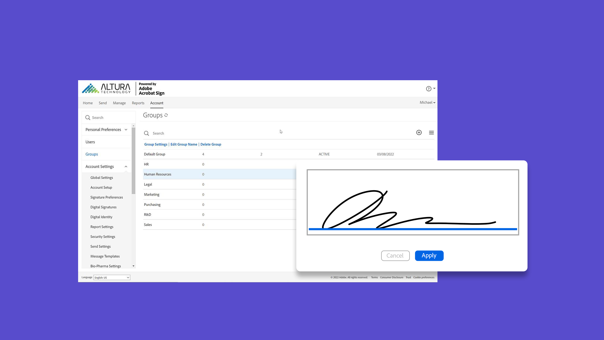
      </a>
      

      <a href="create-and-manage-groups.md"><strong>Creating and managing groups</strong></a>
      

      <em>Create groups, add users to groups, and edit group settings</em>
       
    </td>
</tr>
<tr>
 <td>
      <a href="set-up-your-external-archive.md">
        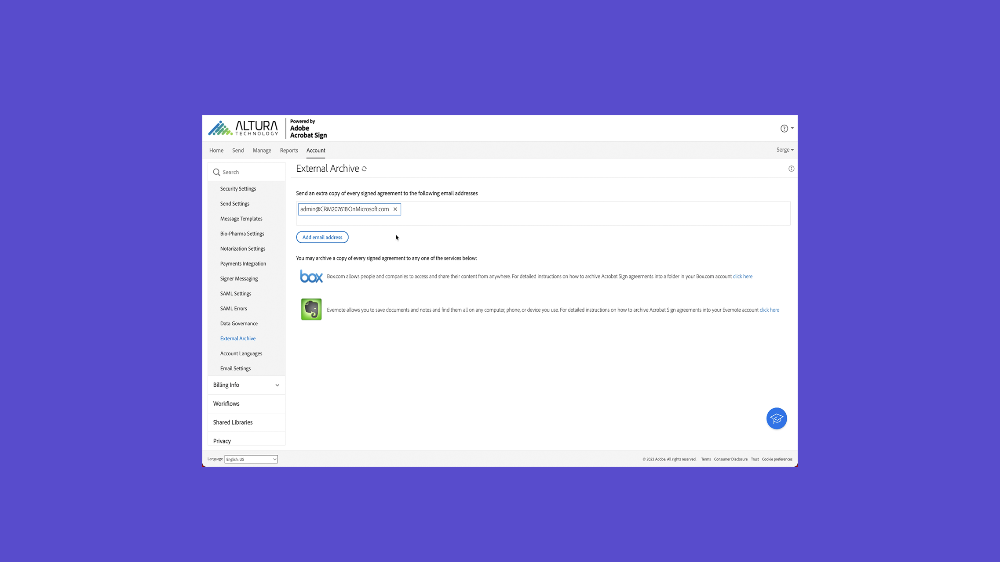
      </a>
      

      <a href="set-up-your-external-archive.md"><strong>Setting up an external archive</strong></a>
      

      <em>Create an external archive for backup copies of agreements that have been signed</em>
       
    </td>
  <td>
    
    

    <a href="../sign-advanced-users/create-a-template.md"><strong>Create a reusable template</strong></a>
    

    <em>Create a reusable document template for speed and consistency</em>
     
  </td>
  <td>
    
    

    <a href="../sign-advanced-users/creating-a-report.md"><strong>Reporting and transaction usage</strong></a>
    

    <em>Learn how to generate reports and track transaction usage</em>
     
  </td>
  <td>
    
    

    <a href="report-options.md"><strong>Report options for users</strong></a>
    

    <em>Learn how to set up report options for users</em>
     
  </td>
</tr>  
<tr>
   <td>
    
    

    <a href="../sign-advanced-users/webform.md"><strong>Creating a web form</strong></a>
    

    <em>Create a document that can be signed electronically directly on your website</em>
     
  </td>
  <td>
    
    

    <a href="../sign-advanced-users/modify-webform.md"><strong>Modify an existing web form</strong></a>
    

    <em>Learn how to disable, edit, and re-enable an existing web form</em>
     
  </td>
  <td>
    
    

    <a href="../sign-advanced-users/megasign.md"><strong>Send in Bulk</strong></a>
    

    <em>Collect thousands of signatures at once for any document</em>
     
  </td>
  <td>
    
    

    <a href="building-a-custom-workflow.md"><strong>Setting up a workflow</strong></a>
    

    <em>Automate document workflows to quickly get electronic signatures and data</em>
     
  </td>
</tr>
<tr>
     <td>
    <a href="audit-reports.md">
      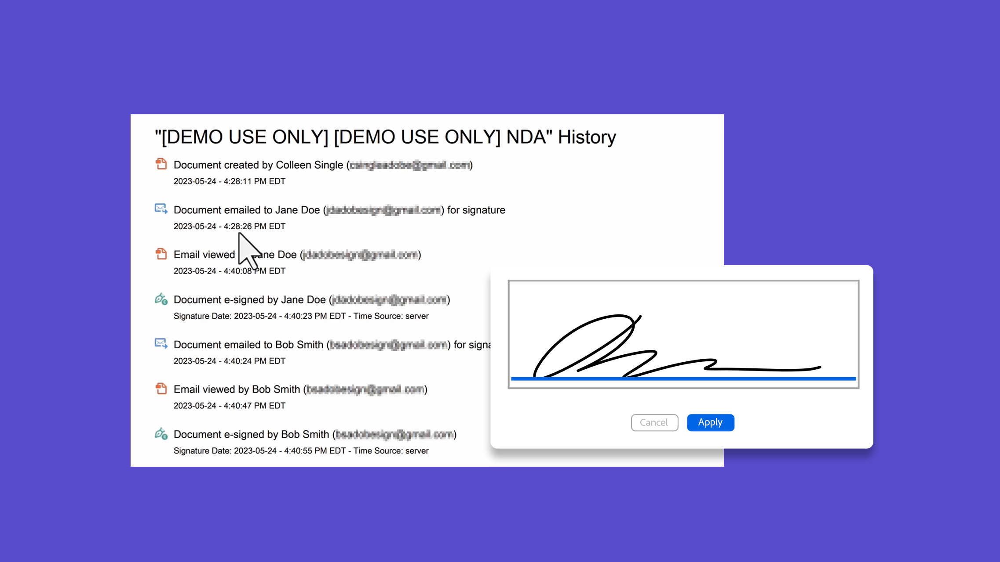
    </a>
    

    <a href="audit-reports.md"><strong>Audit reports</strong></a>
    

    <em>Learn how to access, utilize, and configure audit reports</em>
     
    </td>
    <td>
      <a href="set-up-shared-events-and-alert.md">
        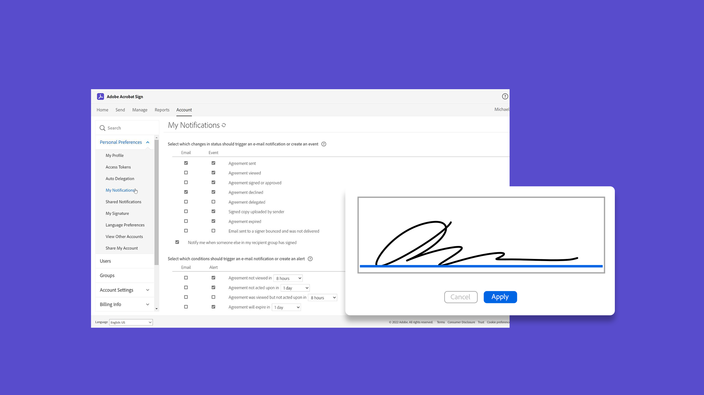
      </a>
      

      <a href="set-up-shared-events-and-alert.md"><strong>Configure notifications for events and alerts</strong></a>
      

      <em>Configure notifications for events and alerts for your account</em>
       
    </td>
    <td>
      
      

       
    </td>
    <td>
      
      

       
    </td>
</tr>    
</table>

## Advanced tasks

<table style="table-layout:fixed">
<tr>
  <td>
    <a href="learn-about-global-settings.md">
      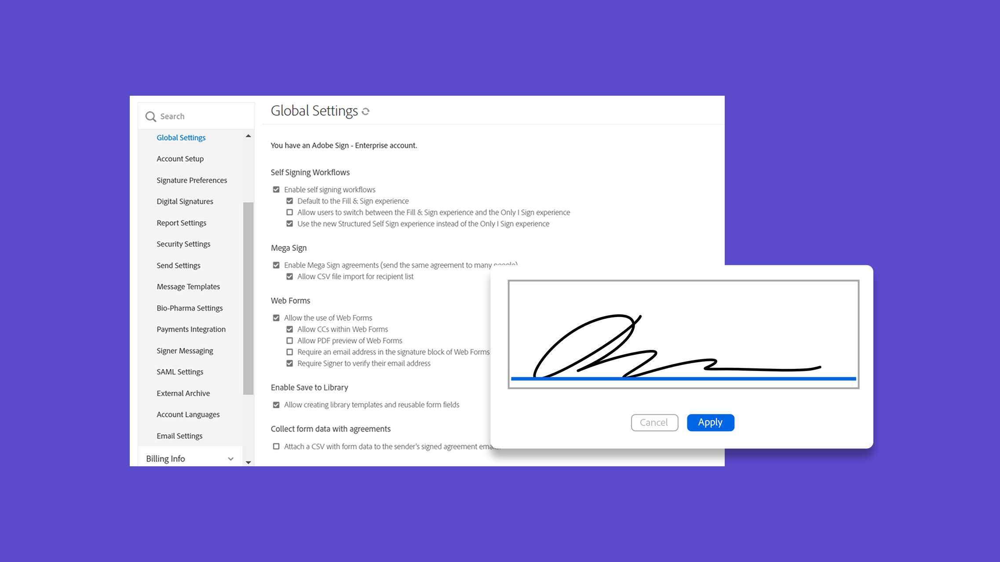
    </a>
    

    <a href="learn-about-global-settings.md"><strong>Global settings</strong></a>
    

    <em>Edit product settings globally for your entire organization or for specific groups</em>
     
  </td>
  <td>
    <a href="share-account-access.md">
      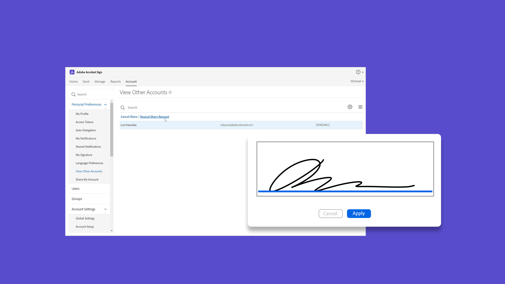
    </a>  
    

    <a href="share-account-access.md"><strong>Sharing account access</strong></a>
    

    <em>Set up view-only access to transactions in another user's account</em>
     
  </td>
  <td>
    <a href="advanced-account-sharing.md">
      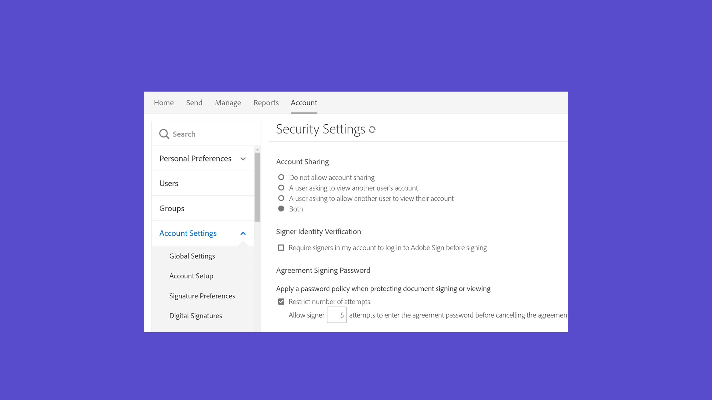
    </a>
    

    <a href="advanced-account-sharing.md"><strong>Advanced account sharing</strong></a>
    

    <em>Set up account sharing to allow admins and users to delegate their send, modify, and view permissions</em>
     
  </td>
  <td>
    <a href="bulk-download-tool.md">
      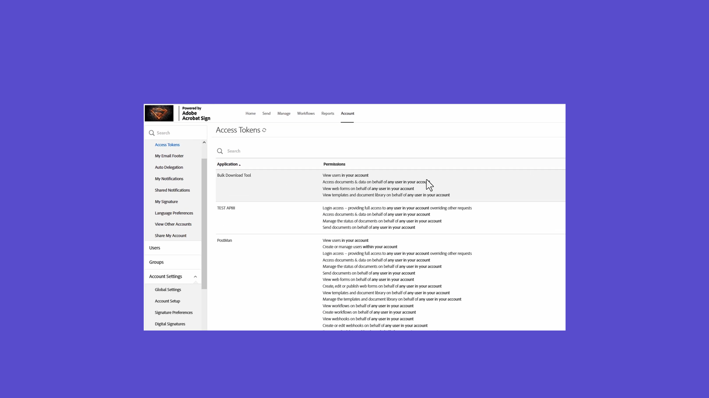
    </a>
    

    <a href="bulk-download-tool.md"><strong>Bulk Download tool</strong></a>
    

    <em>Learn how to use the Bulk Download tool to quickly download all your signed agreements</em>
     
  </td> 
</tr>
<tr>
   <td>
     
    

    <a href="../sign-advanced-users/adobe-sign-text-tagging.md"><strong>Acrobat Sign Text Tagging</strong></a>
    

    <em>Build Acrobat Sign form fields by text tagging using Adobe Acrobat</em>
     
  </td>
  <td>
    <a href="use-bio-pharma-settings.md">
      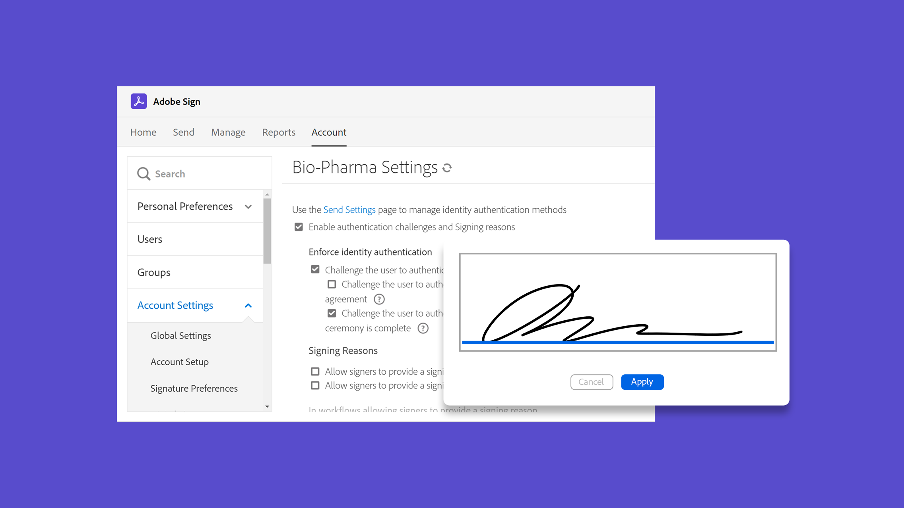
    </a>
    

    <a href="use-bio-pharma-settings.md"><strong>Using Bio-Pharma settings</strong></a>
    

    <em>Set up Bio-pharma settings that allow you to meet FDA 21 CFR Part 11 requirements</em>
     
  </td>
  <td>
    <a href="privacy.md">
      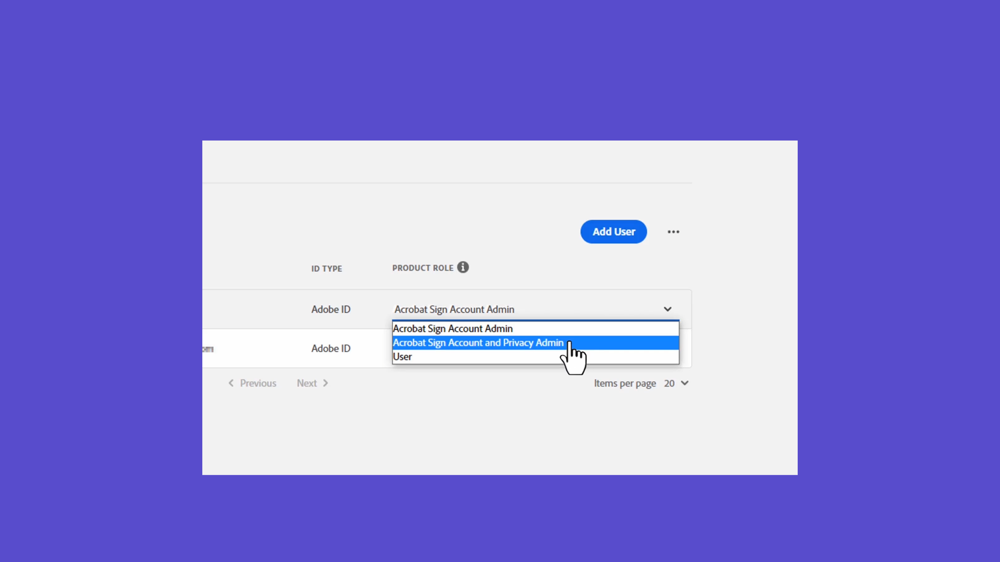
    </a>
    

    <a href="privacy.md"><strong>How to set up privacy admins</strong></a>
    

    <em>Learn how to set up and use privacy admins</em>
     
  </td>
  <td>
    
    

     
  </td>
</tr>
</table>
