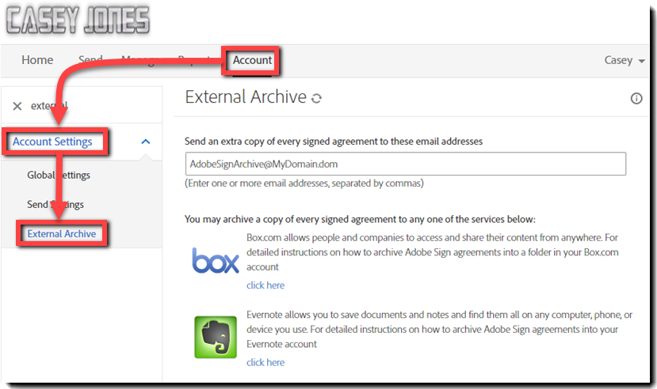
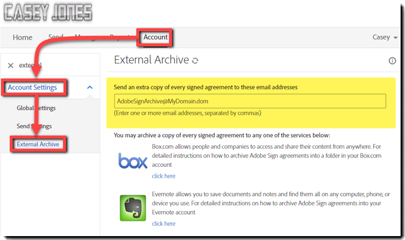
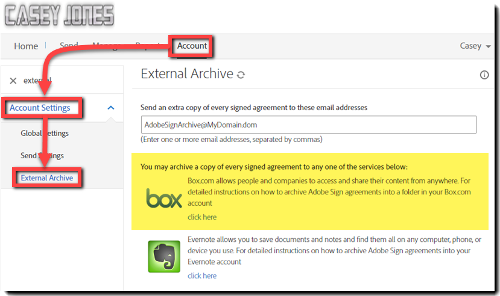
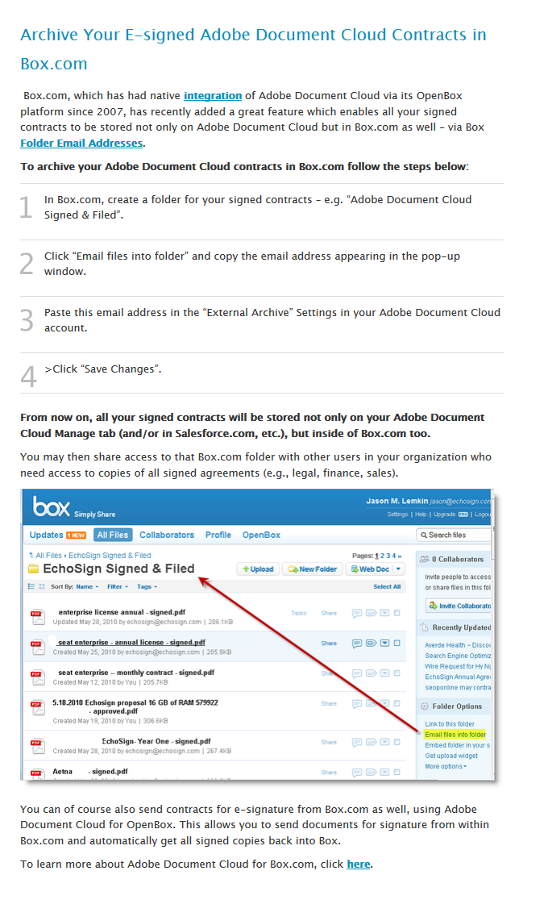
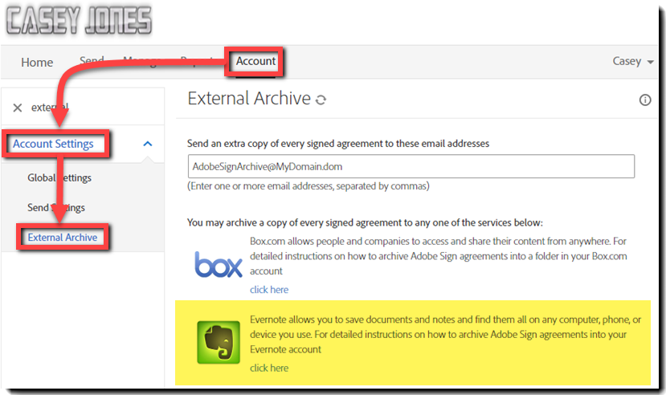
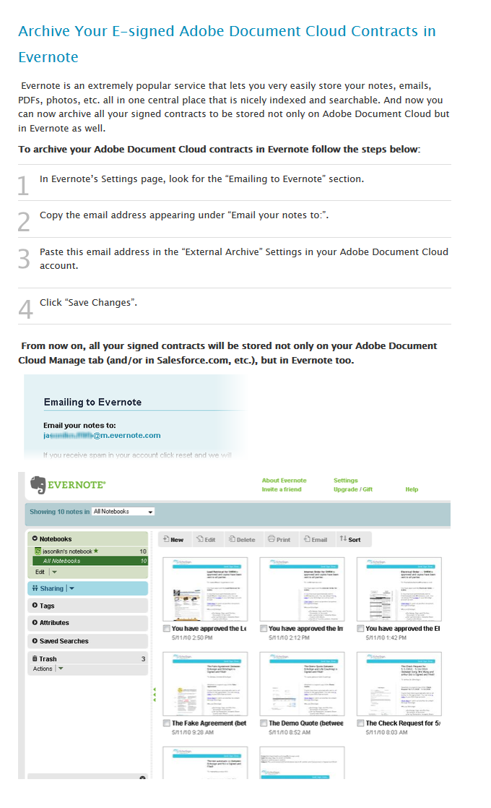

# Setting up an external archive

Learn how to create an external archive for backup copies of agreements that have been sent. You can archive copies of signed agreements to any email address or to Box and Evernote. A copy of the Signed and Filed email is sent to either the email address or the service you set up.

## External archive: email address

1. Log in as the account admin.

1. Click **[!UICONTROL Account Settings]** > **[!UICONTROL External Archive]** under the [!UICONTROL Account] tab.

    

1. Enter the archive email address and click **[!UICONTROL Save Changes]**.

    

## External archive: Box.com

1. Log in as the account admin.

1. Click **[!UICONTROL Account Settings]** > **[!UICONTROL External Archive]** under the [!UICONTROL Account] tab.

1. Select the [!UICONTROL click here] link to the right of the Box logo.

    

1. Follow the Box-specific directions in the pop-up window.

    

## External archive: Evernote

1. Log in as the account admin.

1. Click **[!UICONTROL Account Settings]** > **[!UICONTROL External Archive]** under the [!UICONTROL Account] tab.

1. Select the **[!UICONTROL click here]** link to the right of the Evernote logo.

   

1. Follow the Evernote specific directions in the pop-up window.

   
